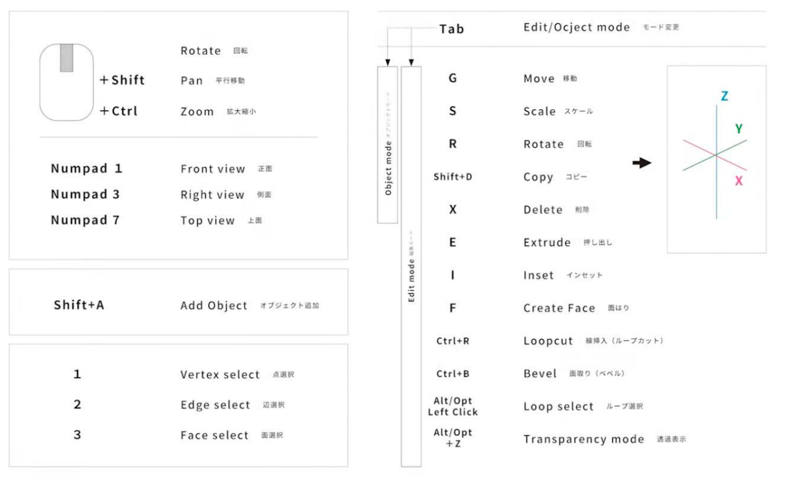
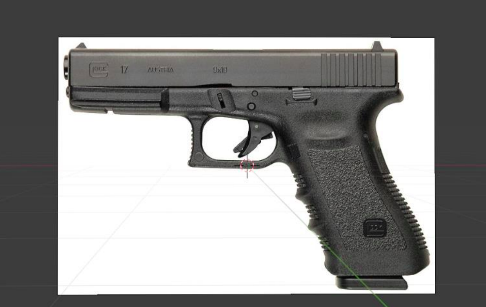
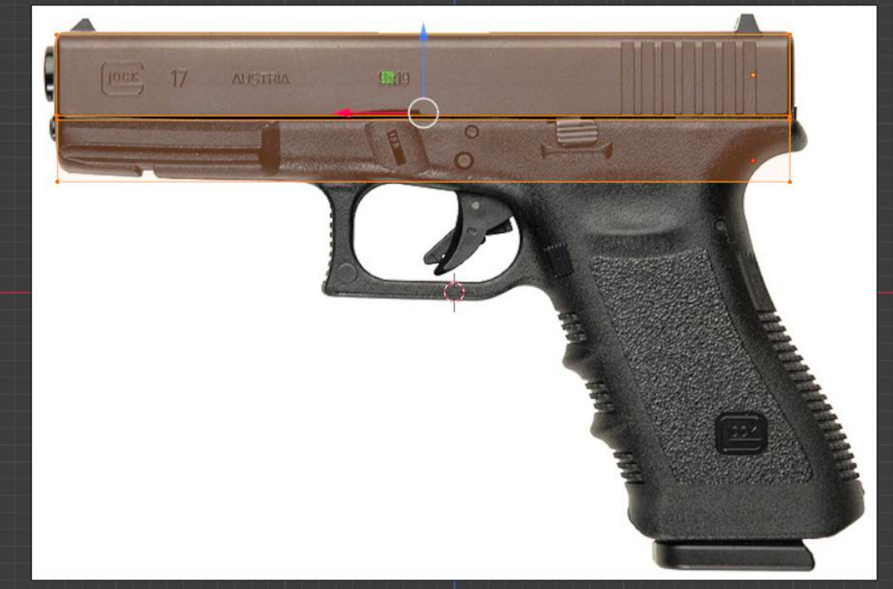
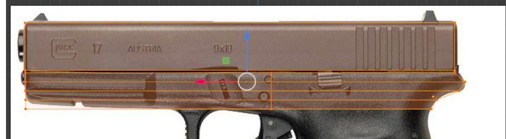
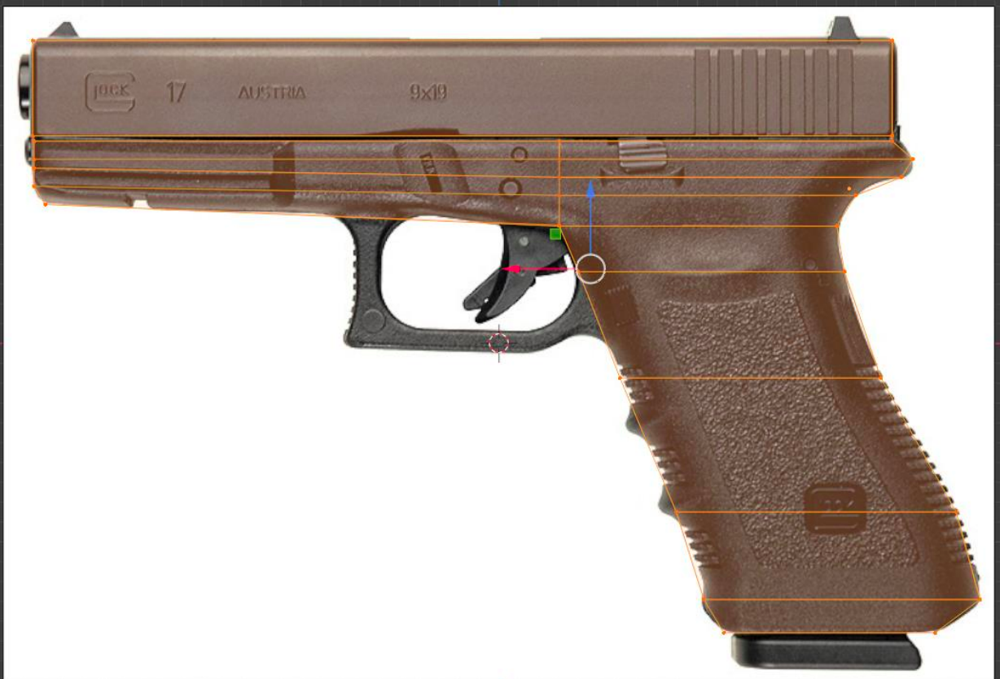
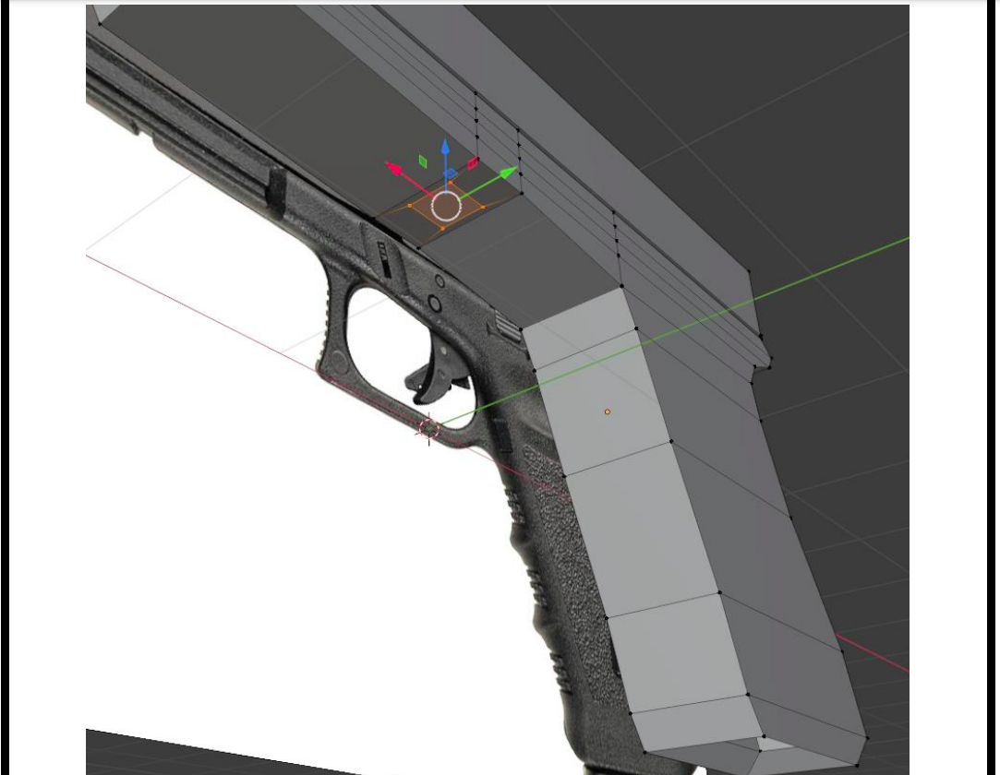
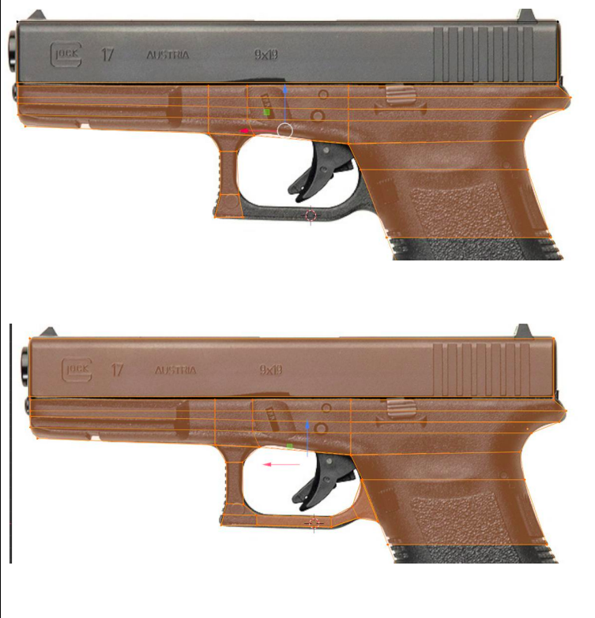
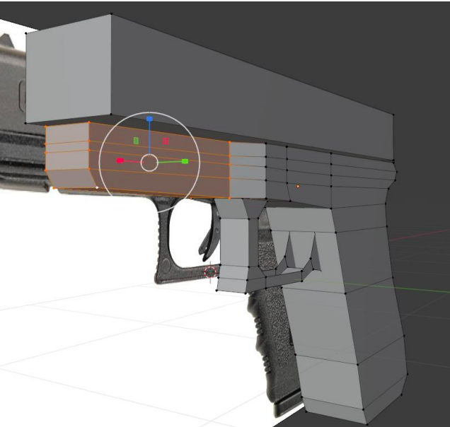
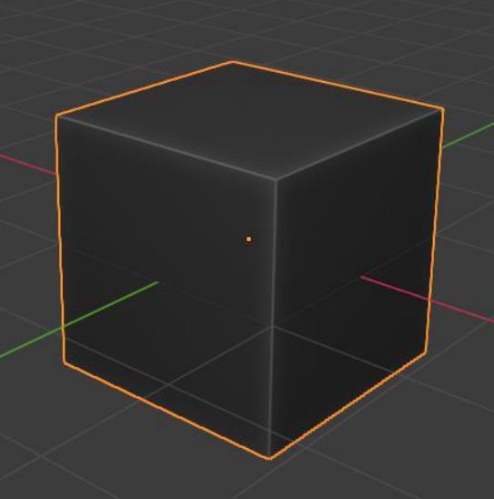
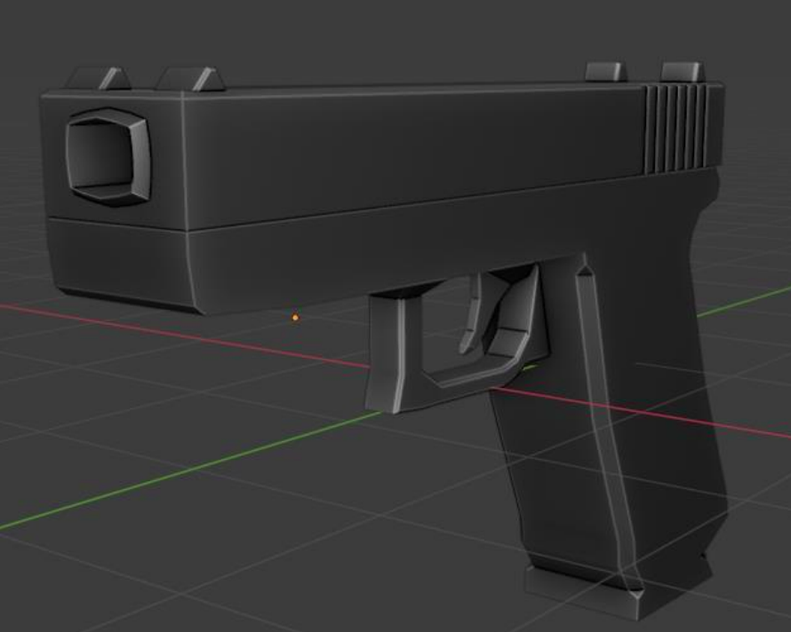

# AR/VR pool Day 01 - Modeling : Blender Gun

## Prerequisite

Download the last LTS Blender version
(3.4.1)

Try to refer to this shortcut list all
throughout the exercise, so that you learn
how to make multiple actions easily as
you create your models.

 

 

## Exercice 00 : First cube

Let's create our Blender scene. Start by launching Blender and deleting the objects already present in your scene hierarchy.
At the top right of your workspace, press the red "X" to enter a side view. Then, drag & drop a reference image in your scene. 
This is the image you will base your model on.

 

 

Press Tab to enter Edit mode (or change modes at the top left of your workspace).
Press Shift + A to create your first cube and move it on top of your reference image.
Scale it to create a rough top section for your gun.
Then add a second cube beneath it, and do the same for the lower part of the barrel.

 

 

## Exercice 01 : Loop cut and adding definition

In order to add definition to our object, we will need to subdivide it in many polygons.

There are many ways to achieve this:  
• Inserts  
• Bevels  
• Chamfers  
• Loop cuts  

The more you subdivide, the more precise your work will be, but too much precision can be burdensome, so be careful not to overdo it.
For our purposes, we will start by creating loop cuts. As you cut, move the new vertices around to define your shape.

 

 

## Exercice 02 : Extruding

As you select an edge, you may choose to create a new polygon from it. This is called extruding. You may extrude from a face, an edge, even a vertex.
In order to create the grip of your gun, extrude the edge you created with your previous subdivision.

Don't forget to define your shape as you go (either with multiple extrusions or with loop cuts, for example), so that your grip matches your reference as close as possible.

 

 

## Exercice 03 : Complex insertions & extrusions

In order to create the trigger area for our gun, we will need to shrink the central bottom part of our lower barrel.

Make two loop cuts in order to delimit your point of extrusion, then make an insert on the center face, so that you end up with a smaller face to extrude.

 

 

You may now extrude this face to start creating the shape of your trigger frame.
As you extrude, don't forget to move your vertices around to define your shape!

 

 

## Exercice 04 : more details

Let's add more detail to our gun.
Add one or more loop cuts to the front part of your lower barrel, so that you may scale down its width.

> Remember that you can limit your actions to a single axis by pressing X, Y or Z once while moving, rotating or scaling.

 

 

Add an autosmooth. As you do so, you might notice that your polygons' normals are random, which prevents your object from being shaded properly.
Normals are a part of a polygon that allows calculation of lights and reflections.
Thus, if the normals of two adjacent polygons differ, they won't react to light in the same way, which will make each of them clearly distinct in the render.

Adding an autosmooth allows us to add some artificial definition to your shape without necessarily adding more polys (which can be useful in specific
cases, like games or other realtime softwares).

For now, select your gun in Object mode, and under the green "Data Object Properties panel", set your Normals to Auto Smooth.
Add a custom material to your object. In the dropdown menu that allows you to adjust your viewport materials (wireframe, solid...), add a black matcap.

Add a Cavity, then play around with the Ridge setting to obtain something close to this:

 

 

## Exercice 05 : Bonus

You now have acquired the basics of modeling.  

Using your knowledge, add definition to your model :  
• Add the sights and the muzzle of your gun  
• Define the shape of the barrel  
• Add a different texture for each part of your
model  

 

 
