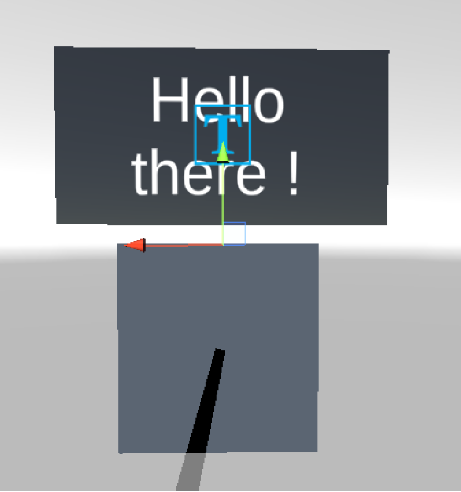

# AR/VR Day 01: Augmented Reality

## Prerequisite

Download the latest LTS version of Unity (2021.3)

Install the two modules Android Build Support via Unity Hub

 
 

## Exercise 01 : Scene setup

To build the AR project, we are going to use a package called « AR Foundation ».

To install this package, go to the unity package manager. In the list of offered packages, select « ARFoundation » and install it, as well as «ARCoreXR Plugin» package.

Once both of these packages are installed, go to the « project settings ».
In the XR plug-in Management tab, go to the android sub-tab, and pick «ARCore».

In the Other Settings section:
- Untick the Auto Graphic API checkbox and remove
Vulkan from the list of graphic APIs.  
- In Target Architecture, tick «ARM64».  
- Then, set your Minimum API level to Android 7.0,
and Scripting backend to IL2CPP.  

Back in your Unity scene, right click the « Hierarchy » panel and add two objects:  
- An AR session  
- An AR session Origin.  

> Both of these components are necessary: they will enable your compilation platform to create a session where AR interaction is possible.
>
> This way, the AR session Origin enables you to translate the position of some real objects (like a flat surface) as precise points, with coordinates in > the application, thanks to a tracking system.

Since the AR session already has a camera, you can now delete the base camera from your hierarchy.
Add a new component to your AR session origin object. To do so, select your object, then click «add component» in the inspector.

Add an AR Plane Manager. This ARCore library script will make you capable of detecting flat surfaces through your mobile device’s camera and overlaying a plane on it.
A plane is a flat surface represented by coordinates, dimensions, and bounding points.
You’ll notice that this script awaits several parameters, like the Prefab Plane.

This object will be instantiated in our scene as soon as the plane manager detects a flat surface.

To create that flat surface, add another object to your hierarchy. This time, make it an AR Default Plane.
Pass this new object as a parameter to the AR Plane Manager script.

 
 

## Exercise 02: Plane detection

Add a new component to your AR Session Origin: an AR Raycast Manager. This script will enable us to create rays from a point to another, towards a specific direction, on a defined or undefined length.

In our case, we want to create a ray starting from our camera objective, going on for an indeterminate length.
If the ray intercepts an object, it will make it easier for our program to know if the user is pointing the camera at an object or not.

In order to know if our camera ray is intercepting our AR Plane, let’s create a scipt.
In our hierarchy, create a new «AR controller» GameObject.
Add to it a new script type component. The goal of this script is for a cube to spawn when the user touches the screen.

In order to do that, the script will need to know if the camera is pointed to the AR Plane, and if the screen is
being pressed. If it’s the case, we will display a cube:
- Create two variables, a GameObject type one, representing the object to spawn, and a ARRaycastManager one, representing our ray manager.  
- In the Update() function, detect if the user touched the screen.  

> https://docs.unity3d.com/ScriptReference/Input-touchCount.html  

- If the user interacts with the screen, we will ask the RaycastManager if the ray coming from our camera has intersected with our AR Plane.  

> Use the Raycast() function !  

- Then, if RaycastManager finds one or several intersections, then we spawn our GameObject  

Once this script is done, don’t forget to pass an object to spawn as parameter (i.e., a Cube) as well as your RaycastManager using the Inspector tab.
Switch to developer mode on your android smartphone, and enable USB debugging.

Compile your app (Build and Run).

 
 

## Exercice 03: Interactive cube 

For this second part, we are going to create an interactive cube. We need to display an information panel when looking directly at a cube, with a simple description on it.

For starters, let’s create a cube in your hierarchy:  
- Add a new GameObject as a child, that we’ll call « InfoPoint ».  
- As a child of that GameObject, add a new quad object. It’s going to be used as our panel. Call it « InfoPanel ».  

Create a new material in your Assets folder. In Unity, materials are components enabling you to add a texture to your objects.
Set up this material to get a color that you enjoy, and add some transparency (in order to do that, don’t forget to set the “Rendering mode” parameter to transparent)

Let’s add some text to our panel:
- Create a « Text – Text Mesh Pro » object as an “InfoPanel”. Accept the « TMP essentials » imports.  
- Using the gizmo around the text, or the Transform parameter, make the text zone smaller, so that it fits our panel.  
- Tick the AutoSize checkbox, and set the min and max parameters respectively to 0 and 1000.  
- Then, slightly pull the text so that it’s not colliding with the panel.  

In order to create our panel’s animation, we need to move the gizmo from our « InfoPoint ».  
Move your infoPoint directly in contact with the top of our cube. We’ll be able to toy with a “Scaling” extension, to display our panel.

 

 

 
 

## Exercice 04: Hide and seek

Create a script that we will add to our « InfoPoint »
cube, named ShowInfo.
This script will toggle the display of our panel. If the
user is looking at the cube, let’s display the panel,
otherwise, it’s going to stay hidden.
In your ShowInfo class, create two variables:

- The first one, a Transform type named InfoPoint. It
will be our InfoPoint object’s position (that’s why
we moved the gizmo in the previous step ! ).
- The second one, a Vector3 type named panelScale.
This vector will be our panel object’s scale in our
script (that’s what we will reduce in order to hide
the panel)
- The last one, a float type named speed.
Let’s create two public functions:
- The void function OpenPanel(), which will set our
panel scale to a standard scale (1,1,1)
- The void function CloseInfo(), which will set our
PanelScale to a null scale (0,0,0).

 

> How can we change scale via a script ? Heard about Lerp() ?

 

Then, in our Update() function, let’s change our InfoPoint
object’s scale to show or hide our panel according to
the panelScale value.

 

Once this script is done, don’t forget to set your
variables to the corresponding object through the
ShowInfo component in the cube inspector.

 
 

## Exercice 05: Always in front

Let’s create another script named LookAtCamera.
With this new script, the panel will always face our
camera, no matter where we are looking at the cube
from.
Add this script to the InfoPoint section, and edit it:
- Create two variables, a Transform type named
camera, which will hold our AR camera’s
position, and a Vector3 type named panelAngle.
- In the Start() function of your script, set your
camera variable: it needs to hold the
MainCamera transform (if it hasn’t been done
already, don’t forget to use the tag MainCamera
on your ARCamera)
- In the Update() function, refresh the angle of your
current object, so that the current object
(InfoPoint) always faces the camera

 

> Look at LookAt() function !

 
 

## Exercice 06: All in one

Then, let’s create our last script, this one will enable us
to execute our previous scripts according to the
camera’s RayCast. Create a new script named
InfoHandler, and add it to your ARCamera.
Edit the script :
- Create a list variable, of ShowInfo type, and
initialize it. Name it infos.
- In the Start() function, retrieve the list of
ShowInfo type objects in the scene, and assign
this list to our infos variable.
- In the Update() function, begin by checking if
your raycast has met an object. If so, check if
your object has the « cubeInfo » tag (don’t
forget to add this tag to your cube).
- Create two new functions:
    - The openInfo function, which returns a
void and takes a ShowInfo object as
parameter. The function will iterate
through your list infos and check if an
object from the list is equal to the
ShowInfo object passed as parameter. If
so, call its OpenPanel() function.
    - The CloseAll() function, which returns a
void and doesn’t take any parameters. This
function will iterate through your list info
and call the CloseInfo() function for each
object.
- Finally, in your Update function, call both of
your new functions where they’ll be able to
open or close the panels, depending on the
raycast results.
You can now compile again on your mobile
device.