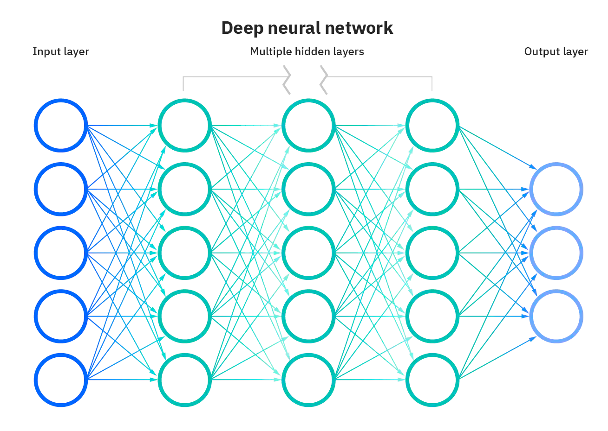
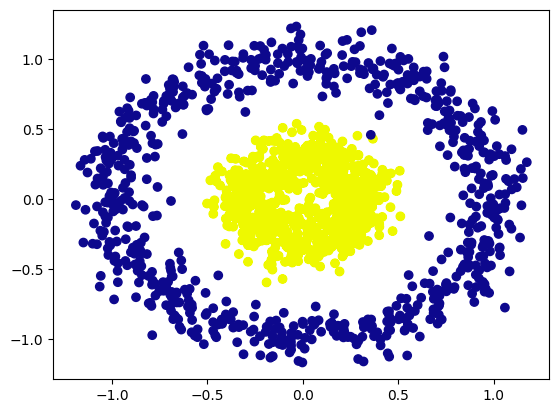
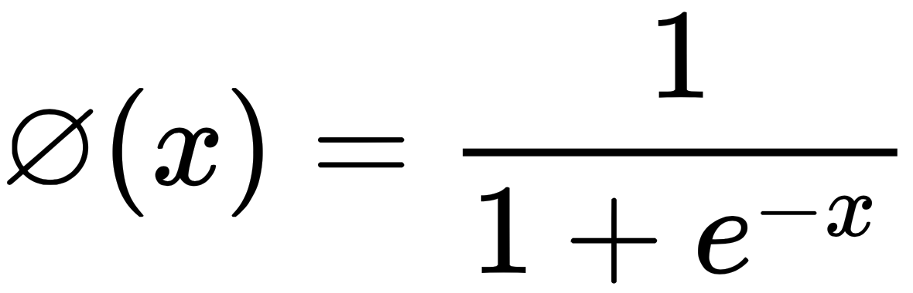
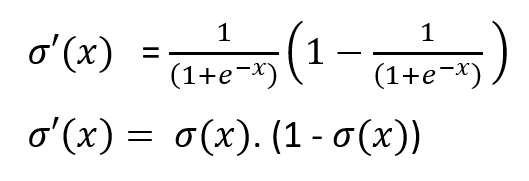
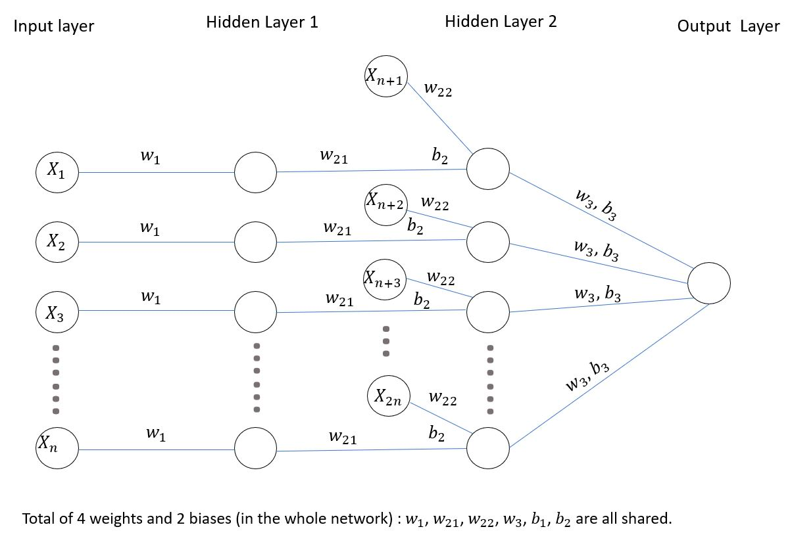
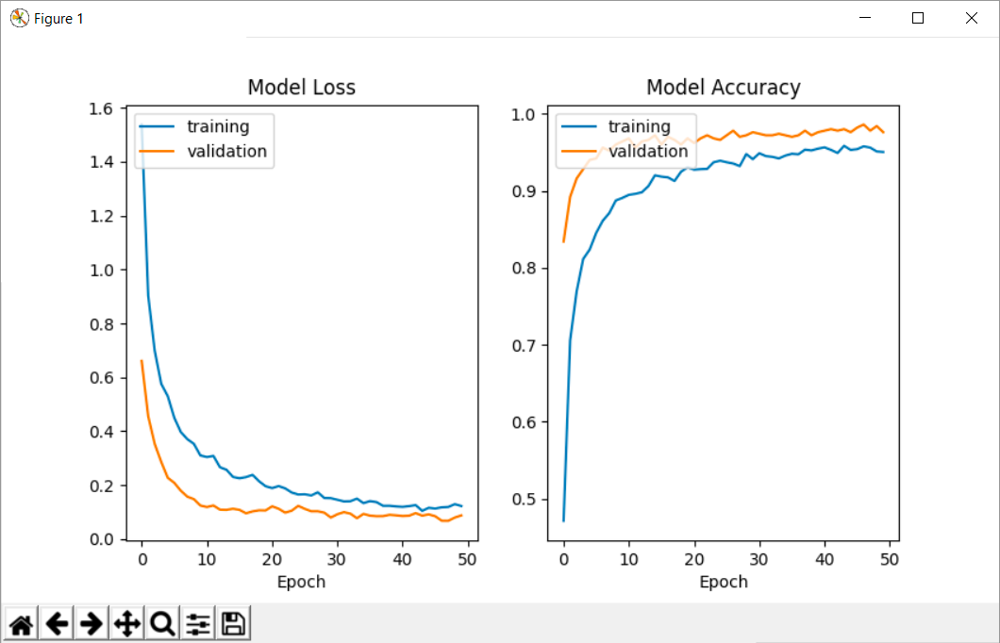

# Module 3 : Advanced neuron from scratch :computer:

Welcome to the third day of the AI Pool. Today we will discover the neuron from scratch. We will see how to create a neuron and how to train it. We will also see how to create a neural network with multiple neurons and multiple layers.

# Before starting

Please do all installations in [this document](./SETUP.md)

# Introduction

    

Multi-layer neural networks are a type of machine learning model used for pattern recognition, classification and prediction. They are inspired by the functioning of the human brain and are composed of several layers of interconnected neurons.

The first layer, called the input layer, takes input from the external environment and passes it to the next layer. Each successive layer processes this data in a more complex way, using processing algorithms and learning from the previously presented examples. The last layer, called the output layer, finally produces an answer or prediction based on the previously processed data.

Neural networks with multiple layers are particularly useful for complex tasks requiring high data processing capacity, such as speech or image recognition. They have also been widely used in many fields, including finance, healthcare and transportation.

It is important to note that neural networks with multiple layers require a considerable amount of training data and can be difficult to implement due to their complexity. However, they are often considered one of the most successful models in machine learning and have therefore been widely used in many applications.

# Submit :trophy:

You must submit your work in the `advanced_neuron_from_scratch.py` file.

# Instructions

## Step 1 - Make a dataset

In this step, we will create a dataset. We will use sklearn to create a dataset. The dataset entries can be represented using circles and should look like this:

    

The dimension of the dataset should be 
- **X**: `2, 1500` 
- **Y**: `1, 1500`

Try printing the datasets dimensions to see if they match the above numbers.

## Step 2 - Create an advanced neural network class

In this step, we will create a neural network class in which we will define the following variables:
- **params**: `dict`
- **dimension count**: `int`
- **learning rate**: `float`
- **training history (Loss & Accuracy)**: `numpy multidimensional array`
- **a params count halved**: `int`

### **We will create a class with the following methods:**

### Method 1 - Init

You will need to initialize the following variables:
- **dimensions**: `list of int`
- **learning rate**: `float`
- **epochs**: `int`

We will initialize a `params` dict including weights and bias. Don't forget to use the dimensions list to initialize it.

We will initialize the training history with a numpy multidimensional array.

### Method 2 - Forward propagation

In this method, we will create the forward propagation. We will use the sigmoid function to calculate the output of the neuron.

    

You need prototype your method like this:
- Input: X
- Output: activations

### Method 3 - Backward propagation

In this method, we will create the backward propagation. We will use the sigmoid derivative function to calculate the output of the neuron.

    

You need prototype your method like this:
- Input: Y, activations
- Output: gradients

### Method 4 - Update weights

In this method, we will update the weights of the neuron. We will use the learning rate to update the weights.

    

You need prototype your method like this:
- Input: gradients, learning rate
- Output: None

### Method 5 - Predict

In this method, we will predict the output of the neuron. Same as the forward propagation, we will use the sigmoid function to calculate the output of the neuron. You can use the forward propagation method to calculate the output.

    

You need prototype your method like this:
- Input: X
- Output: binary prediction

### Method 6 - History show

In this method, we will show the history of the training. We will use matplotlib to show the history of the training.

    

You need prototype your method like this:
- Input: None
- Output: show the plot

## Step 3 - Train the neural network

In this step, we will train the neural network. We will use the forward propagation, backward propagation and update weights methods to train the neural network.

You need prototype your function like this:
- Input: X, Y, layers, learning rate, epochs
- Output: None

We will display the history of the training, for this we will insert in your training a save of the history in the training history numpy multidimensional array.

# Resources :book:

- [Doc scikit-learn](https://scikit-learn.org/stable/)
- [Doc numpy](https://numpy.org/doc/stable/)
- [Doc matplotlib](https://matplotlib.org/3.3.3/contents.html)
- [Doc tqdm](https://tqdm.github.io/docs/tqdm/)
