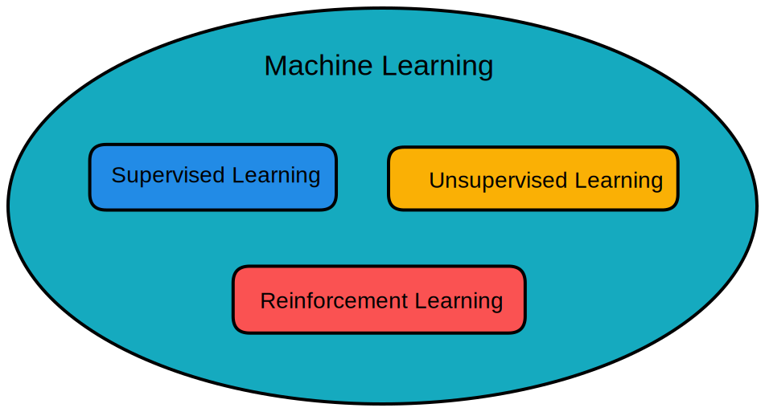
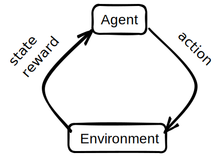
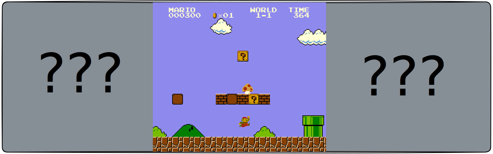
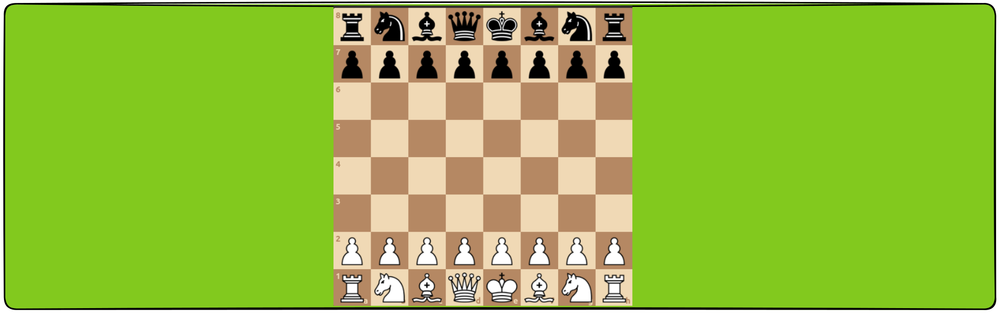
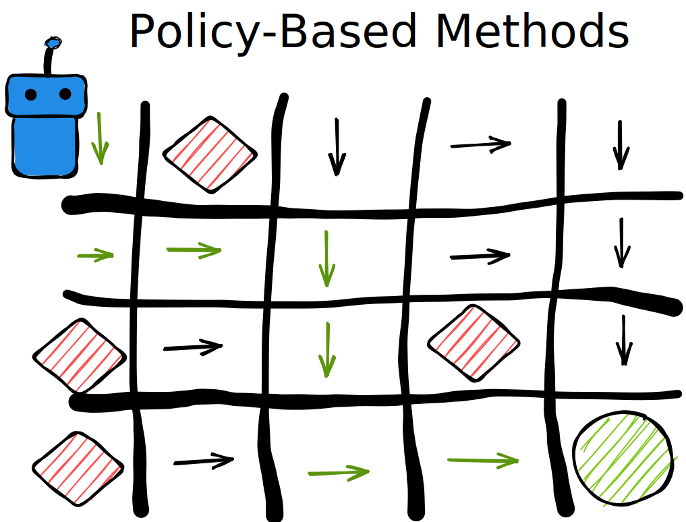
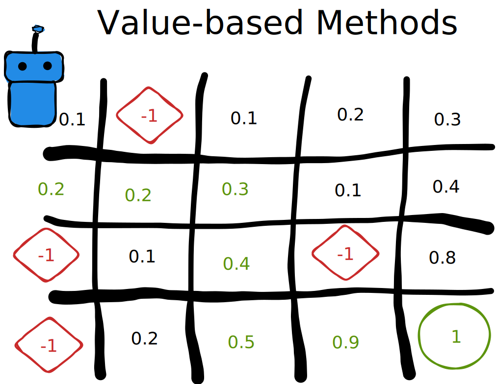

So far, this Pool has covered supervised learning.\
There are two other major fields inside machine learning: **Unsupervised** and **Reinforcement learning** !

In this fifth day, we will be exploring the various algorithms and libraries used in the latter.

# Reinforcement Learning: The Basics

Reinforcement Learning is perhaps the most appealing field in machine learning: teaching an artificial intelligence to play a video game or building a self-driving car can't possibly sound lame to anyone !

But a lot of math is involved behind all of this fun, so let's quickly get into the theory (don't skip this part, you **will** regret it) :

# 1. Introduction

> a basic representation of a reinforcement learning model: the agent sends an 'action' to the environment which returns a 'state' and a 'reward' to the agent.

The key concepts in reinforcement learning are the following:
- **The Agent**, which takes an action based on the state of the environment. The agent is synonymous with the `Player` in a video game, for example, Mario in 'Super Mario Bros.`\
In certain implementations of RL, this Agent can have a Memory of the previous events within the environment.
- **an action**, which is taken by the Agent within the environment. For example, a mapping of all the possible buttons on a keyboard, gamepad or simply a list of defined possible actions within the environment.\
In a grid world problem, like 'Sokoban', the actions could simply be 'left', 'right', 'up', 'down'.
- **The Environment**, which receives an action from the agent and returns a state and reward based on the given action. 
- a **state**, which represents all the information regarding the environment. It can also be a simple observation of itself.\
For example, in a game of chess, the player always receives the full state of the game: there is no **hidden** information from the agent.\
On the contrary, in a game of 'Super Mario Bros.', the player only receives an observation of the state: a grid of pixels the size of the screen. The player can not, at all times, see every detail of the state.

> Example of an observation

> Example of a state

- **a reward**, which is a value given by the environment to 'rate' the action the player has taken. This value can be anything but most importantly, a **negative** reward means that the action was probably not a good idea for the current state and a **positive** reward means that the action was of high value !

| Action               | Reward   |
| -------------------- | -------- |
| Taking a pawn        | +1       |
| Losing a pawn        | -1       |
| Taking a rook        | +5       |
| Losing a rook        | -5       |
| Castling             | +0       |
| Winning by checkmate | **+100** |
| Losing by checkmate  | **-100** |
> Possible rewards based on different chess situations

### As you may have guessed, the goal of Reinforcement Learning is to build an AI which develops an optimal policy for solving a certain environment by attempting to maximise its rewards !

# 2. Two main approaches

There are two main approaches to solving this problem and finding this policy:\
**Keep in mind** that both methods are just as good as the other and can provide better results in different situations. Most methods follow up on either one of these approaches, though, so it is important to learn both !

## a. Direct approach (Policy-based)

The first approach is to directly learn the policy function which will indicate the best action to take at each state of the enviornment.

> The arrows represent the optimal actions for each state, the red diamonds are obstacles (negative reward) and the green circle is the goal (positive reward). The blue robot is our agent.

## b. Indirect approach (Value-based)

The second approach is to indirectly learn the policy function by first defining a value for each state and picking the action that leads to the best state at each step !

# 3. It's up to you !

Now that you know the basic concepts of RL, we invite you to start implementing two basic algorithms:
- Q Learning, which is a value-based method
- and REINFORCE algorithm, which is a policy-based method

>While there is no particular obligation to learn value-based methods before policy-based methods, we encourage you to follow this order today because we will begin using a very important python library inside the `REINFORCE.ipynb` notebook !

**STEPS:**
- Follow the `Q_Learning.ipynb` notebook to get started with this day's first task !\
You will learn the implementation of the Q Learning algorithm which is a value-based approach to solve a custom made grid world environment !
- Follow the `REINFORCE.ipynb` notebook to implement a policy based approach, the REINFORCE algorithm in order to solve an OpenAI Gym environment, `Cartpole` !
- Use your favorite method to solve the `Cartpole` environment and share your results !