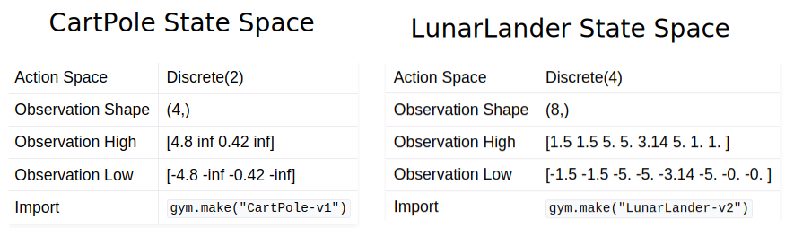
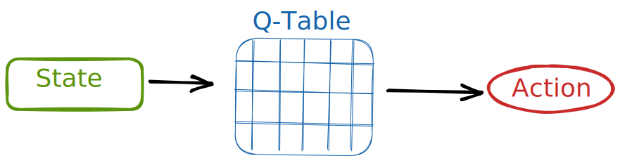
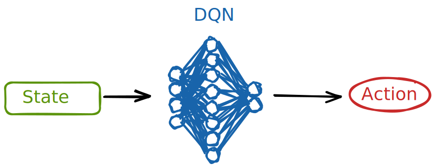
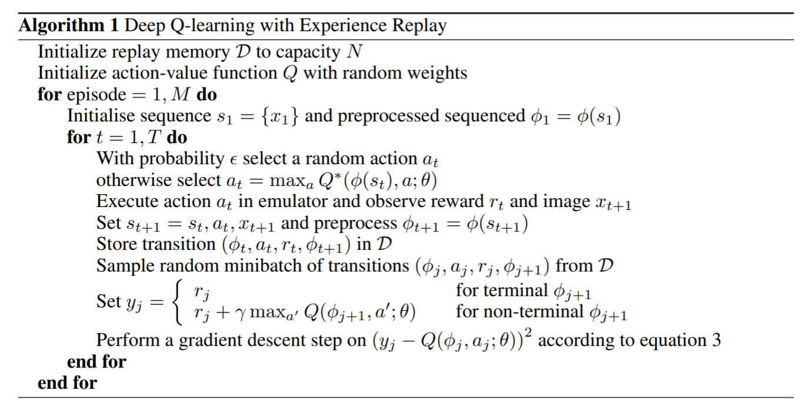
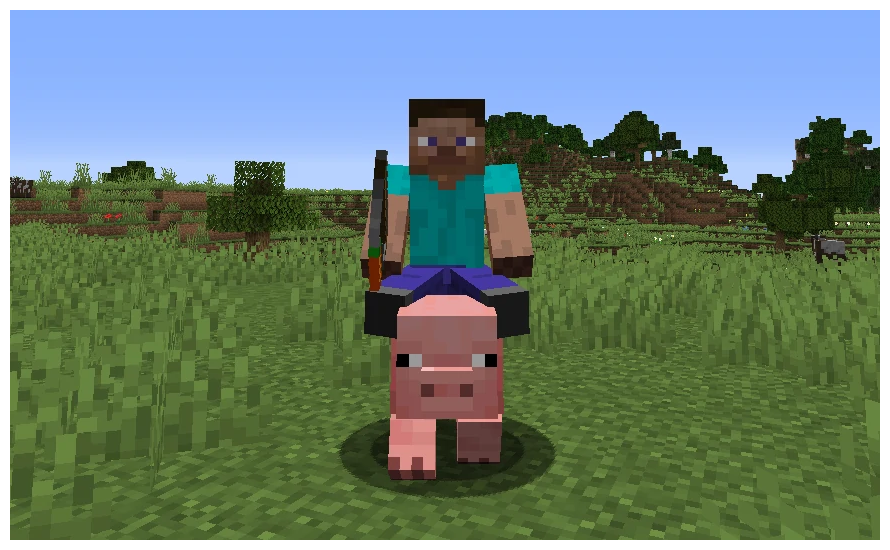
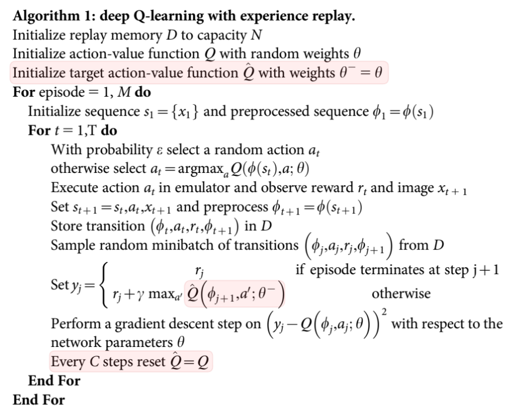

# Going Deeper with Deep Q Networks


> An agent solving the [Lunar Lander](https://www.gymlibrary.dev/environments/box2d/lunar_lander/) environment

Now that you've seen examples of both value and policy based methods for RL, let's take a deeper dive into the first one by implementing the Deep Q Network algorithm, which is what you get when you apply Deep Neural Networks to Q-Learning !

## 1. Why do we need neural networks ?

We were able to train pretty good agents and receive nice rewards using simple Q-Learning by creating a Q-Table and updating its values.



CartPole is one of the simpler Gym environments, with only four values in its state space and only two possible actions to be taken.\
With more and more complex environments, we need to use neural networks to approximate our Q-Table !



We have learned, during this week, of a function which allows to take an input and output a prediction based on that input.



The Deep Q Network can replace our Q-Table. It is a deep neural network which takes a state as input and outputs the q-values of each action within the state !

## Deep Q Network

The goal of this exercise is to implement the following algorithm using PyTorch and OpenAI Gym to solve the Lunar Lander environment !


> The Deep Q Network as defined in [Playing Atari with Deep Reinforcement Learning](https://arxiv.org/pdf/1312.5602v1.pdf) by Mnih et al.

### Dissecting the algorithm:

The first thing you can do with this algorithm is to extract the different variables or constants:

_Constants_:
- **Memory capacity** $N$
- **Training length** $M$, the amount of episodes before the training ends
- **Episode length** $T$, the amount of time steps before the episode ends
  - and its **timestep** $t$
- **Discount rate $\gamma$**, as you know, usually $\gamma = 0.99$

_Variables_:
- **Transitions $(\phi_t, a_t, r_t, \phi_{t+1})$**: a tuple containing the current state $\phi$, the action $a$, the reward $r$ and the new state $\phi$ for each time step $t$
- **Memory $D$**: a list of size $N$ containing $Transitions$
- **Action-value function $Q$**: a neural network
- **sequence $s$ and preprocessed sequence $\phi$**: using gym, we can simply consider that our sequence is already preprocessed and that $\phi$ is the state we receive when we call `env.reset()` or `env.step()`.
- **Parameters $\theta$** these are the parameters of our neural network $Q$

_Methods_:
- **Execute action in emulator and observe reward and image**: the usual OpenAI Gym implementation:
    ```py
    state, reward, termination, truncation, _ = env.step(action)
    ```
- **For terminal / non-terminal state**: this is where `termination` finally comes in handy inside our algorithms !
  > Tip: you can implement this condition in one line by replacing the formula with:
  > $$ y_j = r_j + (termination_j - 1) *  \gamma * max_{a'} * Q(\phi_{j+1}, a'; \theta) $$
  > Because `termination` is a boolean, it means the result will be reduced to
  > $$ y_j = r_j $$
  > when `termination` is equal to `True`
- **Gradient descent step**: the usual PyTorch implementation, nothing new here:
    ```py
    optimizer.zero_grad() ## reset the gradients
    loss.backward() ## backward propagation
    optimizer.step() ## updating the network
    ```


### Lunar Lander

You need to solve the Lunar Lander environment, so read the [documentation](https://www.gymlibrary.dev/environments/box2d/lunar_lander/) carefully.

```py
env = gym.make("LunarLander-v2")
```
> Bonus: your implementation should support the setting of parameters such as learning rate, discount rate, memory capacity, episode length, etc. from the command line, as such:
> ```py 
> python3 dqn.py --lr 5e-4 --gamma 0.99 -M 500 -N 1000 -T 1000
> ```

**Good luck !**

## DQN Extensions

In order to improve upon the base DQN algorithm, many different extensions were made.

We would like to ask you to implement this one, defined in [Human-level control through deep reinforcement learning](https://web.stanford.edu/class/psych209/Readings/MnihEtAlHassibis15NatureControlDeepRL.pdf) by Mnih et al.

It introduces the concept of a **target network**, which allows for the network to compare its predictions with a stable network while updating its "**online network**".

This prevents a problem with the vanilla DQN, where the network would attempt to minimize its loss by getting closer to its own prediction, meaning it would be like a pig chasing a carrot that is attached to a rod carried by the human that's riding it.



With this extension, we use two separate neural networks:
- The **online** network, which is used for prediction. 
  - This network's parameters are:
    - initialized randomly.
    - updated at each timestep according to the loss.
- The **target** network, which is used to compute the loss. 
  - This network's parameters are:
    - initialized to the same values as those of the **online** network.
    - updated every **C** timesteps, but instead of updating them with an optimizer, we replace its parameters with those of the **online** network.

Here's the updated algorithm:



There aren't many changes, as you can see.\
Let's go through each difference:

- First, we initialize a second neural network using the same parameters as the first.
- Then, instead of using the same network for our predictions and to compute our target, we use the second network instead.
- Finally, we reset its parameters to those of the first network every **C** steps.

See if you can implement this extension into your network and observe the differences in performance !

**Good luck !**