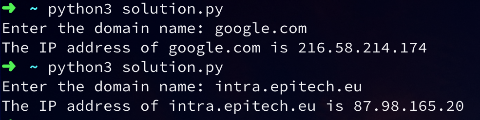

# DNS Lookup

## Objective

- To understand how the Domain Name System (DNS) works and to create a program that performs a DNS lookup.

## Subject
For this exercise, you will write a program that takes a domain name as input and returns its corresponding IP address.

You can use the built-in module "socket" in Python to perform the DNS lookup.

