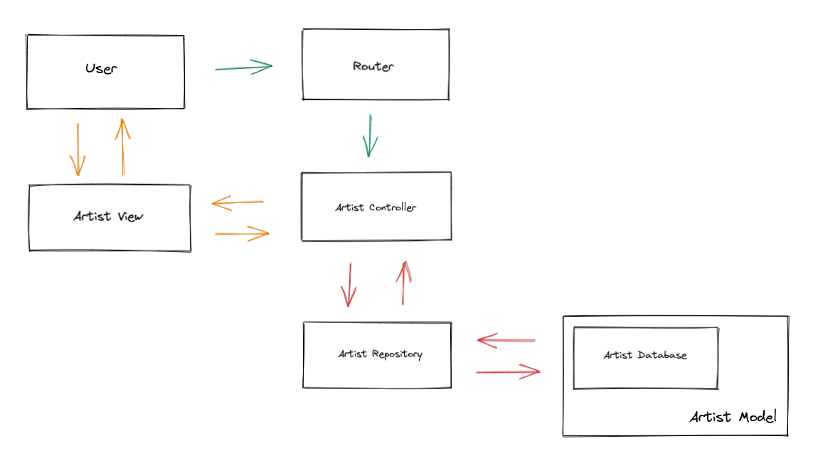

# PoC Software Pool 2023 - Day 01 - Typescript

Welcome to the Software pool 2023! 🚀

During this week, you will learn the base of the modern web programming, core
concept of frontend, backend, data storage... with a piece of devops.

**Day purposes**

✔️ Setup a NodeJS project.

✔️ Learn the basics of Typescript.

✔️ Discover software development good practices.

✔️ Introduce you to design pattern, especially MVC.

✔️ Create an interactive application using your terminal.

## Introduction

### Requirements

Typescript run using a Javascript runtime called [NodeJS](https://nodejs.org/en/).
To begin, install NodeJS using [nvm](https://github.com/nvm-sh/nvm).

> It's really complex to manage Node versions manually, `nvm` exists to help you
> manage it without any complexity.

> If you have any issue don't hesitate to ask the staff for help 😄

You can verify that node is correctly installed using the command below:

```shell
# Version must be at least >= 14
node -v
> v18.12.1
```

We will also need a package manager!  
Indeed, we don't need to totally start from scratch and reinvent the wheel for some things that are already working well, we will just import it.  
To do so, we will use [npm](https://www.npmjs.com) (which stands for _node package manager_ 😉)

You should already have it installed on your computer if you used `nvm`.

```shell
# Get npm version
npm -v
> 8.19.2
```

### Why Typescript?

You've probably already heard of [Javascript](https://developer.mozilla.org/en-US/docs/Web/JavaScript),
which was very popular in the Software world, mostly for web development.  
At the beginning, it was created to make web page interactive, but now you can
code almost everything in Javascript, even backend and standalone apps thanks to
NodeJS 🚀

> If you can read that page, it's thanks to Javascript that will transform
> markdown into human-readable text 😉

However, Javascript is not perfect and many cons come with it. His
weak type system, syntax liberty, `undefined` variables and the lack of rigor
can lead to disasters.

> An agnostic list of Javascript default is available [here](https://serokell.io/blog/why-typescript#typescript-vs.-javascript).

Typescript solves recurrent problems of Javascript:
- Typescript has a strong static type system.
- Auto-completion is much faster and accurate.
- Codebase are cleaner and better defined.
- Objet oriented programming is easier in Typescript than Javascript.
- Frameworks and applications are much more resilient and maintainable.

⚠️ Even if Typescript is better than Javascript, don't forget
that Typescript is still a superset of Javascript, NodeJS can only
understand Javascript so the final Typescript code will be transpiled in
Javascript.<br>
The benefits of Typescript mostly comes during development.

> If you are looking for a Typescript runtime, take a look at [Deno](https://deno.land).

You've understood it, you'll learn both Typescript and Javascript today!

### Warm up

To begin with Typescript, it's important to understand its core concepts.

Start by reading [Typescript for new programmer](https://www.typescriptlang.org/docs/handbook/typescript-from-scratch.html).

> You can also take few minute to read [Javascript building blocks](https://developer.mozilla.org/en-US/docs/Learn/JavaScript/Building_blocks).

Take your time to read some documentation during this day, it will help you to understand what
you are doing when you will code.

It's also recommended to read more about [types](https://www.typescriptlang.org/docs/handbook/2/everyday-types.html),
[functions](https://www.typescriptlang.org/docs/handbook/2/functions.html) and [objects](https://www.typescriptlang.org/docs/handbook/2/objects.html).

> You can also use the official [Typescript playground](https://www.typescriptlang.org/play)
to test and share pieces of code 😃

Finally, it's important to use an IDE to help you.
We recommend you [VSCode](https://code.visualstudio.com) or [WebStorm](https://www.jetbrains.com/webstorm/).

> You can get a free JetBrains license using your [school account](https://console.bocal.org/#/login).

## Step 0 - Setup

As usual, every exercises must be pushed to a git repository.<br>
TODO: add classroom link
To make it easier, we will use a GitHub classroom! Follow this [link]() to create your git repository.

You can then clone your repository.

```shell
git clone git@github.com:PoC-Community/software-pool-days-{YOUR-GITHUB-USERNAME}
```

For each day, we will create a new folder. Start with the `day01`.

```shell
mkdir -p day01
```

## Step 1 - Hello World

It's time to start coding! We will start with a simple `Hello World` program.

### Initialization

First, we must create a new NodeJS project and setup Typescript inside it.

To create you project, use this command from npm:

```shell
# Init your project
npm init
```

It will create a file named `package.json`. You can consider it as a `Makefile`.
It can store commands, but also register dependencies, version and special metadata related to your project.

Now, install Typescript in your project

```shell
npm install -D typescript ts-node @types/node
```

If you open your `package.json`, you should see them in `devDependencies`.

A new file named `package-lock.json` should also appear. Don't remove it, it's a
file that list all dependencies required by your installed dependencies.  
You should also have a `node_modules` directory, it contains all the source files of those dependencies 😉

> We use the `-D` flag to specify that our dependencies are only for development
> purposes. Remember, our final code will be in Javascript, so we don't need those
> dependencies in production.<br>
> Learn more about dependency management [here](https://stackoverflow.com/questions/18875674/whats-the-difference-between-dependencies-devdependencies-and-peerdependencies).

⚠️ Don't forget to create a [`.gitignore`](https://stackoverflow.com/questions/27850222/what-is-gitignore-exactly)
to avoid pushing the `node_modules` directory.

### Say hello

You can now create a `src` directory and a file `helloWorld.ts` in it.

> 💡 Typescript files have the `ts` extension while Javascript files have the `js` extension.

In this file, create a function `helloWorld` that will [display](https://nodejs.org/api/console.html) 
`Hello World!` in your terminal.

Don't call it directly in this file, instead [export it](https://www.typescriptlang.org/docs/handbook/modules.html).

### Where's the main?

Now create a file `index.ts`, then import and call you `helloWorld` function inside it 🚀

> Typescript and Javascript don't have a concept of entrypoint like `C` or
> `Go` have with the `main` function.<br>
> To keep code clean, it's common to create a `index.ts` that will be the
> entrypoint of your program.
> You can also use `index.ts` in subdirectories to aggregate imports.

### Start program

OK, now it's time to launch the project 🔥

For this, we will set up a `start` script.  
There is a section called `scripts` in your `package.json`, it's where you
can define commands to manage your project. For example, you can run the code,
run your tests, deploy infrastructure or whatever is required to manage your project.

Write a script `start` that will execute the command `ts-node src/index.ts`.

> 💡 Using [`ts-node`](https://www.npmjs.com/package/ts-node) enables you to directly execute TypeScript on NodeJS without precompiling it

You can run a script defined in your `package.json` using `npm run <script name>`.<br>
So to run your program, type `npm run start` in your terminal and press enter to see your `Hello World!` message 🎉

> Discover more about npm scripts [here](https://docs.npmjs.com/cli/v8/using-npm/scripts).

Congratulation! You have run your first Typescript program 🚀

## Step 2 - Sort my numbers

Printing stuff is great, but a real program is composed of logic. This is what we will
learn here.

Let's start with a `sort numbers`!

The goal is to: 
1. Sort a list in ascending order
2. Remove odd numbers.
3. Display the result.

This way, you'll be familiar with loop, conditions, arrays and methods.

### Sort like a pro

Still in `src`, create the file `getSortedEvenNumbers.ts`.

Inside it, create a function `getSortedEvenNumbers`:
- It takes an `array` of `number` as parameter.
- It returns a `string` composed of all even numbers in ascendant order split by a `-`.

> 💡 You should have a look at the [sort](https://developer.mozilla.org/fr/docs/Web/JavaScript/Reference/Global_Objects/Array/sort),
> [filter](https://developer.mozilla.org/fr/docs/Web/JavaScript/Reference/Global_Objects/Array/filter)
> and [join](https://developer.mozilla.org/fr/docs/Web/JavaScript/Reference/Global_Objects/Array/join) methods.

Update `src/index.ts` to call your function and run your program to check if it's working 💯

Here's an example for the following input: `[1, 0, 19, 17, 16, 8, 13, 24]`.

```text
0 - 8 - 16 - 24
```

You can try other combinations by manually changing your code or, you can write **tests** 🧪

### Test like a pro

It's really important to correctly test your code, a code not tested can lead
 to unpredictable bugs and the time lost to debug it could be avoided by creating some tests.

To do so, we will use [Jest](https://jestjs.io), the most popular Javascript testing tool.

Start by installing it

```shell
npm install -D jest ts-jest @types/jest
```

> Yes, it's again a development dependencies as we won't need to run tests in production.

In your `package.json`, add those scripts:
- `test`: `jest tests/ --env=node`
- `test:cov`: `jest tests/ --env=node --coverage`
- `test:watch`: `jest tests/ --env=node --watchAll`

> 💡 It's common to add a subcommand with `:` to change the behavior of a command.

Now we will [configure Jest](https://jestjs.io/docs/configuration).
Create the file `jest.config.json` with the following content:

```json
{
    "transform": {
        "^.+\\.tsx?$": "ts-jest"
    },
    "testMatch": ["**/tests/**/*.tests.ts"],
    "moduleFileExtensions": ["ts", "js"]
}
```

Create a `tests` directory, this is where we will write our tests.

Inside, create the file `getSortedEvenNumbers.tests.ts`.

> Suffix files with `<file tested>.tests.ts` are a standard way to name your unit tests.

To make sure your `getSortedEvenNumbers` works as intended, you can write a test for each of these cases:
- Only positive numbers
- Only negative numbers
- Mixed numbers

<Details>
  <Summary>
  <strong>Example of a test</strong>
  </Summary>

  Imagine you want to test a simple `sum` function:

  ```ts
  // sum.ts
  /**
  * Simply do an addition
  *
  * @param nbOne first number to compute
  * @param nbTwo second number to compute
  * @return result of nbOne + nbTwo
  */
  export default (nbOne: number, nbTwo: number): number => {
    return nbOne + nbTwo;
  };
  ```

  Your test file will be:

  ```ts
  // sum.tests.ts  
  import sum from '../src/sum';
  
  /**
   * Test sum function
   * Compute some number to verify if sum is working well
   */
  describe('Test sum function', () => {
    it('Simply 1 + 1', () => {
      expect(sum(1, 1)).toBe(2);
    });
  
    it('The answers of the Universe !', () => {
      const result: number = sum(21, 21);
      expect(result).toBe(42);
    });
  });
  ```
</Details>

Execute your tests with `npm run test` 🚀

```shell
npm run test

# Below is an example of result
# PASS  tests/getSortedEvenNumbers.tests.ts
# Test getSortedEvenNumbers function
#   ✓ Case positive numbers (1 ms)
#   ✓ Case negative numbers (1 ms)
#   ✓ Case positive and negative numbers
# 
# Test Suites: 1 passed, 1 total
# Tests:       3 passed, 3 total
# Snapshots:   0 total
# Time:        1.637 s, estimated 2 s
```

⚠️ Don't forget to add the directory `coverage` in your `.gitignore`.

## Step 3 - Hello asynchronicity

You should have understood Typescript core concept, now it's time for the
most important concept and unfortunately, the hardest: **asynchronicity**.

### Theory

> ⚠️ Take your time to read the links given in this part before coding.
> If you do not understand asynchronicity, you won't be able to understand
> more complex programs.

In Javascript/Typescript, your program is executed following an [event loop](https://www.digitalocean.com/community/tutorials/understanding-the-event-loop-callbacks-promises-and-async-await-in-javascript),
so NodeJS doesn't wait the end of a function before calling the next one.

It can be strange if you are used to `C` but in a NodeJS program, if you run
a function which takes 5 seconds to finish and another that takes 1 second.
You'll see the result of the second before the first one 🤯

This fact raises a lot of constraints because sometime, you need to get the
result of a function to send it to another.

To solve this issue, the [callback](https://codeburst.io/javascript-what-the-heck-is-a-callback-aba4da2deced)
system appeared, but unfortunately it creates new problems and huge codebase with
the [callback hell](https://www.geeksforgeeks.org/what-is-callback-hell-in-node-js/).

A new concept then appear and definitely saved us from the hell: [Promises](https://developer.mozilla.org/en-US/docs/Web/JavaScript/Guide/Using_promises).

Promises allow a function to be waited before calling the next function.
To use it, we use the [async/await](https://developer.mozilla.org/en-US/docs/Web/JavaScript/Reference/Statements/async_function) syntax.

> If you are lost don't hesitate to ask the staff for help, they'll be happy to help you understand this concept 😜

### Practice

Let's practice: you'll create a program that displays `Hello` and the name
wrote by the user in the terminal.

To retrieve inputs from the terminal, we will need to use external dependencies.

Let's install them:
```shell
# Install the prompts module
npm install prompts

# Install its types as a development dependency
npm install -D @types/prompts
```

Still in `src`, create the file `helloName.ts`.

Inside it, create a function `askName` :
- It does not take parameters
- It returns the username retrieved from the terminal.

> Read the documentation of [prompts](https://www.npmjs.com/package/prompts) to read input from the terminal.<br>
> Don't forget that your function must be waited, correctly type it with `async` 😉

You can then create the function `helloName` that will display `Hello ${name}!`
where `${name}` is the result of `askName`.

> To use `await`, your function must be asynchronous.
> Don't forget to [handle errors](https://developer.mozilla.org/en-US/docs/Web/JavaScript/Reference/Statements/try...catch).

To test your function, update `src/index.ts` to call `helloName`.

You should get the following result:

```text
✔ What is your name? … Slim Shady
Hello Slim Shady!
```

> To see the effect of the asynchronicity, remove some `await` in your program and try again.

## Step 4 - Clean Code

Before going through complex exercises, we are going to set up guardians of clean code.

There are two tools well known in Node for this:
- [Eslint](https://eslint.org) will set rules to make your code follow a standard.
It will help to ensure the codebase is clean and spot errors before you run your code.
- [Prettier](https://prettier.io) set rules to keep the same coding style in
the codebase, which is very useful when collaborating with other developers on a project.

We will also customize the behavior of Typescript using a [dedicated config file](https://www.typescriptlang.org/tsconfig).

Create a `tsconfig.json` file with the following content:
```json
{
  "compilerOptions": {
    "esModuleInterop": true,
  }
}
```
> You can learn more about why we need this option from the [documentation](https://www.typescriptlang.org/tsconfig#esModuleInterop) or in this [great blog post](https://duckwho.codes/posts/esmoduleinterop/) 😄

### ESLint - Quality guardian

First, install `eslint` in your development dependencies:
```shell
npm install -D eslint
```

Let's configure it with the CLI:
```shell
# Initialize eslint
npx eslint --init
```

> 💡 `npx` is a tool to execute a binary installed locally in a NodeJS project.
> For example, you can use `npx depcheck` to detect unused dependencies

<Details>
  <Summary><strong>Follow those steps when configuring ESLint</strong></Summary>

  <pre>
  ? How would you like to use ESLint?
  <b>To check syntax and find problems</b>
  ? What type of modules does your project use?
  <b>JavaScript modules (import/export)</b>
  ? Which framework does your project use?
  <b>None of these</b>
  ? Does your project use TypeScript?
  <b>Yes</b>
  ? Where does your code run?
  <b>Node</b>
  ? What format do you want your config file to be in?
  <b>YAML</b>
  The config that you've selected requires the following dependencies:

  @typescript-eslint/eslint-plugin@latest @typescript-eslint/parser@latest
  ? Would you like to install them now?
  <b>Yes</b>
  ? Which package manager do you want to use?
  <b>npm</b>
  </pre>
</Details>

> Those steps are configuring some ESLint rules, during the pool we will follow the
> [AirBnB](https://github.com/airbnb/javascript) convention.

Let's add some rules in the `package.json` to run the linter:
- `lint`: `eslint src/**/*.ts`.
- `lint:format`: `eslint --fix src/**/*.ts`.

> You will certainly find syntax errors when running it.

As you'll see, calls to `console.log` are considered as a warning.<br>
We also need to use the base convention provided by AirBnB.

To fix this, let's update our ESLint configuration with the one below:
```yaml
env:
  browser: true
  es2022: true

extends:
  - airbnb-base
  - airbnb-typescript/base
  - plugin:@typescript-eslint/recommended

parser: '@typescript-eslint/parser'

parserOptions:
  project: tsconfig.json
  ecmaVersion: latest
  sourceType: module

rules:
  no-console: 'off'
  quotes:
    - error
```

Make that you have the following modules in your `devDependencies`:
```json
"@typescript-eslint/eslint-plugin": "^5.42.0",
"@typescript-eslint/parser": "^5.42.0",
"eslint": "^8.27.0",
"eslint-config-airbnb-base": "^15.0.0",
"eslint-config-airbnb-typescript": "^17.0.0",
```

If a dependency is missing, install it.
> It's not a problem if your versions are different 😉

As well, ESLint extensions are available in your favorite IDE:
- [VSCode](https://marketplace.visualstudio.com/items?itemName=dbaeumer.vscode-eslint)
- [WebStorm](https://www.jetbrains.com/help/webstorm/eslint.html)

With those, you will see errors and warning directly in your code 🤩

### Prettier - Clean guardian

ESLint is ready, let's setup Prettier now!<br>
As before, you have to add it as a development dependency:
```shell
npm install -D prettier eslint-config-prettier eslint-plugin-prettier
```

> [`eslint-config-prettier`](https://github.com/prettier/eslint-config-prettier#readme) is used avoid conflicts between ESLint and Prettier rules, while [`eslint-plugin-prettier`](https://github.com/prettier/eslint-plugin-prettier#readme) will report Prettier errors in ESLint 😉

When you are done, update your `.eslintrc.yml` to:
- [extends `plugin:prettier/recommended`](https://github.com/prettier/eslint-plugin-prettier#recommended-configuration)
- set the `prettier/prettier` rule to `warn`

Finally, create a `.prettierrc.json` file at the root of your project and [configure](https://prettier.io/docs/en/configuration.html)
it as you like!

There are also extensions available:
- [VSCode](https://marketplace.visualstudio.com/items?itemName=esbenp.prettier-vscode)
- [WebStorm](https://www.jetbrains.com/help/webstorm/prettier.html)

## Step 5 - Artists Book v1.0

You are ready for a complex exercise. Let's create our first application!

It will be a program that helps you manage your favorite artists from your terminal 🎵

We will not code everything in one step, that would be too huge for this moment.

⚠️ Read the **whole** step before coding, it will help you understand what to do and how to do it.

Let's start with a simple implementation. The goal is to have a CLI similar to this one:
```text
Welcome into your Artists Book!

What do you want to do?
1 - List my favorite artists
2 - Leave

# User tip input
> 3

Tip 1 or 2.

# User tip input
> 1

Here's your favorite artists:
-- 1 -- B2O
-- 2 -- SCH
-- 3 -- Laylow
-- 4 -- Billie Eilish

What do you want to do?
1 - List my favorite artists
2 - Leave

# User tip input
> 2

See you!
```

To do this, we must build a program that follows a strong architecture.
We will use one of the most popular: [MVC](https://www.calhoun.io/using-mvc-to-structure-go-web-applications/).

MVC stands for **Model - View - Controller**. It's an architecture where your
code logic is split into smaller parts to easily maintain and scale a project.

We will now adapt MVC to our need, don't worry if we do not strictly follow the architecture.

Here's a schema of your architecture:


Let's code it step by step 😄

### Router

The router corresponds to the entrypoint of your program and the main loop.<br>
It has different roles:
- Display actions to user.
- Catch the user input.
- Call `controllers` to execute the action asked by the user.

A good architecture also requires a good folder management in your code. 
Each _resource_ must be in its own folder with the `router` making the link
between them.

- Create a directory `artistsBook` in `src` and create the file
`router.ts` in it.
- Create a function `router` that will perform the loop described in the example.
> You are big boy/girl now, you got the keys to do it by yourself 💪
- Update `index.ts` to call `router`.

### Controllers

A controller is in charge of the business logic that manages your resources.

Its only purpose is to create the link between the function that manage your
data storage (for now it will be a simple `JSON` file) and functions exposed
to the user.

- Create a directory `controllers` in the `artistsBook` folder. 
- Create a directory `artists` in it.
- Create a file `display.ts`
- Write the function `displayAll` that controls the display of the user's favorite artists

### Repositories

A repository is responsible for all interactions with the data storage.
- Create a directory `repositories` in the `artistsBook` folder. 
- Create a directory `artists` in it.
- Create a file `get.ts`
- Write the function `getAll` that retrieves user's favorite artists

### Views

A view exposes a list of functions to the user to make it interact with a resource.

- Create a directory `views` in the `artistsBook` folder.
- Create a directory `artists` in it.
- Create a file `display.ts`
- Write the function `displayAll` that displays the user's favorite artists in the terminal.

### Models

A model defines the type of the stored data.

- Create a directory `models` in the `artistsBook` folder.
- Create a file `artist.ts`
- Export a type `Artist` that contains a field `name` of type `string`

### Data

Data defines your storage, it can be a database, an Excel file or whatever that
can store data. Here, it will be a simple `JSON` file.

> [JSON](https://en.wikipedia.org/wiki/JSON) stands for JavaScript Object Notation.
> It's a standard like `CSV`, `XML` or `YAML` used to define a structured data.

> We'll discover real databases tomorrow 👀

- Create a directory `data` in the `artistsBook` folder.
- Create the file `artists.json` with the following content:

```json
[
  {
    "name": "B2O"
  },
  {
    "name": "SCH"
  },
  {
    "name": "Laylow"
  },
  {
    "name": "Billie Eilish"
  }
]
```

You will need to modify your `tsconfig.json` to [import `.json` files](https://www.typescriptlang.org/tsconfig#resolveJsonModule) 😉

### Summary

Finally, you should have the following architecture:

```text
artistsBook/
  router.ts
  controllers/
    artists/
       display.ts
  repositories/
    artists/
      get.ts
  views/
    artists/
       display.ts
  models/
    artist.ts
  data/
    artists.json
```

This exercise may seems hard but if you write your code step by step, it will
be a piece of cake 🍰!

## Step 6 - Artists Book v2.0

You've built the base of your MVC architecture, it's time to improve it 📈

For now, you can only read data, let's add operations to create, update or delete it.

Those four primitive operations are mandatory to manage a resource in a data storage.
They are usually called [CRUD](https://en.wikipedia.org/wiki/Create,_read,_update_and_delete),
which stands for **CREATE - READ - UPDATE - DELETE**.

Let's add the missing ones 🚀

### CREATE

Update your codebase to allow a user to **add** a new artist to his list.

#### Repository

Add a file `create.ts` in your artists repository.

In it, write the function `create` that will add a given artist in the data storage.<br>

> ⚠️ You'll need to [write data](https://medium.com/@osiolabs/read-write-json-files-with-node-js-92d03cc82824)
> into `artists.json`.<br>
> Take care to not **lose data** when you rewrite the file. 

It must have the prototype below:

```ts
function create(name: string, callback: (found: boolean, err: NodeJS.ErrnoException) => void) {}
```

`found` must be set to `true` if an `Artist` match the given name.

> `found` help you to know what to do after calling `create`, for example if
> `found` is true, you'll display `<artist name> already exists!` in the terminal.

As you've seen in the function prototype, you will use a [`callback`](https://developer.mozilla.org/en-US/docs/Glossary/Callback_function).

> Even if you know `async/await` and could do this with it, it's important to understand callbacks 😄

Now that you have updated `repository`, you must update other parts of your MVC.

#### View

- Create the file `ask.ts` in the `views` directory.
- Write the function `askName` that retrieves an artist's name from the terminal.

> 💡 You can copy code from the precedent step to win time 

#### Controller

- Create the file `create.ts` in the `controllers` directory.
- Write the function `create` that controls the artist addition.

#### Routing

Add the possibility to create an artist in `router.ts`.

#### Result

You can code other functions to make your code works. For example, a function to
display the artist name if it has been correctly added to the list.<br>
This function should be in the views, in `display.ts` for example.


You should have the following result: 

<details>
  <summary>Result preview</summary>

  ```text
  Welcome into your Artists Book!

  What do you want to do?
  1 - List my favorite artists
  2 - Add an artist to my favorite
  3 - Leave

  # User tip input
  > 2

  What's the artist's name?

  # User tip input
  > Bob Marley

  Bob Marley has been added to your favorite artists!

  What do you want to do?
  1 - List my favorite artists
  2 - Add an artist to my favorite
  3 - Leave

  # User tip input
  > 1

  Here's your favorite artists:
  -- 1 -- B2O
  -- 2 -- SCH
  -- 3 -- Laylow
  -- 4 -- Billie Eilish
  -- 5 -- Bob Marley

  What do you want to do?
  1 - List my favorite artists
  2 - Add an artist to my favorite
  3 - Leave

  # User tip input
  > 2

  What's the artist's name?

  # User tip input
  > Bob Marley

  Bob Marley already exists!

  What do you want to do?
  1 - List my favorite artists
  2 - Add an artist to my favorite
  3 - Leave

  # User tip input
  > 3

  See you!
  ```
</details>
<br>

### UPDATE

Update your application to allow the user to **update** an artist in his list.

#### Repository

Create the file `update.ts` in your `repository` folder.

Add the function `update` to modify an artist in the data storage.

The function must follow the following prototype:

```ts
function update(name: string, newName: string, callback: (found: boolean, err: NodeJS.ErrnoException) => void) {}
```

> ⚠️ Same as create, take care when you rewrite the JSON file.

#### View

Add the function `askNewName` in your `view`.

> I'm sure you have understood the logic 🧠

#### Result

Don't forget to update your `controller`, the `router` and add anything
required to correctly update an artist.

You should have a result similar to this one:
<details>
  <summary>Result preview</summary>

  ```text
  Welcome into your Artists Book!

  What do you want to do?
  1 - List my favorite artists
  2 - Add an artist to my favorite
  3 - Update an artist in my favorite
  4 - Leave

  # User tip input
  > 2

  What's the artist's name?

  # User tip input
  > Bob Marley

  Bob Marley has been added to your favorite artists!

  What do you want to do?
  1 - List my favorite artists
  2 - Add an artist to my favorite
  3 - Update an artist in my favorite
  4 - Leave

  # User tip input
  > 3

  What's the name of the artist you want to update?

  # User tip input
  > unknown

  What will be the new name of unknown?

  # User tip input
  > Mac Miller

  unknown is not in your favorite list.

  What do you want to do?
  1 - List my favorite artists
  2 - Add an artist to my favorite
  3 - Update an artist in my favorite
  4 - Leave

  # User tip input
  > 3

  What's the name of the artist you want to update?

  # User tip input
  > B20

  What will be the new name of unknown?

  # User tip input
  > Booba

  B2O has been successfully updated.

  What do you want to do?
  1 - List my favorite artists
  2 - Add an artist to my favorite
  3 - Update an artist in my favorite
  4 - Leave

  # User tip input
  > 1

  Here's your favorite artists:
  -- 1 -- Booba
  -- 2 -- SCH
  -- 3 -- Laylow
  -- 4 -- Billie Eilish
  -- 5 -- Bob Marley

  What do you want to do?
  1 - List my favorite artists
  2 - Add an artist to my favorite
  3 - Update an artist in my favorite
  4 - Leave

  # User tip input
  > 4

  See you!
  ```
</details>
<br>

### DELETE

Update your application to allow the user to **delete** an artist in his list.

#### Repository

Create the file `delete.ts` in your `repository` folder.

Add the function `deleteFunc` to delete an artist in the data storage.

> 💡 We can't use `delete` as it's [a reserved word](https://www.w3schools.com/js/js_reserved.asp)

The function must follow this prototype:

```ts
function deleteFunc(name: string, callback: (found: boolean, err: NodeJS.ErrnoException) => void) {}
```

> ⚠️ Same as before, take care when you rewrite the JSON file.

#### View

You already have the `askNewName` function that you can use 😉

#### Result

Don't forget to update your `controller`, the `router` and add anything
required to correctly delete an artist.

You should have a result similar to this one:
<details>
  <summary>Result preview</summary>

  ```text
  Welcome into your Artists Book!

  What do you want to do?
  1 - List my favorite artists
  2 - Add an artist to my favorite
  3 - Update an artist in my favorite
  4 - Delete an artist
  5 - Leave

  # User tip input
  > 2

  What's the artist's name?

  # User tip input
  > Bob Marley

  Bob Marley has been added to your favorite artists!

  What do you want to do?
  1 - List my favorite artists
  2 - Add an artist to my favorite
  3 - Update an artist in my favorite
  4 - Delete an artist
  5 - Leave

  # User tip input
  > 4

  What's the name of the artist you want to delete?

  # User tip input
  > unknown

  unknown is not in your favorite list.

  What do you want to do?
  1 - List my favorite artists
  2 - Add an artist to my favorite
  3 - Update an artist in my favorite
  4 - Delete an artist
  5 - Leave

  # User tip input
  > 3

  What's the name of the artist you want to delete?

  # User tip input
  > Bob Marley

  B2O has been successfully deleted.

  What do you want to do?
  1 - List my favorite artists
  2 - Add an artist to my favorite
  3 - Update an artist in my favorite
  4 - Delete an artist
  5 - Leave

  # User tip input
  > 1

  Here's your favorite artists:
  -- 1 -- Booba
  -- 2 -- SCH
  -- 3 -- Laylow
  -- 4 -- Billie Eilish

  What do you want to do?
  1 - List my favorite artists
  2 - Add an artist to my favorite
  3 - Update an artist in my favorite
  4 - Delete an artist
  5 - Leave

  # User tip input
  > 5

  See you!
  ```
</details>
<br>

## Step 7 - Artists Book v3.0

You have implemented a complete MVC architecture, that's excellent 🚀

Only one thing is missing, our data is too basic, it only has a name.

Let's add some fields by updating the `Artist` type:
- `id`: A [unique identifier](https://en.wikipedia.org/wiki/Universally_unique_identifier) of type `string`
- `top`: Best song, as a `string`
- `fans`: `number` of fans
- `listenedTime`: the amount of time you listened to this artist, stored as a `number` of listened hours

> 💡 It's common to put a unique identifier when you store data, this way, you can easily distinguish them.
> [Several packages and implementations](https://medium.com/@matynelawani/uuid-vs-crypto-randomuuid-vs-nanoid-313e18144d8c) exist, but here we'll use the [built-in randomUUID() method](https://developer.mozilla.org/en-US/docs/Web/API/Crypto/randomUUID) from the `crypto` WebAPI.

You'll have to update all your codebase to support those new fields.

> Don't worry, it's not that hard because you have build a strong architecture!  
> And if you struggle, remember that the staff is here to help you out 😃

## Bonus

First, congratulation! You've survived day 1 👏

Below you'll see two bonuses to challenge you.

### Music

Your MVC currently manages only one resource: `Artist`.

You can create a new resource named `Music` containing the following data:
- `id`: Resource unique identifier
- `artist`: Owner of the music 
- `name`: Music's title
- `listened`: Number of listening
- `link`: A link to the music (E.g: `spotify`, `youtube`...)

You're free to add any features to your application.

You can maybe start by adding the **CRUD** for your new `Music` resource.

### Object Oriented Programming

Your MVC is build with the imperative paradigm. 

But actually, when you are managing resource, it's much more natural to do it
in an [object oriented](https://dev.to/kevin_odongo35/object-oriented-programming-with-typescript-574o) way 😉

Try to do it in that way by merging your `repository` and your `model` into a [Class](https://www.typescriptlang.org/docs/handbook/classes.html).

> You do not need more help if you reach this step, be strong soldier!

## Additional resources

- [Transpile Typescript to Javascript](https://www.typescriptlang.org/docs/handbook/compiler-options.html)
- [Typescript type explanations](https://betterprogramming.pub/understanding-typescripts-type-system-a3cdec8e95ae)
- [Decorators](https://www.typescriptlang.org/docs/handbook/decorators.html)
- [Templating](https://refactoring.guru/design-patterns/template-method/typescript/example)
- [Contribute to Typescript](https://github.com/microsoft/TypeScript)
- [Type a Javascript module](https://github.com/DefinitelyTyped/DefinitelyTyped)

<h2 align=center>
Organization
</h2>
<br/>
<p align='center'>
    <a href="https://www.linkedin.com/company/pocinnovation/mycompany/">
        
    </a>
    <a href="https://www.instagram.com/pocinnovation/">
        
    </a>
    <a href="https://twitter.com/PoCInnovation">
        
    </a>
    <a href="https://discord.com/invite/Yqq2ADGDS7">
        
    </a>
</p>
<p align=center>
    <a href="https://www.poc-innovation.fr/">
        
    </a>
</p>

> 🚀 Don't hesitate to follow us on our different networks, and put a star 🌟 on `PoC's` repositories.
