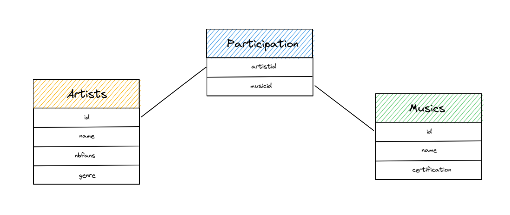
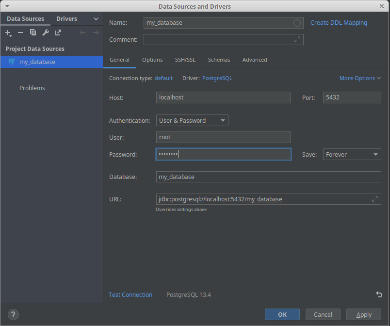
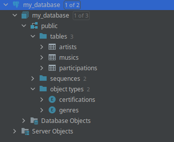
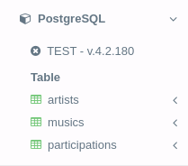

# PoC Software Pool 2023 - Day 02 - SQL

**Day purposes**

✔️ Execute simple SQL requests.

✔️ Discover database management tools.

✔️ Understand the fundamentals of relational database.

## Introduction

During the [day 01](../../day01), you learned a programming language to 
develop software. But a software isn't only composed of a hundred thousand
lines of code, it's common to use external tools to take in charge a specific
task. 😉<br>
For example, you can use [Prometheus](https://prometheus.io)/[Grafana](https://grafana.com) to monitor your app, [Kafka](https://kafka.apache.org) as a queue or a [database](https://en.wikipedia.org/wiki/Database) to store huge amount of data...

### What's a database?

It's an organized space where you can store pieces of information.
Each time you need a permanent storage, for example, to store users, you will
need a database.<br>
It has many usage and ways, the most popular is [SQL database](https://en.wikipedia.org/wiki/SQL) or 
also called [relational database](https://en.wikipedia.org/wiki/Relational_database).

### Type of database

Today we will learn relational database but other exists:

- [Document](https://en.wikipedia.org/wiki/Relational_database)
- [Graph](https://en.wikipedia.org/wiki/Graph_database)
- [Column](https://en.wikipedia.org/wiki/Column-oriented_DBMS)
- [Key/Value](https://en.wikipedia.org/wiki/Key–value_database)
- [Search Engine](https://en.wikipedia.org/wiki/Database_search_engine)
- [Multi model](https://en.wikipedia.org/wiki/Multi-model_database)

> You can find more information about databases in this [post](https://fireship.io/lessons/top-seven-database-paradigms/) 😄

## Requirements

There are many tools to manage a database. We give you the choice between
[DataGrip](https://www.jetbrains.com/datagrip/) and [SQL IDE Online](https://sqliteonline.com).

> We recommend DataGrip for its powerful UX and easy adoption 😉

In the folder [resources](./resources), you will find a file named 
[database.sql](./resources/database.sql) to generate a new database
with artists and musics 🎵

Here's a schema of our data:


In relational database, data is stored into a [table](https://www.postgresql.org/docs/9.2/ddl-basics.html)
where each information is a [column](https://www.postgresql.org/docs/8.0/ddl.html).

You can then create a [relation](https://hasura.io/learn/database/postgresql/core-concepts/6-postgresql-relationships/)
between tables 😄

> 💡 You can find more information about PostgreSQL concepts [here](https://www.postgresql.org/docs/8.3/tutorial-concepts.html).

> These concepts are important, if you are lost don't hesitate to ask the staff for help they'll be happy to help you understand 😜

### DataGrip

> If you don't want to use DataGrip, move to the [SQL IDE Online](#sql-ide-online) setup.

First, download DataGrip using the [Jetbrains Toolbox](https://www.jetbrains.com/toolbox-app/).

You can use [docker](https://www.docker.com) to run a [PostgreSQL](https://www.postgresql.org) 
database with the following command in the directory containing the file `database.sql`

```shell
docker run  --name my_database -e POSTGRES_PASSWORD=password -e POSTGRES_USER=root -e POSTGRES_DB=my_database -p 5432:5432 -v "$(pwd)"/database.sql:/docker-entrypoint-initdb.d/init.sql -d postgres:alpine
```

> Don't worry about this command for now, you will learn docker during day04 👀

Start DataGrip and create a new `Data Source` of type `PostgreSQL`.

Here's the information to fill in the form:
- Database name: `my_database`
- Username: `root`
- Password: `password`
- Host: `localhost`
- Port: `5432`

> 💡 You will certainly have to download the PostgreSQL driver on your first connection.

Below you have an example of configuration:



After applying the configuration, you should see a new data source in the left panel of DataGrip.

Verify that you have something similar to the example below:


> You can look a [these steps](https://www.jetbrains.com/help/datagrip/postgresql.html)
> if you encounter an issue during the configuration.

> 💡 If you are already familiar with You can use [pgAdmin](https://www.pgadmin.org) or 
> [DBeaver](https://dbeaver.io) feel free to use them.

### SQL IDE Online

> We do not recommend this solution because it's important to use professional tools, but you can use it if you want to go fast 🏃

- Go to [SQL IDE Online](https://sqliteonline.com).
- Click on `PostgreSQL` database.
- Click on category `File`.
- Open `database.sql`
- Execute it with the button `Run`.

You should get the following result



## Step 0 - Setup

If you correctly followed the requirements, you should have a database
ready to use 😍

You will just need to create a new directory in your pool repository to
submit your work:
```shell
mkdir -p day02
```

This day is composed of two parts, so for now you will push your work in the directory `SQL` 😉
```shell
mkdir -p day02/SQL
```

Create a file `queries.md` in which you will write every query you make to keep a trace:
```shell
touch queries.md
```

## Step 1 - Basics

Your database is ready to run your first requests 🥳

The goal of this step is to understand how to read data in a database using
[SQL](https://en.wikipedia.org/wiki/SQL).

Let's try to get some information from the table `artists`.

Write 3 queries to :
- Retrieve **all** the information contained in the `artists` table.
- Retrieve **only** `name` and `genre` from the table `artists`.
- Retrieve the list of all `artists` of `genre` `hip-hop/rap`.

> See how to [read data in SQL](https://sql.sh/cours/select) or in [PostgreSQL](https://www.postgresql.org/docs/9.5/sql-select.html).

## Step 2 - Relations

As we said before, a relational database is perfect to handle data with 
multiple relations between them.

Let's write 3 new queries to link information from tables:
- Retrieve `name` from `artists` and `musics`.<br>
You must specify the name of your result column with `artists_names` and `musics_names`.
- Retrieve all `artist` who singed in the music `We Are The World`.<br>
Those artists must be sorted in `descending` order according to their number of fans.
- Retrieve all the `musics` from `Booba`.<br>
They must be sorted in `alphabetical` order.

> See [how to sort data](https://docs.postgresql.fr/9.2/queries-order.html)
> and [join in SQL](https://sql.sh/cours/jointures).

## Step 3 - CRUD

Yesterday, you programmed the CRUD of a resource, let's learn how to do it using SQL 💪

Write 3 queries to:
- Add a new `artist` with his `id` set to `100`.
- Delete all musics that have the `Gold` `certification`.
- Add the music `Take What You Want` to the `artists` you previously created.

> ⚠️ `artists` and `musics` are linked using a relationship table, you
> will maybe need to do 2 queries to delete records.

> See how [create](https://www.w3schools.com/sql/sql_insert.asp) or 
> [delete](https://www.w3schools.com/sql/sql_delete.asp) data in SQL.

## Step 4 - Good counts make good friends

You've learned the basics, let's see more advanced features with pre-processing SQL functions 🧐

You will use functions to [count elements](https://www.w3schools.com/sql/sql_count_avg_sum.asp) directly from SQL.

> 💡 Databases are faster than any programming language (except C) so if you can pre-process your data in your query, do it.

Write 4 new queries to:
- Count the number of `artists`
- Count the number of `artists` in each `genre`.
- Count the number of `musics` sorted by their certification and displayed in ascending order.
- Count the number of `musics` of each `artists`, sorted by their certification and 
displayed in ascending order.

> ⚠️ Be sure you never count the same music two time.

> You'll certainly need to [group element in SQL](https://www.w3schools.com/sql/sql_groupby.asp) 😉

## Step 5 - Rap Game

You have certainly noticed, there are several kind of musics related to rap: 
the `rap` and `hip-hop/rap`.

We would like to organize a concert with all the rappers in our database, but
for that, we need a list of them.

Write a query that retrieve all the rappers in the database, sorted in 
descending order by their fans' number.

> 💡 You'll maybe need to [manipulate string](https://www.tutorialspoint.com/sql/sql-string-functions.htm) 
> and [cast data](https://www.w3schools.com/sql/func_sqlserver_cast.asp). 

## To go further

Congratulation, you now have solid knowledge in SQL 🎉

Here are some links for the most courageous among you:

- [Organize your database with schemas](https://www.postgresql.org/docs/14/ddl-schemas.html)
- [Create your own PostgreSQL function](https://www.postgresql.org/docs/14/xfunc-sql.html)
- [Automate task with triggers](https://www.postgresql.org/docs/14/trigger-definition.html)
- [Improve query performance](https://www.postgresql.org/docs/14/performance-tips.html)

<h2 align=center>
Organization
</h2>
<br/>
<p align='center'>
    <a href="https://www.linkedin.com/company/pocinnovation/mycompany/">
        
    </a>
    <a href="https://www.instagram.com/pocinnovation/">
        
    </a>
    <a href="https://twitter.com/PoCInnovation">
        
    </a>
    <a href="https://discord.com/invite/Yqq2ADGDS7">
        
    </a>
</p>
<p align=center>
    <a href="https://www.poc-innovation.fr/">
        
    </a>
</p>

> 🚀 Don't hesitate to follow us on our different networks, and put a star 🌟 on `PoC's` repositories.