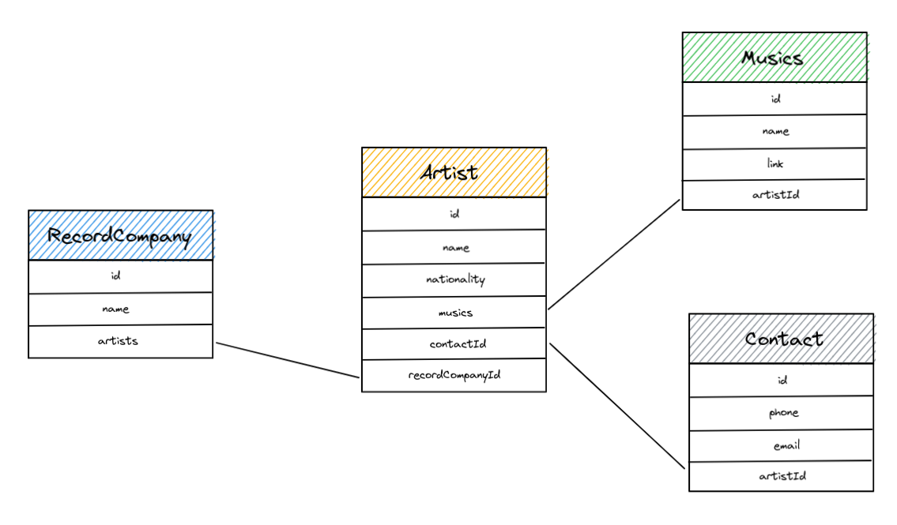
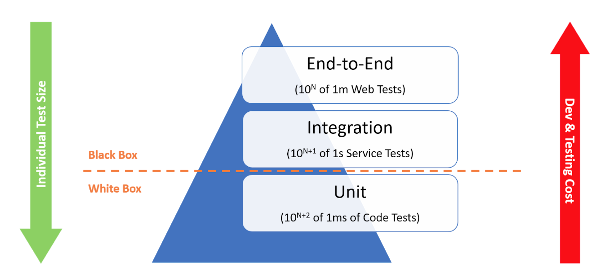
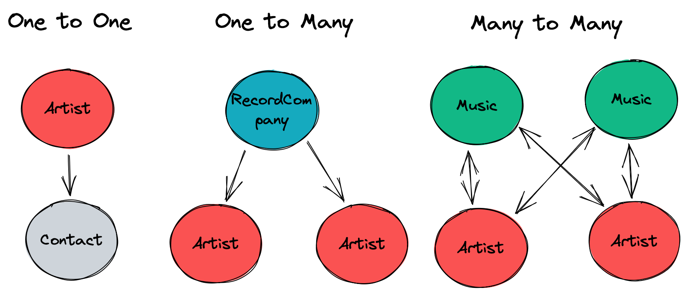

# PoC Software Pool 2023 - Day 02 - ORM

✔ Understanding and Using an ORM

✔ Implement a clean architecture

✔ Familiarize yourself with unit tests

✔ Understand the Go interface system

> ⚠️ This half-day is particularly long and contains a lot of concepts to explore.</br>
> Here are some tips for you to advance as far as possible:
> - Be sure to read the statements and concepts covered in the steps
> - Read the documentation provided in each exercise
> - Don't stay stuck for a long time if you encounter a problem, quickly ask the staff for help 😄

## Step 0 - Setup

> Estimated time: 2 minutes

- In the `day02` folder of your pool directory, create a folder `ORM`.
```shell
mkdir -p day02/ORM
```

- Initialize a `SoftwareGoDay2` module.

## Step 1 - Laying the Foundation

> Estimated time: 10 minutes

This morning, you learned to use SQL to insert or read data, sort these data, linking certain data to each other, etc.

You have most likely noticed two important problems:

- > Writing and executing these queries by hand is a tedious task 🙁
- > When you wanted to search for artists by type of music, you had to write the raw type in your query.

> But how to use the same kind of request for another model, especially if it is unknown in advance?
>
> In short, the queries were not dynamic.

Apart from maintenance or debugging needs, a developer *very rarely* uses SQL commands in CRUD.

### Objectives

You will therefore have to create and interact again with a database containing different tables:

- `RecordCompany`: publishers.
- `Artist`: artists.
- `Contact`: contact sheets.
- `Music`: music.

Here's a schema to clear your mind:  


But unlike this morning, you're not going to use any SQL commands or queries, but learn how to use an ORM
which makes these SQL requests for you, directly from your Go code.

### RawSQL, QueryBuilder & ORM

When a developer writes an application that uses an SQL database, he must make an important choice regarding how to communicate with this database:
- `RawSQL client`: A client that performs dynamic queries very close to the basic syntax.
- `Query Builder`: A tool to build queries more easily, using the language of the application.
- `ORM`: A tool to abstain from the SQL query system.

> Note:
>
> As usual in the development world, each method has pros and cons, depending on the application's needs.
> 
> You can learn more about this with [this article](https://www.prisma.io/dataguide/types/relational/comparing-sql-query-builders-and-orms).

Since you now know how to make SQL queries by hand, and for simplicity reasons, you will use the 3rd method, an [ORM](https://blog.bitsrc.io/what-is-an-orm-and-why-you-should-use-it-b2b6f75f5e2a)

## Step 2 - Connect an ORM

> Estimated time: 30 minutes

> What is an [ORM](https://blog.bitsrc.io/what-is-an-orm-and-why-you-should-use-it-b2b6f75f5e2a)?
>
> "Object-relational mappers", or ORM, are software dedicated to translation between data representations
> in relational databases and in-memory representation used with object-oriented programming (OOP).
>
> The ORM provides an object-oriented interface to the database data, trying to use familiar programming concepts and reduce the amount of code needed to accelerate development.
>
> In general, ORMs serve as an abstraction layer to help developers work with databases without radically changing the object-oriented paradigm.
>
> This can be useful to reduce the mental load of adapting to the specificities of a database's storage format.


> Don't worry, you will gradually discover what it means by practicing 🚀

The ORM you will use today is called [ENT](https://entgo.io/).

It's one of Go's ORM by excellence, it's very practical and well documented.

**But that's not all.**

Indeed, ENT as a specificity compared to others, which is to *generate* code for you.

ENT allows you to quickly set up the CRUD for your database according to schemas that you'll define directly in your Go code 🤩

> Is it really useful to automatically generate the CRUD?
>
> It depends on your use case, but if you want to quickly manipulate a database *without edge effects* (that is to say in a classic way), then yes it is useful! Imagine the time that you'll win!

This exercise will therefore be carried out in four parts:
- Configuring your PostgreSQL database
- Installation of ENT
- Creation of your first schema (data model)
- Connect to the database with ENT

### PostgreSQL

Even before implementing the ORM, we must created the database we'll use with this ORM.

Like this morning, we will be using a [PostgreSQL](https://www.postgresql.org/) database.

<details>
  <summary>As a reminder, here is the database diagram:</summary>


</details>

Create a `.env` file in which you will put the environment variables related to your db:
- `DB_USER`: the username of your database.
- `DB_PASS`: your user's password for your database.
- `DB_HOST`: the host to connect.
    > You must put `localhost` here.
- `DB_PORT`: the listening port of your database.
- `DB_NAME`: the name of your database.
- `DB_URL`: the login url, it groups all the above information.
    > You must put `postgresql://$DB_USER:$DB_PASS@$DB_HOST:$DB_PORT/$DB_NAME`

To create a new database, simply execute the following command:
```shell
docker run --name [DB_NAME] -e POSTGRES_PASSWORD=[DB_PASS] -e POSTGRES_USER=[DB_USER] -e POSTGRES_DB=[DB_NAME] -p [DB_PORT]:[DB_PORT] -d postgres:alpine
````

Or :
```shell
source .env
docker run --name $DB_NAME -e POSTGRES_PASSWORD=$DB_PASS -e POSTGRES_USER=$DB_USER -e POSTGRES_DB=$DB_NAME -p $DB_PORT:$DB_PORT-d postgres:alpine
```

> 💡 It's possible to create several databases in a single postgres instance, that's why each db is given a name.

### Install ENT:

Install ENT with the command:
```shell
go get -d entgo.io/ent/cmd/ent
```

### Your first model :

⚠️ During this step, we strongly advise you to keep an eye on the introduction of [ENT](https://entgo.io/docs/getting-started/#create-your-first-schema)

- Run the command `go run entgo.io/ent/cmd/ent init Artist`.
  > A folder will be generated in which you will find the `schema/artist.go` file.
  >
  > This file corresponds to the schema that will define your model and create a db table according to this model.

- Modify the `Artist` model to have the `name` and `nationality` attributes.
  > 💡 For ENT:
  > - each type with an embedded `ent.Schema` is a table in a database.
  > - each [`field`](https://entgo.io/docs/schema-fields) is a column in this table.
  > - each [`edge`](https://entgo.io/docs/schema-edges) is a link to another table.

- Run the `go generate ./ent` command to start generating ENT code.
  > You will see many folders and files appear, here are some particularly interesting to know:
  > - `ent/client.go`: The ENT client for your database.
  > - `ent/artist.go`: The template of your Artist defined by your Artist schema.
  > - `ent/artist_create.go`: Functions/methods for creating an artist
  > - `ent/artist_query.go`: Functions/methods that allow you to query an artist
  > - `ent/artist_update.go`: The functions/methods that allow you to modify an artist
  > - `ent/artist_delete.go`: The functions/methods that allow you to delete an artist

- Still in the `schema/artist.go` file, add the `id` field to your schema so that ENT uses a [UUID](https://en.wikipedia.org/wiki/Universally_unique_identifier) instead
  of an `int` 🙂
  > In a relational database, each table contains a unique identifier, so that each element of that table can be distinguished even if their data are the same.  
  > In our case, this identifier is `id`.
  >
  > ENT generates this identifier automatically, so no need to create it!
  > It is also common for security to use a `uuid` rather than a simple index.
  >
  > ENT has an integrated function specifically for this purpose.
  > [More details](https://entgo.io/docs/schema-fields/#id-field).

### Login

- Create the database package, where we will manage our connection and calls to our database.
    - Create the `database/database.go`.
        - Create a `Database` structure containing the following fields:
            - `Client`, a pointer to an ENT client (`*ent.Client`).
            - Any field that seems useful to you (URL of the database, named logger...)
        - Create a `NewDatabase` function that returns a completely initialized Database and an error in case of failure
    - [With ENT](https://entgo.io/docs/sql-integration#use-pgx-with-postgresql), open the database, initialize the connection and synchronize the schemas to create the tables in your database.
- Create the file `main.go`.
    - Retrieve your environment variables needed to initialize your database.
    - Call the `NewEntDatabase` function of the `database` package:
        - If successful, write: `Database is ready`.
        - If the operation fails, write: `Failed to initialize database: ` followed by the error message.

> You can also connect to your database with DataGrip and see your newly created table 🚀

**Resources**
- [ENT - Your First Schema](https://entgo.io/docs/getting-started/#create-your-first-schema)
- [ENT - Connect to PostgreSQL](https://entgo.io/docs/sql-integration#use-pgx-with-postgresql)
- [ENT - Fields](https://entgo.io/docs/schema-fields)
- [ENT - Edges](https://entgo.io/docs/schema-fields)
- [ENT - ID Field](https://entgo.io/docs/schema-fields/#id-field)
- [Go - Load a .env file automatically](https://github.com/joho/godotenv)
- [Go - Retrieve environment variables](https://pkg.go.dev/os#Getenv)

## Step 3 - CRUD with an ORM

> Estimated time: 45 minutes

> ⚠️ Respect EXACTLY the prototypes of the methods given to you.

Now it's time to develop the functions to read, add, modify and delete an artist. In other words, the CRUD 💥

The code generated by ENT provides you with many methods and functions that allow you to interact with your database:

- [CRUD with ENT](https://entgo.io/docs/crud)

> 💡 For this exercise, assume that the parameters sent to you are valid.

### C for Create

In the `database` folder, create a file `artist.go`.<br>
Then inside it you can add a `CreateArtist` method on the `Database` type that takes as parameters a context and the attributes of
the Artist:

- `name`: the name of the artist
- `nationality`: the origin country of the artist

```go
package database

func (d Database) CreateArtist(ctx context.Context, name, nationality string) (*ent.Artist, error) {

... = d.Client...

return ...
}
```

The method must create a new artist and return it once saved in the db.
> You can test it by calling it directly from the `main` function 😉


### R for Read

Create a `GetArtists` method on the `Database` type that returns all the `Artist` saved in db.

```go
package database

func (d Database) GetArtists(ctx context.Context) ([]*ent.Artist, error) {

	... = d.Client...

	return ...
}
```

Then you can also add a `GetArtistByID` method that takes an `uuid` as parameter and returns the artist that matches this id.

```go
package database

import "github.com/google/uuid"

func (d Database) GetArtistByID(ctx context.Context, id uuid.UUID) ([]*ent.Artist, error) {

	... = d.Client...

	return ...
}
```
> If the artist doesn't exist, you must return an error ❌


### U for Update

Create an `UpdateArtist` method that takes this parameter:
- `artist`: a pointer to the already modified artist whose changes must be saved in the database.

```go
package database

func (d Database) UpdateArtist(ctx context.Context, artist *ent.Artist) (*ent.Artist, error) {

	... = d.Client...

	return ...
}
```

> It must save the modified artist in your database and then send it back.

> If the artist doesn't exist, you must return an error ❌

### D for Delete

Create a `DeleteArtist` method that takes an `id` parameter and removes the selected artist.

```go
package database

import "github.com/google/uuid"

func (d Database) DeleteArtist(ctx context.Context, id uuid.UUID) (*ent.Artist, error) {

	... = d.Client...

	return ...
}
```
If the artist does not exist, you must return an error.
TODO: add tip to use the given tests
> ⚠️ Don`t forget to test your functions.

> ⚠️ Make sure that you have respected the prototype of the methods given above.


**Resources**
- [CRUD](https://en.wikipedia.org/wiki/Create,_read,_update_and_delete)
- [CRUD with ENT](https://entgo.io/docs/crud)


## Step 4 - The controller: validate data & orchestrate your logic.

> Estimated time: 45 minutes


> It is essential for a developer to break down their application into different logical parts that will have a different responsibility. </br>
> This is called the **Separation of Concern**. </br>
>
> There are several design patterns to split your application: </br>
> - MVC
> - Domain Driven Design
> - Clean Architecture
> - ...

Like yesterday, you will implement a part of the MVC design pattern to introduce you to several concepts.

This architecture will be divided into two layers:
- The `database` layer will contain the unit functions related to the database. (Units do one thing and only one 😉). </br>
  > You have just implemented it in the previous exercise 🎉
- The `controller` layer will contain the functions that will control your logic and orchestrate the methods of the
  database to perform your logic.

Like yesterday, you will use a package `controller` in which you will store all the functions/methods to interact with the database.

However, we will use it a little differently 👀

---
There are many business cases where the logic checks need to be performed before executing an action.

Let's take an example:</br>
**In a company, a manager of a team requests access to another user's personal information.** </br>

However, the company has decided that a manager is allowed to access only the information of his team members, who are under his responsibility. </br>

Before returning the requested information, we must therefore verify:
- If the user requesting the information is indeed a Manager, that is to say that his "Role" is allowed to see the information of other users.
- If the employee requested is in the team of this manager, that is to say in the perimeter of access/vision of this manager.
- If the employee is the manager's responsibility.

**When do we need to verify this information, in other words, make a logic?**

Your database layer is only responsible for creating, retrieving, modifying or deleting database data. Which means only **interact** with it.</br>
Its operation can become very complex as your application grows over time.

As you may have noticed, your database layer is completely linked to ENT.
Imagine that you have implemented your logic in this layer.

If one day, for performance or comfort, you no longer use ENT but another ORM, you should rewrite all the code containing your logic 😦

> This doesn't follow the [SOLID principles](https://en.wikipedia.org/wiki/SOLID). 

It will therefore be your controller's responsibility to perform your logic using the functions of your database layer.

> As this day is already very long, you will only implement a very basic logic: the validation of the received data 😄

---

Create a `controller` package and write the constructor below in the `controller/controller.go` file.

```go
package controller

import "SoftwareGoDay2/database"

type Controller struct {
	*database. Database
	// Add some fields if necessary
}

func NewController(db *database.Database) *Controller {
	// Return a pointer to a `Controller` struct filled with the database
	return &Controller{Database: db}
}
```

This type `Controller` will be used to implement your logic using the methods of your type `Database` that you give it as a parameter when using the constructor.


### C for Create

Create a new file `controller/artist.go`

Create a `CreateArtist` method on the `Controller` type that takes a context and the attributes of the Artist:
- `name`
- `nationality`

```go
package controller

import (
	"context"

	"github.com/pkg/errors"
)


var InvalidArtistName = errors.New("artist name is invalid")

func (c Controller) CreateArtist(ctx context.Context, name, nationality string) (*ent.Artist, error) {
	
	... = c.Database.CreateArtist(...)

	return ...
}
```

> When a developer creates a new feature that interacts with a database, he must ask himself the following questions:
> - What data is absolutely necessary for my model (here: `Artist`) to be considered valid and instantiated in the DB?
> - In what form/state may the information will be transmitted to me and in what cases could it invalidate my model?

Let's say an `Artist` must have a non-empty `name` and their nationality *could be* unknown

The method must verify that the Artist's name is correct and return the `InvalidArtistName` error if not.

> 💡 [Working with Errors in Go](https://go.dev/blog/go1.13-errors)


### R for Read

Create a `GetArtists` method on the `Controller` type that returns the list of all `Artist` saved in the database.

```go
package controller

func (c Controller) GetArtists(ctx context.Context) ([]*ent.Artist, error) {
	...
}
```

Create a `GetArtistByID` method on the `Controller` type that takes an `id` as parameter and returns an artist if its `id` matches the one
given as parameter.

```go
package controller

func (c Controller) GetArtistByID(ctx context.Context, id string) (*ent.Artist, error) {
	...
}
```

The method must verify that the Artist's id sent as a string is a UUID and transform it to send it to the `Database` method.

> 💡 [How to parse a UUID](https://pkg.go.dev/github.com/google/uuid#Parse)


### U for Update

Create an `UpdateArtist` method on the `Controller` type that takes the following parameters:

- `id`: the identifier of the artist to be modified
- `name`: the name of the artist to be modified (can be blank)
- `nationality`: the nationality of the artist to be modified (may be empty)


```go
controller package

func (c Controller) UpdateArtist(ctx context.Context, id, name, nationality string) (*ent.Artist, error) {
    ...
}
```

It must:
- Retrieve the artist from the database
- Modify artist attributes that are not invalid and are different from the recovered artist
- Save the changes in the db and return the modified artist

### D for Delete

Create a `DeleteArtist` method on the `Controller` type that takes an `id` parameter and removes the selected artist.

```go
controller package

func (c Controller) DeleteArtist(ctx context.Context, id string) (*ent.Artist, error) {
	...
}
```

**Resources**
- [SOLID principles](https://en.wikipedia.org/wiki/SOLID)
- [Go - Parse a UUID](https://pkg.go.dev/github.com/google/uuid#Parse)
- [Go - Working with Errors](https://go.dev/blog/go1.13-errors)


TODO: use the content of this step for the tests, and reduce it by explaining how the tests work
## Step 5 - Test the CRUD

> Estimated time: 30 minutes


If you are a real developer, you should have tested your functions/methods.

However, it would be cool to automate your tests in order to check your application and serve as a safety net when making changes or implementing new features.

---
**A little reminder about the tests.**

There are 3 bid test families:
- Unitary: Tests a function/feature and only one without interaction with your other components (connection to the database, ...).
- Integration: Tests the behavior of a feature that brings together several components together.
- Functional or EndToEnd(E2E): Tests all components of your application for a given feature.



---
Go has a [built-in package](https://pkg.go.dev/testing) directly in the language that allows you to perform tests.

If this package is generally used for unit tests, it can also be used for some integration tests.

You will first implement unit tests, then integration tests.

> In Go, any function that starts with the prefix "Test", which takes as a single parameter a `*testing.T` and is located in a file named with the suffix "_test.go" is launched during the tests.
>
> You can run all tests with the `go test ./...` command.

You will first test your logic, that is, your controller only.

### Unitary: With a Mock

As a reminder, a unit test only checks the logical functioning of an action. </br>
It must be quickly executable, and must not depend on any other component of your application.

However, your current controller relies on your `Database` type of the `database` package, which itself relies on ENT which connects to your postgres database, which is a different component of your application. </br>
This violates the principle of a unit test.

If you wanted to test your controller with your postgreSQL database, it falls into the integration tests family.

> So why not do integration tests directly?
>
> As your application becomes more complex, it is often necessary to first check if your logic is correct.</br>
> 
> If an error occurs in your tests, the problem can have several origins.</br>
> It is important to minimize the range of possibility of source your errors.
> 
> This will make it easier for you to see where your error occurs and to correct it. </br>
> This will also make it easier for you to quickly test in local before running integration tests that may take longer.


### Set up the mock

To perform your unit tests, we will have to make some modifications to use a fake database (a mock).

You will therefore change the type of the `Database` field from your `Controller` type but without changing the method called (without changing all your code).</br>
This new type will be used in exactly the same way as your `Database` type of the `database` package.

To do this, you will use the [interface principle](https://go.dev/tour/methods/9) (CF: previous day's interface exercise).

You will need to declare an interface that defines the same methods defined in your Database type that are used in your Controller

> ⚠️ If you have not followed the prototypes of the methods of the exercise on the crud with an ORM, the interface will not be accepted when compiling your code.

In the `controller/controller.go` file, declare the interface below, and change the `Controller` and its `NewController` constructor to use your new interface instead of a pointer to your  type `database.Database`.

```go
package controller

type Database interface {
	CreateArtist(ctx context.Context, name, nationality string) (*ent.Artist, error)
	GetArtists(ctx context.Context) ([]*ent.Artist, error)
	GetArtistByID(ctx context.Context, id uuid.UUID) (*ent.Artist, error)
	UpdateArtist(ctx context.Context, artist *ent.Artist) (*ent.Artist, error)
	DeleteArtist(ctx context.Context, id uuid.UUID) (*ent.Artist, error)
}

type Controller struct {
	Database
	// ...
}

func NewController(db Database) *Controller {
	return &Controller{Database: db}
}
```
> Note: GoLand IDE allows you to easily extract an interface from an existing type. </br>
> For this purpose:
> - Put your cursor over the `Database` type of your `database` package.
> - In the tabs at the top of your IDE, `Refactor` -> `Extract/Introduce` -> `Interface...`
> - From the menu that appears, select all methods of your type `Database`
> - On the `To directory` line, open the file explorer and find the `controller/controller.go`

If you have followed all the steps so far, the `NewController` constructor is perfectly capable of using a `*database.Database` argument without causing any errors.

Create a new test package.

In a `tests/mock_database.go` file, copy the entire following file:


### [Link to the mock code](./resources/mock_database.go)

Now that everything is in place, it's time to write your first tests.

Create a `tests/artist_mock_test.go`.

Here is an example of a test for creating an artist with the mock.

```go
package tests

func TestCreateArtist(t *testing.T) {
	artists:= []struct {
		Name, Nationality string
	}{
		{Name: "Florida", Nationality: "us"},
		{Name: "Charles Aznavour", Nationality: "en"},
	}

	c:= controller.NewController(NewMockDatabase())
	ctx:= context. Background()

	for _, a:= range artists {
		_, err:= c.CreateArtist(ctx, a.Name, a.Nationality)
		if err!= nil {
			t.Errorf("artist create failed: %v", err)
		}
	}
}
```

You can copy it and run your tests.

Now that you have an example, write tests on your controller to verify that:
- `CreateArtist` returns an error when the artist's name is empty.
- `GetArtist` with a badly formed `uuid` returns an error.
- `UpdateArtist` modifies the right fields of your artist.
- `UpdateArtist` with a badly formed `uuid` returns an error.
- `DeleteArtist` with a badly formed `uuid` returns an error.

### Integration tests - With your Database

Now that you have tested your logic, it is time to test the integration of your PostgreSQL Database with ENT.

Create a new file `tests/artist_db_test.go`.

Declare a global variable for your tests that will contain the connection and an init function to instantiate it only once when you run the tests.

```go
test package

var db *database.Database

func init() {
	// Load your environment
	
	var err error
	
	// Use your ENT Database
	db, err = database.NewDatabase(...)
	if err!= nil {
		log. Fatal("Failed to initialize database: %+v n", err)
	}
}
```

> Resource: [The `init` function in GO](https://tutorialedge.net/golang/the-go-init-function/).

Now write tests on your controller to verify that:
- `CreateArtist` instantiates an artist in the Database and `GetArtist` allows you to retrieve it.
- `CreateArtist` reviews an error when the artist's name is empty.
- `GetArtists` refers all artists present in DB.
- `GetArtist` with a badly formed `uuid` returns an error.
- `UpdateArtist` modifies your artist well.
- `UpdateArtist` with a badly formed `uuid` returns an error.
- `DeleteArtist` removes an Artist in DB.
- `DeleteArtist` with a badly formed `uuid` returns an error.

> Note: You may have noticed that the interface could be improved.
>
> Let's take the example where you decide to change ENT to another ORM.</br>
> You always have an ent.Artist type that involves a dependency on ENT.
>
> Generally speaking, outside your database, it is a bad idea to use the types provided by the ORM, because it makes your code dependent on it.
>
> Instead, you will use a dedicated package to define your models, such as the previous day's model package (M of MVC), and in your database package, perform transformations between your model and that of ENT.
>
> For the sake of time, we won`t look into this problem, but you can implement it as a bonus if you have time

**Resources**
 - [GO - Interface](https://go.dev/tour/methods/9)
 - [GO - init function](https://tutorialedge.net/golang/the-go-init-function/)

## Step 6 - Contact Artists

Now you know how to:
- Basically use the CRUD of an ORM for a model
- Organize your code for more flexibility
- Test your logic and your database

Congratulations, that already really cool 🥳

In the relational database, there are 3 types of relationships:
- One to One: One entity related to another</br>
  Example: An `Artist` has only one contact and a contact will only serve an artist
- One to Many: An entity that can be linked to multiple copies of another entity</br>
  Example: a `RecordCompany` can produce multiple artists
- Many to Many: Several entities linked to several other entities of another table</br>
  Example: An `Artist` can write several musics and a music can be created by several artists in collaboration.

Here's a schema to illustrate these relationships:



To create these relationships with ENT, you will need to declare [edges](https://entgo.io/docs/schema-edges) that will serve as a link between your models.


The database at the end of this exercise will look like this:
`Artist`:
- `id`
- `Name`
- `Nationality`
- `Contact`

`Contact`:
- `id`
- `Phone`
- `Email`

### Add template and links

- Create a new `Contact` template:
    ```shell
    go run entgo.io/ent/cmd/ent init Contact
    ```

- Give the following attributes to your `Contact` model:
    * id (uuid)
    * email (string)
    * phone (string)

- Create a relationship from your `Artist` model to a `Contact` (the relationship must be `Unique`)

- Create the reverse relationship from your `Contact` model to an `Artist` (the relationship must be `Unique`)

> Resource: [OneToOne relationship with ENT](https://entgo.io/docs/schema-edges/#o2o-two-types)


### Edit your CRUD

You will need to modify your CRUD to support operations on your new model.

As for your artists, create 2 new files:
- `database/contact.go` which will contain all your Database methods that will interact with ENT for the `Contact` type.
- `controller/contact.go` which will contain all your methods of the `Controller` type which will implement your logic for the `Contact` type.

Following the CRUD example on artists, implement/modify the methods for your Database type and your Controller type 😄

### C for Create

Create the `CreateContact` methods that take the following parameters:
- `context`: A context for ENT
- `artistID`: the unique number (uuid) of the artist to whom this contact is attached
- `phone`: The contact's telephone number.
- `email`: The email of the contact.

This method must create a contact and binds it to the Artist whose ID is passed as parameter.
If the artist does not exist, it must return an error.

### R for Read

A contact being completely linked to an artist, it doesn't make sense to create a method to recover a contact.

Change the `GetArtistByID` and `GetArtists` methods of your type to refer to artists with their contact.

> 💡 You don't need to modify the prototype of these methods

An artist's contact will be loaded into the `Artist.Edges.Contact` field.

> Resource: [Eager Loading with ENT](https://entgo.io/docs/eager-load)

### U for Update

Create the `UpdateContact` method on the `Controller` type that takes the following parameters:
- `context`: A context for ENT
- `id`: the contact ID to be modified
- `phone`: The contact's phone number (could be empty/invalid).
- `email`: Contact email (could be empty/invalid).

### D for Delete

Create the `DeleteContact` methods that take the following parameters:
- `context`: A context for ENT
- `id`: the identifier of the contact to be deleted

> If the contact does not exist, you must return an error ❌

## Step 7 - Music Labels

You have just implemented your first relationship on OneToOne artists 🥳

Now it's time to produce your artist, through a Music Label 😄

This time, this relationship will be of the [OneToMany](https://entgo.io/docs/schema-edges/#o2m-two-types) type 

At the end of this exercise, the database will look like this:
`Artist`:
- `id`
- `Name`
- `Nationality`
- `Contact`
- `RecordCompany`

`Contact`:
- `id`
- `Phone`
- `Email`

`RecordCompany`:
- `Name`
- `Artists`


- Create a new RecordCompany template:
    ```shell
    go run entgo.io/ent/cmd/ent init RecordCompany
    ```

- Give your RecordCompany template the following attributes:
    * id
    * name

- Create a relationship from your RecordCompany template to an Artist

- Create the reverse relationship from your `Artist` (`From`) model to a `RecordCompany` (the relationship must be `Unique`)

> Resource: [OneToMany relationship with ENT](https://entgo.io/docs/schema-edges/#o2m-two-types)

### Edit your CRUD.

You begin to understand the principle, create 2 new files:
- `database/record_company.go` which will contain all your Database methods that will interact with ENT for the `RecordCompany` type.
- `controller/record_company.go` which will contain all your Controller methods that will implement your logic for the `RecordCompany` type.

### C for Create

Add the `CreateRecordCompany` method that take the following parameters:
- `context`: A context for ENT
- `artistID`: the unique number (uuid) of the artist to whom this label is attached
- `phone`: The phone number of the label.
- `email`: The email of the label.

This method must create a label and binds it to the Artist whose ID is passed as parameter.

### R for Read

Create the `GetRecordCompanies` and `GetRecordCompanyByID` methods that also reference all the artists associated with these labels.

> Don't forget to take a look at [Eager Loading with ENT](https://entgo.io/docs/eager-load) 😉

### U for Update

Create the `UpdateRecordCompany` method on the `Controller` type that takes the following parameters:
- `context`: A context for ENT
- `id`: the label identifier to be modified
- `name`: The label name (can be empty/invalid).

Create the `UpdateRecordCompany` method on the `Database` type that takes the following parameters:
- `context`: A context for ENT
- `label`: a pointer to the already modified label whose changes must be saved in database.

> If the label does not exist, you must return an error ❌

### D for Delete

Create the `UpdateRecordCompany` methods that takes the following parameters:
- `context`: A context for ENT
- `id`: the label identifier to be deleted

> If the label does not exist, you must return an error


### Make connections

Create an `AddArtistToRecordCompany` method.

It must take as parameters:
- `artistID`: Artist identifier
- `recordCompanyID`: Record company identifier

Your function will connect these entities by following their ID.
> If one of them doesn't exist, return an error ❌

Create a `RemoveArtistFromRecordCompany` method.

It must take as parameters:
- `artistID`: Artist identifier
- `recordCompanyID`: Record company identifier

Your function will disconnect these entities according to their identifier.
> If one of them does not exist, return an error.

> Perhaps you have heard about various arguments? Wouldn't it be practical to give a list of artists to add instead of one by one?
> Ent give you access to many functions... 😉

## Step 8 - Active Artists

Finally, we are near the end! There is only one entity left: `Music` 😄

And only one relationship type remains: the [ManyToMany](https://entgo.io/docs/schema-edges/#m2m-two-types).

This step is intentionally less guided, if you have reached it, you should have understood everything about relational databases, CRUD and how you should code it.

The final database will look like this:

`Artist`:
- `id`
- `Name`
- `Nationality`
- `Contact`
- `RecordCompany`
- `Musics`

`Contact`:
- `id`
- `Phone`
- `Email`

`RecordCompany`:
- `Name`
- `Artists`

`Music`:
- `Name`
- `Link`
- `Artists`

Create the `Music` template with ENT.

It will consist of the following properties:
- `id`: unique identifier
- `name`: name of music
- `link`: public link to the music (it could be whatever you want, like *YouTube*, *Spotify*...)
- `artists`: Artists who collaborated for this music

You will need to create a ManyToMany relationship between Artist and Music.

> Remember to update other templates if necessary 😉

We want to:
- create
- read
- updating
- delete
- Link an artist to a music
- Removing an artist from a music

> Don't forget to handle errors 😄

**Resources**
- [ManyToMany with ENT](https://entgo.io/docs/schema-edges/#m2m-two-types)
- [Eager Loading with ENT](https://entgo.io/docs/eager-load)


## Bonus

Congratulations for completing this day! This one was particularly long, we're really proud of you 🥳

If you still have some energy though, here are some bonuses for you 😃

### Artists Book 2.0

Yesterday, you created a cool application following a strong and resilient architecture called MVC.

An advantage of MVC is his layered architecture, you can easily update a
part of your application without refactor everything.

If you remembered well, your data storage was a simple `JSON` file, what
about replacing it if a relational database?

You know how MVC works, you know how to store data in a relational database, you
know an easy way to interact with database directly from your code...

Let's mix all your knowledge to add a permanent storage to your application 🚀

Indeed, you are free to add/update models, refactor the application and
do whatever you find useful.

Have fun!

### Testing, again and again 🧪

You've noticed that your architecture has become more complex.
If this continues, you risk, when modifying a feature, to break other essential functionalities.

You've seen some unit and functional tests, maybe it's time to implement some for your application?

## Additional Resources

If you want to learn more about databases, here are some interesting links:
- [The graph databases](https://neo4j.com/developer/graph-database/)
- [Database indexes](https://planetscale.com/blog/how-do-database-indexes-work)
- [DGraph](https://dgraph.io/)
- [MongoDB](https://www.mongodb.com/en)

> Made with ❤️ by PoC
