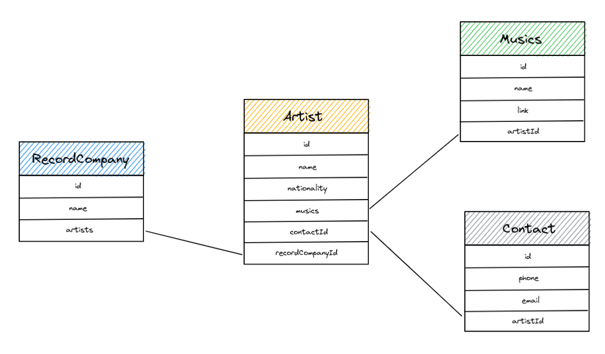
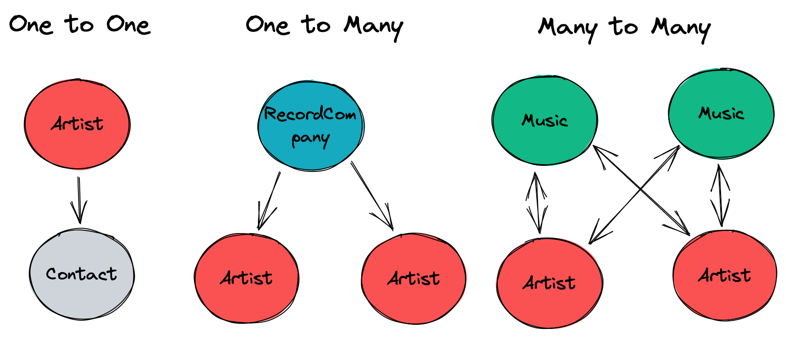

# PoC Software Pool 2023 - Day 02 - ORM

**Day purposes**

✔️ Discover ORM

✔️ Execute SQL query directly from code

✔️ Understand ORM pro and cons

## Introduction

This morning, you wrote raw SQL queries to manage resources in a database.<br>
But you can also do it directly from your code with a [client](https://www.npmjs.com/package/ts-postgres) 😄  
It's an efficient way, but what if you have a big database with many relations
and tables? It will be hard to correctly maintain your code and follow updates
in your database. What will happen if you miss an update and broke your database?
How will you manage a [data migration](https://www.postgresql.org/docs/current/app-pgdump.html)?

There are many disadvantage to manually manage your database, and it's not
relevant in small project. As well, you must learn the query language and 
specificities of the database you use (like PostgreSQL here).

To solve this problem, you can use an [ORM](https://en.wikipedia.org/wiki/Object–relational_mapping).
It stands for *Object Relational Mapping* and help you to code faster, better and
automatically synchronize your codebase with your database 😍
More than that, your database can be directly defined from your code or from a schema. You don't have to learn a query language and some ORM can
handle multiple databases.<br>
The last killer feature of ORM is the code generation, you can generate all the basics functions (CRUD for instance) and call it from your code.

> 💡 Even if ORMs are perfect for small or simple projects, it will always
be better to use raw SQL for a production application. If you require 
performance and control, you should manage your database manually or with tools that still
give you control on your code.

## Step 0 - Setup

- In the `day02` folder of your pool directory, create a folder `ORM`:
```shell
mkdir -p day02/ORM
```

We will go back to Typescript so let's initialize a new NodeJS project:
```shell
npm init
```

You can now add Typescript and ESLint/Prettier using the knowledge you acquired from [day01](../../../day01/Typescript) 😉

> 💡 Don't hesitate to go back to previous steps if you need it.

## Step 1 - Put the base

The purpose is to create and work with a PostgreSQL database that contains these resources:
- `RecordCompany`
- `Artist`
- `Contact`
- `Music`

Here's a schema to clear your mind:  


It's similar to the one from the [SQL subject](../../1%20-%20SQL), but this time
you will create it yourself 👍

> To be more precise, you will define a schema and your ORM will create it for
you using raw SQL queries 😉

To do that, we will use [Prisma](https://www.prisma.io)! It's a powerful ORM that supports resource
definition outside of code. It follows a schema and generate both code and SQL queries for you 💥<br>
With Prisma, a [schema](https://www.prisma.io/docs/concepts/components/prisma-schema) 
is a database and a [model](https://www.prisma.io/docs/concepts/components/prisma-schema/data-model#defining-models) is a table.

> You should look at the [Prisma documentation](https://www.prisma.io/docs/) to understand how it works 😄

### Installation

Let's install the prisma binary in our project:

```shell
npm install --save-dev prisma
```

We can now initialize prisma:
```shell
npx prisma init
```

> 💡 `npx` is a tool to execute a binary installed locally in a NodeJS project.

You should see a new `prisma` folder in your current directory, which means that you're ready to start!

### Schema

To begin, we will create only one table.

In the file `prisma/schema.prisma`, create a model `Artist` with the
following properties:
- `id`: the unique key of your model, it must be a string [automatically generated as uuid](https://www.prisma.io/docs/concepts/components/prisma-schema/data-model#defining-a-default-value).
- `name`: Artist's name
- `nationality`: Artist's nationality

> It's really important to define a key `id` when you create a resource, this
> way you can distinguish two resources with the same data but not the same 
> identifier. You can use a simple number and increment it, but
> it's safer to use a [`uuid`](https://en.wikipedia.org/wiki/Universally_unique_identifier).

For now, nothing is concrete, continue to step 2 to execute your first
query directly from Typescript 🚀

## Step 2 - Things get serious

You defined your model but there is no running database at this time.
We are now using an ORM so everything will be manage by it, we just need to
give it a connection URL.<br>
The purpose of this step is to create a database, migrate our schema in and setup a client.

We will use a [PostgreSQL](https://www.postgresql.org) database
because it's efficient and one of the most used database across the world 🔥

To easily start it, we will use the [official docker image](https://hub.docker.com/_/postgres).

> Don't worry about docker for now, you will learn it during day04 👀

### Configuration

First, we must configure our environment to give prisma access to our
future database. To centralize our configuration, we will use the `.env`
file. This way we will be able to use these values from our host and keep
only one source of truth.

Update the `.env` file with the following variables:
- `DB_USER`: Database username
- `DB_PASSWORD`: Database user password
- `DB_HOST`: Host location (here it's `localhost`)
- `DB_PORT`: Listening port of your PostgreSQL server, by default it's `5432`
- `DB_NAME`: Name of your database
- `DB_URL`: Connection url, it's composed of all information defined before.
Set it to: `postgresql://$DB_USER:$DB_PASS@$DB_HOST:$DB_PORT/$DB_NAME`

> 💡 You can create multiple databases in a single PostgreSQL server, so it's important to specify a name.

### Start the database

Our environment is ready, let's create a postgres database 🙂

To make it easier to start for everyone, we will directly add the setup
command in our `package.json`. This way, you can run the database without
effort.

> It's common to add external dependencies' setup directly into the `package.json` 😉

Add the following `script` to your `package.json`: 

```json
"dev:db": "docker run --name ${DB_NAME} -e POSTGRES_PASSWORD=${DB_PASS} -e POSTGRES_USER=${DB_USER} -e POSTGRES_DB=${DB_NAME} -p ${DB_PORT}:${DB_PORT} -d postgres:alpine",
```

You can now start the database:
```shell
# Add the variables to your environment
source .env

# Start your database
npm run dev:db
```

> You can verify that your database is successfully started with `docker container ls` 🙂

### Migrate the schema

We will now ask prisma to generate the database from our schema:
```shell
# Migrate data
npx prisma db push
```

> You can also generate the schema from a database using the [introspection](https://www.prisma.io/docs/getting-started/setup-prisma/add-to-existing-project/relational-databases/introspection-typescript-postgres).

> You can verify with [DataGrip](https://www.jetbrains.com/datagrip/) that
your database has been successfully created 😉

### Client

Let's install the [Prisma client](https://www.prisma.io/docs/getting-started/setup-prisma/add-to-existing-project/relational-databases/install-prisma-client-typescript-postgres) in our dependencies:
```shell
npm install @prisma/client
```

Then let's generate the code from the schema:
```shell
npx prisma generate
```

### Code

Finally, we can start coding 🥳


Create a folder `src` and a file `client.ts`, then paste the following code inside:
```ts
// Import the Prisma Client constructor
import { PrismaClient } from '@prisma/client';

// Constructor client
const prisma = new PrismaClient();
export default prisma;
```

This will instantiate a prisma client that we'll use in the following steps 😄

> If you're curious, [here's why this matters](https://www.prisma.io/docs/concepts/components/prisma-client/working-with-prismaclient/instantiate-prisma-client#the-number-of-prismaclient-instances-matters)

Then, create an `index.ts` file still in `src` with the following content:
```ts
import prisma from './client';

// Declare an asynchronous main
async function main() {
  console.log('Database connected');
}

// Run main
main()
  .catch((e) => {
    // Throw on error	
    throw new Error(`Failed to initialize database: ${e}`);
  })
  .finally(async () => {
    // Disconnect client after main
    await prisma.$disconnect();
  });
```

You can now add a `start` script into your `package.json` and run
`npm run start` to launch it 🚀

If everything goes well, you should see the message `Database connected` in
your terminal.

## Step 3 - CRUD with an ORM

As usual, a resource must expose a CRUD interface to be manipulated.

Let's write functions to create, read, update and delete an `Artist` 😄

You will create a directory `src/models` and code all your functions in the
file `artist.ts`.

> You can copy the logic of the previous step 😉

You can now import the client to call [CRUD functions](https://www.prisma.io/docs/concepts/components/prisma-client/crud)
generated by prisma.

> ⚠️ Don't forget that manipulation in your database takes time, so your
> function must be *asynchronous*.

### C for Create

Add an _asynchronous_ function named `createArtist`.

It must take a parameter `data`, which is an object that contains all the properties of your artist (`name` and `nationality`)

The function must create a new `Artist` in the database and return it.

### R for Read

Create an _asynchronous_ function named `getArtists` that will return all the `Artists` stored in your database.

But you'll also need to recover a single artist.  
To do this, add an _asynchronous_ function named `getArtist`.

It must take as parameter an `id` of type `string` and return the `Artist` found with this id.

### U for Update

Create an _asynchronous_ function named `updateArtist`.

It must take as parameters:
- `id`: artist's identifier
- `data`: information to update

This function must update the artist's data, save it in the database and return it.

> ⚠️ It must be possible to give any properties supported by Artist.

For example:
```ts
updateArtist(id, { name: 'newName' }); // This works
updateArtist(id, { name: 'newName', nationality: 'French' }); // This works too
updateArtist(id, { name: 'newName', unknownProperty: 'Unknown' }); // Error
```

> 💡 You should have a look to the [Partial keyword](https://www.typescriptlang.org/docs/handbook/utility-types.html) in Typescript.

### D for Delete

Create an _asynchronous_ function named `deleteArtist`.

It must take as parameter an `id` of type `string` and delete it.

> 💡 Find more information about CRUD [here](https://en.wikipedia.org/wiki/Create,_read,_update_and_delete).


### Testing
Tests are important, even more when it's about resource manipulation.<br>
If something is broken in it, your whole application will be broken.

To gain time, we created a Jest testing suite for you ✨

<details>
  <summary>Setup and run the tests</summary>
  TODO: provide the code
  First, extract the given <code>step3_tests.zip</code> file given to you.<br>
  You should have a <code>jest.config.json</code> file that you have to put at the root of your project, as long as the <code>tests</code> with our first file inside it 🥳<br>

  Then, you should add Jest to your project:
  ```shell
  npm install -D jest ts-jest @types/jest
  ```

  Finally, add the following scripts to your <code>package.json</code>:

  ```json
  "test": "jest tests -i --env=node",
  "test:cov": "jest -i --coverage tests --env=node",
  "test:watch": "jest -i --watchAll tests --env=node"
  ```

  You can now run <code>npm run test</code> to make sure your code works as expected:

  

  > If the tests don't pass, make sure you've respected the folders, files and function names, if it's all good then your logic is certainly wrong 😉
</details>

## Step 4 - Contact Artists

If you correctly remember the first step, our database is composed of 4 tables:
`Artist`, `Contact`, `Music` and `RecordCompany`. To simplify the work, we code our project step by step.

Let's add the table `Contact` in our schema and our first relation 💪

In a relational database, there are 3 types of relationship:
- `One to One`: one entity is linked to another.<br>
For example, an `Artist` can have only one `Contact`.
- `One to Many`: also called `Many to One`, it's an entity that can be linked to
more than one kind of another entity.<br>
For example, a `RecordCompany` can work with many `Artist` but an `Artist` can
only have one `RecordCompany`.
- `Many to Many`: Many entities from a table are linked to many entities from
another table.<br>
For example an `Artist` can sing multiple `Music` and a `Music` can be singed
by multiple `Artist`.

Here's a schema to illustrate these relationships:



> 💡 Click [here](https://www.prisma.io/docs/concepts/components/prisma-schema/relations)
> for more information about relationships in Prisma.

If you have well followed these explanations, you can figure out that we
will create a `One to One` relationship 😉

### Schema

Let's first update our [Prisma schema](https://www.prisma.io/docs/concepts/components/prisma-schema) with
the new model `Contact` 😃

It must be composed of the following properties:
- `id`: unique identifier automatically generated (same as `Artist`)
- `email`: Artist's email (`string`)
- `phone`: Artist's phone (`string`)
- `spotify`: Artist's Spotify link (`string`)
- `youtube`: Artist YouTube channel's link (`string`)

> You will also need to create the relation between `Artist` and `Contact` 😉

To do so, update your models to:
- Link `Artist` to `Contact`
- Declare the [`One To One`](https://www.prisma.io/docs/concepts/components/prisma-schema/relations/one-to-one-relations)
relation between them
- Add a [cascade](https://www.prisma.io/docs/concepts/components/prisma-schema/relations/referential-actions#cascade) behavior on deletion and update. 

> 💡 If an `Artist` is deleted, his `Contact` must follow. This is what we call cascade.

> ⚠️ You have to create an `artistId` field with an `artist` relation in `Contact`, and a `contact` relation in `Artist` to make the tests

You can apply your changes using this command:
```shell
npx prisma db push
```

> If you encountered an error, your schema is certainly false. Try to debug it, or ask the staff if you're really stuck 😄

### The return of CRUD

Let's add the model functions that we will interact with.

Still in `src/models`, create the file `contact.ts`.

> You should now have understood the concept, so explanations will be brief 😉

#### C for Create

Create an _asynchronous_ function `createContact`.

It must take as parameters:
- `artistId`: Artist's identifier to link with
- `data`: Contact's properties (`email`, `phone`, `spotify`, `youtube`)

This function must create a `Contact` and [connect](https://www.prisma.io/docs/concepts/components/prisma-client/relation-queries#connect-an-existing-record)
it to the selected `Artist` to be able to return it.

> ⚠️ If the artist doesn't exist, it must `throw` an error (like the one in `index.ts`)

#### U for Update

Create an _asynchronous_ function `updateContact`.

It must take as parameters:
- `id`: Identifier of the `Contact` to update
- `data`: Contact's properties to update (`email`, `phone`, `spotify`, `youtube`)

This function must update the `Contact` with the given data and return it.<br>

> If the artist doesn't exist, it must `throw` an error ❌

> Same as `updateArtist`, `data` can contain any properties of `Contact` so
> you will also need to use [Partial](https://www.typescriptlang.org/docs/handbook/utility-types.html) 😉

#### D for Delete

Create an _asynchronous_ function `deleteContact`.

It must take as parameter the `id` of the `Contact` to remove and delete it.<br>
Once again, `throw` an error if the `Contact` doesn't exist.

#### R for Read

It's not relevant to retrieve a `Contact` without his `Artist`.

Instead of create `getContacts` and `getContact`, you will update **all** the `Artist` model functions to [include](https://www.prisma.io/docs/concepts/components/prisma-client/relation-queries#include-all-fields-for-a-specific-relation) the `Contact` in his result.

#### T for Test

As usual, you should test your functions to verify their behavior.

TODO: give the files

Replace the content of your `tests` folder with the files given for this step and run them with `npm run test` 🧪

## Step 5 - Skilled artists

We added the first relation of our `Artist`, let's add the second with `RecordCompany` 💪

This time, it will be a [One to Many](https://www.prisma.io/docs/concepts/components/prisma-schema/relations/one-to-many-relations) 
relationship 😄

### Schema

Update your [Prisma schema](https://www.prisma.io/docs/concepts/components/prisma-schema)
to add the model `RecordCompany` with the following properties:
- `id`: same as usual, you are a professional now 💯
- `name`: Record's name
- `artists`: List of `Artist` working with this `Record`

You can now link them in a [`One To Many`](https://www.prisma.io/docs/concepts/components/prisma-schema/relations/one-to-many-relations)
relation.

> ⚠️ You have to name your new `Artist` fields `recordCompanyId` and `recordCompany` for the tests to work.

### CRUD (again)

You are now used to this, create a file `recordCompany.ts` in `src/models`.

#### R for Read

Create an _asynchronous_ function `getRecordCompanies` that will return
all `RecordCompany` stored in the database.

Create an _asynchronous_ function `getRecordCompany`.

It must take as parameter an `id` and return a `RecordCompany` if one match it.

#### C for Create

Create an _asynchronous_ function `createRecordCompany`.

It must take as parameter the `data` object that contains the company properties (`name`)

> 💡 Yes we could directly pass the name here instead of an object, but it's a more generic way that'll work even if we add more fields later.

The function must create a new `RecordCompany` in the database and return it.

#### U for Update

Create an _asynchronous_ function `updateRecordCompany`.

It must take as parameters:
- `id`: record company's identifier
- `data`: an object that contains the company properties to update (`name`)

The function must update the `RecordCompany` in the database and return it.<br>
If the `RecordCompany` doesn't exist, `throw` an error.

#### D for Delete

Create an _asynchronous_ function `deleteRecordCompany`.

It must take as parameter the company `id` and delete the `RecordCompany` in the database.<br>
> If the `RecordCompany` doesn't exist, `throw` an error ❌

### Link our entities

Since `RecordCompany` and `Artist` are standalone entities, it will be
necessary to create function to link/unlink an `Artist` to a `RecordCompany` 🙂

Still in `src/models/recordCompany.ts`, we will add 2 new functions.

#### Link

Create a function `addArtistToRecordCompany`.

It must take as parameters:
- `artistId`: Artist identifier
- `recordCompanyId`: Record company identifier

Your function will [connect](https://www.prisma.io/docs/reference/api-reference/prisma-client-reference#connect)
these entities using their id.

> Don't forget error handling 😉

#### Unlink

Create a function `removeArtistFromRecordCompany`, which takes the same parameters than the previous function.

It will perform the reverse behavior, which is to [disconnect](https://www.prisma.io/docs/reference/api-reference/prisma-client-reference#disconnect)
these entities using their id 😃

#### Testing

You know how this goes now! 

Copy the given test files and run them to check that you implemented everything correctly 🧪 

## Step 6 - Active artists

Finally, we are near the end! Only one entity remains: `Music`.

This step is intentionally less guided, if you reached it, you should
have understood everything about relational databases, CRUD and how you should
code it 🚀

### Schema

Update your schema with the model `Music`. It will be composed of the following
properties :
- `id`: unique identifier
- `name`: music's name
- `link`: public link to the music (it could be whatever you want _YouTube_, _Spotify_...)
- `artists`: list of `Artist` in featuring

You will need to create a [`Many To Many`](https://www.prisma.io/docs/concepts/components/prisma-schema/relations/many-to-many-relations)
relation between `Artist` and `Music`.

> Don't forget to update other models if it's necessary 😉

### You already know it

You already know what to do and how to do it 🚀

We want to:
- create
- read
- update
- delete
- link an artist to a music
- remove an artist from a music

You can also write your own tests based on the ones we gave you for the previous steps to make sure everything works as intended 👍

> Don't forget to handle errors 😃

## Bonus

Congratulations for completing this day!

Here are some bonuses for you if you still have time:

Yesterday, you created a cool application following a strong and resilient architecture called MVC.

An advantage of MVC is its layered architecture, you can easily update a
part of your application without refactoring everything.

If you remember well, your data storage was a simple `JSON` file, what
about replacing it with a relational database?

You know how MVC works, you know how to store data in a relational database, you
know an easy way to interact with database directly from your code...

Let's mix all your knowledge to add a permanent storage to your application 🚀

Indeed, you are free to add/update models, refactor the application and
do whatever you find useful.

Have fun!

## To go further

Some links to additional resources and cool stuff:

- [Visualize your data with Prisma studio](https://www.prisma.io/studio)
- [A classes based ORM: TypeORM](https://typeorm.io/#/)
- [ORM vs raw SQL](https://levelup.gitconnected.com/raw-sql-vs-query-builder-vs-orm-eee72dbdd275)
- [Prisma Blog](https://www.prisma.io/blog/)
- [Comparing Prisma](https://www.prisma.io/docs/concepts/more/comparisons)

> Made with ❤️ by PoC
