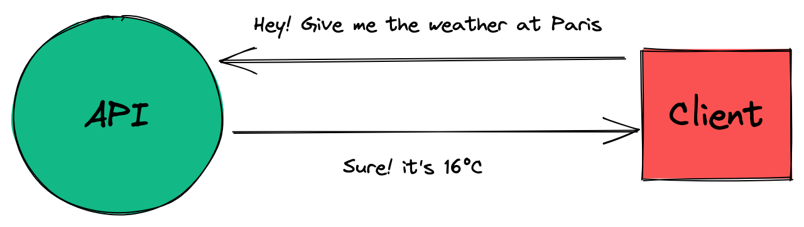

# PoC Software Pool 2023 - Day 03 - REST API

**Day purposes**

✔️ Discover HTTP server with Gin.

✔️ Learn the basics and good practices of web development.

✔️ Secure your endpoints with validators.

✔️ Explore request's resources, their location and usage.

## Introduction

In our modern world, **everything** is a story of [server](https://developer.mozilla.org/en-US/docs/Learn/Common_questions/What_is_a_web_server).

If you want to share a resource on the internet you will need a server. You
want to save your picture into a cloud? Same. You want to access PoC's ✨ amazing ✨
subject for this day? Everything is on GitHub and by extension, on their servers.

They have many usages and everyone uses it daily. One of the most common is resource sharing.
 With server and a protocol, you can share resources between applications or clients.

Those kinds of applications are called [API](https://www.redhat.com/en/topics/api/what-are-application-programming-interfaces),
it's an interface exposed to let your application share resources with other applications
or consumers. For example, you can ask for the weather through a [weather API](https://www.weatherapi.com).

To communicate, APIs usually follow the [HTTP protocol](https://en.wikipedia.org/wiki/Hypertext_Transfer_Protocol)
and standard. The most popular is [REST](https://en.wikipedia.org/wiki/Representational_state_transfer).

Here's a simple schema of an API and a client:



This subject will give you all the knowledge required to create a secure REST API.

## Step 0 - Setup

Still in your repository, create a new directory for the `day03`:
```shell
mkdir -p day03
```

- Initialize a Go module `SoftwareGoDay3`.

> See [day01](../../day01/Golang) if you don't remember how to initialize a Go module 😉

## Step 1 - Hello Web 👋

Let's begin with a simple `hello world`. In fact, it will be more complex
than a simple hello world function called from a main, but it's not that hard 🙂

First, we must create a server using the [Gin](https://github.com/gin-gonic/gin)
package. It's the most popular framework to create server in Go.
> ***Please take a moment to read the documentation.***\
> Here is the [quickstart](https://github.com/gin-gonic/gin#quick-start) to help you.

When your `server` is correctly initialized, launch it to listen on port `8080`.

> We encourage you to show a message that displays your server root
> endpoint to easily reach it.\
> For example: `server listening on http://localhost:8080/`

You must also define an endpoint `/hello` reachable through the `GET` [method](https://developer.mozilla.org/en-US/docs/Web/HTTP/Methods).<br>
When hitting the endpoint, it must responds `world` with the status `200`.

To do so:
- Create a package `routes` with your Router and Controllers.
- Create a package `server` with:
  - A structure `Server` (storing your Gin Engine).
  - A function `NewServer()` that will instantiate a new Server.
- Create a main to launch your Server.

Here is an example to manage your routes:
```go
package router

import (
    "github.com/gin-gonic/gin"
)

func world(c *gin.Context) {
}

func ApplyRoutes(r *gin.Engine) {
  //r.HttpMethod(route, controller)
}
```

## Step 2 - Where is the data?

### Theory

In [HTTP](https://en.wikipedia.org/wiki/Hypertext_Transfer_Protocol),
data is stored in different parts of the request depending on the data type:

- [`body`](https://en.wikipedia.org/wiki/HTTP_message_body): message in the
request. Generally used to store structured data in a given format (`JSON`, `XML`, ...)
- [`query`](https://en.wikipedia.org/wiki/Query_string): a string that
extends the url to fill parameter of type `key/value`. Generally used to
give additional information about the request.<br>
For example: order of data to return, max number of entities etc... It's also
used for [SEO](https://en.wikipedia.org/wiki/Search_engine_optimization).
- [`url param`](https://doriantaylor.com/policy/http-url-path-parameter-syntax): a dynamic
string in the path. Generally used to select a resource directly from
the url. For example: `http://localhost:3000/cat/1` select the resource `cat` with
the id `1`.
- [`cookie`](https://developer.mozilla.org/en-US/docs/Web/HTTP/Cookies): used to
store session (keep user logged in) or track user activity.
- [`header`](https://developer.mozilla.org/en-US/docs/Web/HTTP/Headers): `key/value` pairs used for contextual information. You can specify the type of your request, proxy
information, give an API key, specify how the server should manage cache etc...

### Here we are

It's time to create your different endpoints 🚀

#### Query

Create the endpoint `/repeat-my-query`, it must define the following handler
for the `GET` method:

If there is a `message` in the [query](https://github.com/gin-gonic/gin#querystring-parameters),
return it with status `200`.<br>
If there is no message: return a status `400`.

#### Param

Create the endpoint `/repeat-my-param/:message`, it must define the following handler
for the method `GET`:

Take as [url parameter](https://github.com/gin-gonic/gin#parameters-in-path)
a `message` and return it with status `200`.

#### Body

Create the endpoint `/repeat-my-body`, it must define the following handler
for the `POST` method:

If there is a `message` in the [`body`](https://github.com/gin-gonic/gin#try-to-bind-body-into-different-structs)
of your request, return it with status `200`.<br>
If there is no message, return a status `400`.

#### Header

Create the endpoint `/repeat-my-header`, it must define the following handler
for the `GET` method:

If there is a [header](https://github.com/gin-gonic/gin#serving-data-from-reader)
`X-Message`, return it with status `200`.<br>
If there is no message: return a status `400`.

#### Cookie

Create the endpoint `/repeat-my-cookie`, it must define the following handler
for the `GET` method:

If there is a [cookie](https://github.com/gin-gonic/gin#set-and-get-a-cookie)
`message`, return it with status `200`.<br>
If there is no message: return a status `400`.

> You can use [Postman](https://www.postman.com) or [Insomnia](https://insomnia.rest) to test your HTTP endpoints 😉

> 💡 You should check [AbortWithStatus](https://pkg.go.dev/github.com/gin-gonic/gin#Context.AbortWithStatus).

## Step 3 - A scaling issue 📈

### Theory

It's common to configure your web server when you are about to launch it.<br>
In this case, you can't just hardcode value in your code, you need another
way.

[Environment variables](https://en.wikipedia.org/wiki/Environment_variable) 
are the best way to configure a software behavior.
> You can check them by tipping `env` in your terminal 😉

Those variables are used when you deploy an application in production to
specify some parameters that will affect the global behavior of your app.
It can also be used to pass sensitive information, such as API Key, secrets...

It's essential to know how use it! In this step, we will try to dynamically
configure your `host` and `port` when running the server, and create a 
dynamic greeting message.

It's also important to think about your configuration from the beginning
of your application by putting any variable that should be configurable into
your environment.

### Installation

Let's install the package [dotenv](https://github.com/joho/godotenv) in order to automatically load environment variables from a file.

```shell
go get github.com/joho/godotenv
```

### Practice

Now you can create a file named `.env` that will `export` the following
environment variables:
- `SERVER_PORT`: `8080`
- `SERVER_HOST`: `localhost`
- `HELLO_MESSAGE`: `world`

Let's create a `config.go` file in the directory `server`.

> 💡 In order to keep a clean architecture, it's common to dedicate a file 
> to your API configuration.

In it, use the [envconfig](https://github.com/kelseyhightower/envconfig) package to create a structure storing your server's environment variables.

Update the needed files to use your environment variables.

> If your `.env` contains sensitive information, **do not push it**! A good
practice is to create a file `.env.example` that will define the
same environment variables but without value.

## Step 4 - HTTP status

REST APIs return data according to customer's desire, but in case he tries to
access data that he doesn't own, or which do not exist, the REST API will
not be able to do what he asked for.

When this happens, the REST API must explicitly send an error. To do so,
we can use [HTTP codes](https://medium.com/@sahelasumi/http-status-codes-31644d99fb1) to help the client understand what happened. Those codes are essentials and must be correctly set from your REST API.

For example, a response with status `404` means that the resource has not been
found in the server, `201` stands for resource creation and `200` is used
when everything went well.

Let's create an endpoint `/health` that will always return the status `200`.<br>
If that endpoint fails when you test it, you are sure that your server is not
working. That's call a health-check!

Even if status codes make sense of their own, you don't know the meaning of [every status code](https://developer.mozilla.org/en-US/docs/Web/HTTP/Status).
<br>
When the client receives the response status, it's his own responsibility to properly handle it. But it's important to explicit these status in your codebase.

To do so, we will use aliases instead of the raw number. This way it will be really easy to understand what we return in our response 😉

Now, replace all raw http status codes by the ones [exported](https://pkg.go.dev/net/http#pkg-constants) by the [http package](https://pkg.go.dev/net/http).

TODO: remove the step and talk about the given tests
## Step [OLD\] - Testing time

Since [day01](../../day01/Golang), we asked you to create tests to verify
the behavior of your functions. API are not exception and there are also
tools to manage tests.

To do so, you can use [Postman](https://www.postman.com), it's a powerful 
GUI to make requests, tests suites and many other useful stuff like API 
mockup, documentation etc...

Install Postman and create a [Postman collection](https://learning.postman.com/docs/sending-requests/intro-to-collections/)
to tests every endpoint previously coded.<br>
After you create your request, you should be able to run a whole [test-suite](https://www.postman.com/use-cases/api-testing-automation/)
on your server.

You can also create an [environment](https://learning.postman.com/docs/sending-requests/managing-environments/)
to manage your configuration.

## Step 5 - Who use hard coded text?

It's important to transform the data sent to the client to make the API easier to use 😄<br>
With time, data took standard forms like `JSON` or `XML`. Here we will use
the most popular: [`JSON`](https://en.wikipedia.org/wiki/JSON).

Create an endpoint `/repeat-all-my-queries` with a handler on the `GET` method.

This handler must retrieve all the [query parameters](https://en.wikipedia.org/wiki/Query_string)
and return an array of objects containing the `key` and the `value` of each
query parameter.

Here's the shape of the data to return an `OK` status:
```json
[
    {
        "key": "<key of the query>",
        "value": "<value of the query>"
    }
]
```

Don't forget error handling, you have to return a `Bad Request` status in case there is no query param.

> As it returns an Object array, you have to create a `structure` 👀

## Step 6 - Server's bodyguard 🛡️

It's important to know what kind of data is sent to your API. This will help you to keep it resilient and secured.

<details>
    <summary>For example, here's an endpoint that checks if body words are palindromes</summary>

    ```go
    // Structure for our returned JSON
    type PalindromeResponse struct {
        Input  string `json:"input"`
        Result bool   `json:"result"`
    }

    // Helper function to check a single string
    func isPalindrome(input string) bool {
        size := len(input)
        stop := size / 2
        for i := 0; i < stop; i++ {
            if input[i] != input[size-i-1] {
                return false
            }
        }
        return true
    }

    // Main function
    func areThesePalindromes(c *gin.Context) {
        var inputs []string
        _ = c.BindJSON(&inputs)
        palindromes := make([]PalindromeResponse, len(inputs))
        for idx, input := range inputs {
            palindromes[idx] = PalindromeResponse{Input: input, Result: isPalindrome(input)}
        }
        c.JSON(http.StatusOK, palindromes)
    }
    ```
</details>

If you send an empty body to this endpoint, you should get an error. That kind of issue is not suitable in a production API.

To ensure API security, a system has been created: [`Middleware`](https://en.wikipedia.org/wiki/Middleware).

> 💡 Middleware can also be used for other purposes: logger, permissions management etc...

Here's a code snippet of a [middleware for a gin API](https://github.com/gin-gonic/gin#custom-middleware):

```go
func Logger() gin.HandlerFunc {
    return func(c *gin.Context) {
        // Before request
        t := time.Now()

        // Set an example variable
        c.Set("example", "12345")

        // Calling the next function to be executed
        c.Next()

        // After the request
        latency := time.Since(t)
        log.Print(latency)

        // Access the status we are sending
        status := c.Writer.Status()
        log.Println(status)
    }
}
```

Add the `/are-these-palindromes` endpoint to your server so we can validate it ✅

Then, create a `middlewares` package, containing the `CheckPalindrome` function.
> Here's [how to validate body with gin](https://github.com/gin-gonic/gin#model-binding-and-validation).

> If the body is invalid, return the right error code with an explicit error message 😄

- Apply this middleware to the `/are-these-palindromes` endpoint.
> 💡 Here's [how to use middlewares with gin](https://github.com/gin-gonic/gin#using-middleware).

> If you end up with an empty array result with the middleware, check [this issue related to binding](https://github.com/gin-gonic/gin/issues/1078) 😉

## Step 7 - Time to clean up 🧹

At this point, you should have many endpoints in one file in your package `routes`:
- Some simply retrieve content in the request and return it.
- One analyze palindromes.
- One says a message.
- One checks health.

It's time to organize our endpoints into different files.

Create the file `routes/index.go` with the following content:
```go
package routes

import (
    "github.com/gin-gonic/gin"
)

func ApplyRoutes(r *gin.Engine) error {
    applyHealth(r)
    applyHello(r)
    applyRepeat(r)
    applyPalindrome(r)
    return nil
}
```

Then create these files in `routes`: `health.go`, `hello.go`, `palindrome.go`, `repeat.go`.

Now move your endpoints into the corresponding files and create the required functions.
> 💡 `ApplyRoutes` should be the only exported function of your `routes` package.

You should end up with the following architecture:
```
...
routes/
  health.go
  hello.go
  index.go
  palindrome.go
  repeat.go
...
```

## Step 8 - Authentication with JWT 👨

What if you want to control who can access certain endpoints of your API?

That's where authentication comes into play 🚀

It has many purposes in this world of servers and API.<br>
Manage users accounts, control activities and limit privileges requiring to
know the user identity are some examples.

Many systems exist today, depending on the usage and the consumers: [API keys](https://cloud.google.com/endpoints/docs/openapi/when-why-api-key),
sessions, [OAuth](https://auth0.com/intro-to-iam/what-is-oauth-2/) and so on, you can use a single one or combine them to fit with your product and provide the best possible user experience.

Here we will use JSON Web Tokens 😃

### Concept

JSON Web Tokens are used to share security token between entities, it can be
user or a service.<br>
It's a signed electronic signature to verify a consumer's identity. 

> 💡 It's common to use [HMAC](https://en.wikipedia.org/wiki/HMAC) or [RSA](https://en.wikipedia.org/wiki/RSA_(cryptosystem)) to sign tokens.

Those token can be stored in cookies, but they can also be sent in a header.

A JWT (JSON Web Token) is composed of 3 parts: `Header`, `Payload` and `Signature`.<br>
For more information about JWT, go to [jwt.io](https://jwt.io/introduction/). You can also use a [debugger](https://jwt.io/#debugger-io) to visualize the different parts of a jwt.

The classic workflow for JWT authentication is:
1. You authenticate yourself with your credential (username, password, etc...)
2. API signs those credentials with a secret key
3. API sends back the token to the user
4. The client put the token in future requests to authenticate him in the header

### Practice

Let's create an authentication system with JWT 🔥

#### Installation

The first thing we need to do is to add a package to generate the JWT:
```sh
go get -u github.com/golang-jwt/jwt
```

Then, add a folder `jwt` in `routes`.<br>
It will contain 2 files:<br>
`jwt.go` with a `users` [map](https://go.dev/tour/moretypes/19) that will mock a simple database, stored in your RAM.

```go
package jwt

type user struct {
	Email    string `json:"email"`
	Password string `json:"password"`
}

var users = map[string]user{}
```

`utils.go`, with a few useful functions:
```go
package jwt

// Function to check if a given email is already registered
func isRegistered(email string) bool {
	_, ok := users[email]
	return ok
}
```

#### Register

Now it's time to create the endpoints 💥

The first one is `/jwt/register` with a resolver on method `POST`.

The resolver must take as `body` parameter:

```json
{
  "email": "<email>",
  "password": "<password>"
}
```

It will extract these information from the `body` and add it to `users`.<br>
Then it should return a `JWT token` containing the user's email ✉️ in a JSON format like this:
```json
{
  "accessToken": "<token>",
  "user": {
    "email": "<email>",
    "password": "<password>"
  },
  "message": "User successfully created"
}
```

You should return it with the `201 CREATED` status in this case (use the right `net/http` status 😉)

If there is no `body`, return `Bad Request` with the corresponding status.

If the user is already registered, you have to return `User already exists` with the `403 Forbidden` status.

> 💡 You will need to use a secret, create a new environment variable in your `config.go` for this.

> If you get a `key is of invalid type` error, take a look at [this issue](https://github.com/dgrijalva/jwt-go/issues/65#issuecomment-284784243) 😉

#### Login

Now let's create an endpoint `/jwt/login` with a resolver on method `POST`.

It must take as `body` parameter:

```json
{
  "email": "<email>",
  "password": "<password>"
}
```

It will extract information from `body` and check if there is a match in
the `users` map.<br>

If the identifier matches, you should return the same JSON as for `/jwt/register`, but with this message:
```json
{
  "message": "Successful login"  
}
```

This time didn't create any resource, so we'll just return an `OK` status 😄

As always don't forget error handling:
- If there is no `body`, return a `Bad Request` message & status.
- If the email doesn't match any user, return `User not found` with the `404 Not Found` status
- If the password doesn't match, return `Wrong password` with `404` again.

> You can also add an [expiration date](https://gist.github.com/soulmachine/b368ce7292ddd7f91c15accccc02b8df#1-how-to-hadle-jwt-expiration)
> to the tokens generated in `register` and `login` 😉

#### Token

Finally, let's create an an endpoint `/jwt/me` to retrieve user data on method `GET`.

If a token is present in the header `Authorization` with the format 
`Bearer <TOKEN>`, return information related to the authenticated user with an `OK` status:
```json
{ 
  "user": {
    "email": "<email>",
    "password": "<password>"
  },
  "message": "User found" 
}
```

And the last errors to handle:
- If the token is wrong, return `Unauthorized` with the right status.
- If no user is found, return `Unknown user` with the right status.


## Bonus

Well done for completing this day 🔥

TODO: add auth advanced exercises
If you are still looking for exercises, here are two intermediate ones:


<details>
  <summary>OAuth with Google</summary>
  <br>

  ### Concept

[OAuth 2.0](https://oauth.net/2/) is a powerful authentication framework
to use trustworthy service to manage the authentication for you.

You have certainly already meet the button "_Login with Google_" or
"_Login with GitHub_" and you wanted to register on a website.<br>
This is exactly what you're going to create.

In short, you will use an external service to authenticate users.

The workflow is quite complex but common for any kind of service you want
to use to create your OAuth 2.0 authentication:
- You create an OAuth application in the service you want to use (Google,
Facebook, Twitter, GitHub, Microsoft...)
- You define a redirection URL that will redirect the user to your website
after he successfully connected to the service
- From your server, retrieve from this url an authentication token
- Server can use this token to retrieve user's information and execute
action on the service.

The user is warned about which permissions you require when he
logs him in the service.<br>
As well, the token is linked to the application, if a user log himself
in two different application, both application will have a different token.

### Practice

Here you will use the `oauth2` package for a simple workflow:
```sh
go get -u golang.org/x/oauth2
```

> **Take a moment to read the [documentation](https://pkg.go.dev/golang.org/x/oauth2/google)**.

You will also need to create an application on the [Google developers console](https://console.developers.google.com/) and configure your **callback url** that you will use next.

You can then create a `routes/oauth/google.go` file with a mocked database:
```go
package oauth

type userGoogle struct {
  DisplayName   string
  GoogleId      string
}

var usersGoogle := map[string]userGoogle{}
```

Then you can create the needed routes to handle a google login
> First, follow the documentation.\
> Then if you're in trouble, this [tutorial](https://medium.com/@hfogelberg/the-black-magic-of-oauth-in-golang-part-1-3cef05c28dde) can help you.

- Once you have retrieved the id of the connected user, save it in the "db" and return a JWT like in exercise the previous steps, containing this id (instead of an email before)

> ⚠️ If the user's id already exists in db, you must return its information rather than create a new user with the same id each time.
<br><br>
</details>

### Testing time, round 2
TODO: replace with advanced tests based on the provided ones

Postman is a powerful tool, but it's an external tool... you need a team
who knows the tool and everything relate to it. As well, it's hard to
create complex pipelines with Postman, scripts work good, but it does not
feel natural compared to code.

Here is [how to write a tests suite](https://kpat.io/2019/06/testing-with-gin/) for each endpoint to verify that it correctly handles errors and works well.

### Expose Data

Yesterday you discovered how to manipulate a database with Ent. Today, you've build an API with Gin.

What about mixing it?

Expose yesterday's database with today's API 🚀

> Made with ❤️ by PoC
