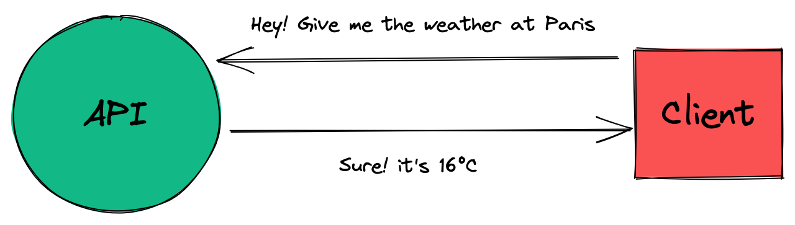

# PoC Software Pool 2023 - Day 03 - REST API

**Day purposes**

✔️ Discover HTTP server with express.

✔️ Learn basics and good practices of web development.

✔️ Secure your endpoints with validators.

✔️ Explore request's resources, their location and usage.

## Introduction

In our modern world, **everything** is a story of [server](https://developer.mozilla.org/en-US/docs/Learn/Common_questions/What_is_a_web_server).

If you want to share a resource on the internet you will need a server. You
want to save your picture into a cloud? Same. You want to access PoC's ✨ amazing ✨
subject for this day? Everything is on GitHub and by extension, on their servers.

They have many usages and everyone uses it daily. One of the most common is resource sharing.
 With server and a protocol, you can share resources between applications or clients.

Those kinds of applications are called [API](https://www.redhat.com/en/topics/api/what-are-application-programming-interfaces),
it's an interface exposed to let your application share resources with other applications
or consumers. For example, you can ask for the weather through a [weather API](https://www.weatherapi.com).

To communicate, APIs usually follow the [HTTP protocol](https://en.wikipedia.org/wiki/Hypertext_Transfer_Protocol)
and standard. The most popular is [REST](https://en.wikipedia.org/wiki/Representational_state_transfer).

Here's a simple schema of an API and a client:



This subject will give you all the knowledge required to create a secure REST API.

## Step 0 - Setup

Still in your repository, create a new directory for the `day03`
```shell
mkdir -p day03
```

You can directly initialize your repository with `npm init` and `typescript`, `eslint` and `prettier`.

> See [day01](../../day01/Typescript) if you do not remember how to setup a NodeJS project 😉

You will also need to create a `tsconfig.json` with the following configuration:
```json
{
  "compilerOptions": {
    "target": "es2020",
    "module": "commonjs",
    "sourceMap": true, 
    "outDir": "./dist",  
    "strict": true,  
    "allowUnreachableCode": false,

    "baseUrl": "./src",
    "esModuleInterop": true,
    "forceConsistentCasingInFileNames": true
  },
  "include": [
    "src/**/*.ts"
  ],
  "exclude": [
    "node_modules",
    "tests/**/*.ts"
  ]
}
```

> Check the [documentation](https://www.typescriptlang.org/docs/handbook/tsconfig-json.html)
> if you are curious about TSConfig.

As usual, you can also create a folder `src`:
```shell
mkdir -p src
```

## Step 1 - Hello web 👋

Let's begin with a simple `hello world`. In fact, it will be more complex
than a simple hello world function called from a main, but it's not that hard 🙂

First, we must create a server using the [express](https://github.com/expressjs/express)
package. It's the most popular framework to create server in NodeJS.

Let's install express and its type dependencies:
```shell
npm install express

npm install -D @types/express
```

Then let's create a file `server.ts` to initialize our server.

In it, create a variable `server` that will instantiate your express server.

> In the [official documentation](http://expressjs.com/en/starter/hello-world.html),
> examples are in javascript, don't forget to convert it to Typescript when
> you will reproduce it.\
> For example, use `import` instead of `require`.\
> ***Please take a moment to read the documentation.***

When your `server` is correctly initialized, launch it to listen on port `8080`.

> We encourage you to show a message that displays your server root
> endpoint to easily reach it.\
> For example: `server listening on http://localhost:8080/`

You must also define an endpoint `hello` reachable through the `GET` [method](https://developer.mozilla.org/en-US/docs/Web/HTTP/Methods).\
When hitting the endpoint, it must responds `world` with the status `200`.

> 💡 You can import the types `Request` and `Response` from `express` to add
> types to your parameters in the handler of your endpoint.

## Step 2 - Where is the data?

### Theory

In [HTTP](https://en.wikipedia.org/wiki/Hypertext_Transfer_Protocol),
data is stored in different parts of the request depending on the data type:

- [`body`](https://en.wikipedia.org/wiki/HTTP_message_body): message in the
request. Generally used to store structured data in a given format 
(`JSON`, `XML`, ...)
- [`query`](https://en.wikipedia.org/wiki/Query_string): a string that
extends the url to fill parameter of type `key/value`. Generally used to
give additional information about the request.<br>
For example: order of data to return, max number of entities etc... It's also
used for [SEO](https://en.wikipedia.org/wiki/Search_engine_optimization).
- [`url param`](https://doriantaylor.com/policy/http-url-path-parameter-syntax): a dynamic
string in the path. Generally used to select a resource directly from
the url. For example: `http://localhost:3000/cat/1` select the resource `cat` with
the id `1`.
- [`cookie`](https://developer.mozilla.org/en-US/docs/Web/HTTP/Cookies): used to
store session (keep user logged in) or track user activity.
- [`header`](https://developer.mozilla.org/en-US/docs/Web/HTTP/Headers): `key/value` pairs used for contextual information. You can specify the type of your request, proxy
information, give an API key, specify how the server should manage cache etc...

### Installation

In this step, we will learn how to extract data from these locations 🙂

To do so, we need to install additional dependencies:
```shell
npm install body-parser cookie-parser

npm install -D @types/cookie-parser
```

These dependencies are [middlewares](https://expressjs.com/en/guide/using-middleware.html) that will help you parse data from
the [body](https://www.npmjs.com/package/body-parser) and [cookies](https://github.com/expressjs/cookie-parser).

> 💡 You will need to import and apply them to your server with the `use()`
method from your `server`.

### Here we are

It's time to create your different endpoints in the file `server.ts` 🚀

#### Query

Create the endpoint `/repeat-my-query`, it must define the following handler
for the `GET` method:

If there is a message in the [query](https://www.educative.io/edpresso/what-is-reqquery-in-expressjs),
return it with status `200`.<br>
If there is no message: return `Bad Request` with status `400`.

#### Param

Create the endpoint `/repeat-my-param/:message`, it must define the following handler
for the method `GET`:

Take as [url parameter](https://www.geeksforgeeks.org/express-js-req-params-property/)
a `message` and return it with status `200`.

#### Body

Create the endpoint `/repeat-my-body`, it must define the following handler
for the `POST` method:

If there is a `message` in the [`body`](https://masteringjs.io/tutorials/express/body)
of your request, return it with status `200`.<br>
If there is no `message`, return `Bad Request` with status `400`.

#### Header

Create the endpoint `/repeat-my-header`, it must define the following handler
for the `GET` method:

If there is a [header](https://stackoverflow.com/questions/13147693/how-to-extract-request-http-headers-from-a-request-using-nodejs-connect)
`X-Message`, return his value with status `200`.<br>
If there is no header `X-Message`, return `Bad Request` with status `400`.

#### Cookie

Create the endpoint `/repeat-my-cookie`, it must define the following handler
for the `GET` method:

If there is a [cookie](https://www.geeksforgeeks.org/express-js-req-cookies-property/)
`message`, return his value with status `200`.<br>
If there is no cookie `message`, return `Bad Request` with status `400`.

> You can use [Postman](https://www.postman.com) or 
> [Insomnia](https://insomnia.rest) to test your HTTP endpoints 😉

> 💡 You should check [http-status-codes](https://www.npmjs.com/package/http-status-codes)
> to explicitly set your status code in your response.

## Step 3 - A scaling issue 📈

### Theory

It's common to configure your web server when you are about to launch it.<br>
In this case, you can't just hardcode value in your code, you need another
way.

[Environment variables](https://en.wikipedia.org/wiki/Environment_variable) 
are the best way to configure a software behavior.
> You can check them by tipping `env` in your terminal 😉

Those variables are used when you deploy an application in production to
specify some parameters that will affect the global behavior of your app.
It can also be used to pass sensitive information, such as API Key, secrets...

It's essential to know how use it! In this step, we will try to dynamically
configure your `host` and `port` when running the server, and create a 
dynamic greeting message.

It's also important to think about your configuration from the beginning
of your application by putting any variable that should be configurable into
your environment.

### Installation

Let's install [`dotenv`](https://www.npmjs.com/package/dotenv) to preload our variables from a file.

You will also need to install [env-var](https://github.com/evanshortiss/env-var), a useful dependency to automatically validate your environment with a defined schema.

```shell
npm i dotenv env-var
```

### Practice

Now you can create a file named `.env` that will define the following
environment variables:
- `SERVER_PORT`: `8080`
- `SERVER_HOST`: `localhost`
- `HELLO_MESSAGE`: `world`

Let's create a `config.ts` file in the directory `src`. 

> 💡 In order to keep a clean architecture, it's common to dedicate a file 
> to your API configuration.

In it, use the function `get` from `env-var` to retrieve these three environment
variables and export them.

> The best way to retrieve the value is to create a generic function taking
> the `key` of the variable you want to retrieve. It will help you to
> do not repeat code.<br>
> Indeed, you can use other methods of the package to type your values.

> Take a look at the [`env-var` with `dotenv` documentation](https://github.com/evanshortiss/env-var/blob/master/EXAMPLE.md#dotenv) 😉

Update `server.ts` to use the `host` and `port` define in your environment.<br>
If no `port` is defined, use the port `8080`.

You must also update the endpoint `GET` `/hello` to use the variable `HELLO_MESSAGE`
as response.<br>
If the value is not defined, return `No message defined` with status `404`.

> If your `.env` contains sensitive information, **do not push it**! A good
practice is to create a file `.env.example` that will define the
same environment variables but without value.

## Step 4 - HTTP status

REST APIs return data according to customer's desire, but in case he tries to
access data that he doesn't own, or which do not exist, the REST API will
not be able to do what he asked for.

When this happens, the REST API must explicitly send an error. To do so,
we can use [HTTP codes](https://medium.com/@sahelasumi/http-status-codes-31644d99fb1) to help the client understand what happened. Those codes are essentials and must be correctly set from your REST API.

For example, a response with status `404` means that the resource has not been
found in the server, `201` stands for resource creation and `200` is used
when everything went well.

Let's create an endpoint `/health` that will always return the status `200`.<br>
If that endpoint fails when you test it, you are sure that your server is not
working. That's call a health-check!

Even if status codes make sense of their own, you don't know the meaning of [every status code](https://developer.mozilla.org/en-US/docs/Web/HTTP/Status).
<br>
When the client receives the response status, it's his own responsibility to properly handle it. But it's important to explicit these status in your codebase.

To do so, we will install the dependency [`http-status-code`](https://www.npmjs.com/package/http-status-codes)
to use aliases instead of the raw number. This way it will be really easy to
understand what we return in our response 😉

Let's install that dependency:
```shell
npm i http-status-codes
```

Now, replace all raw http status code by the ones [exported](https://github.com/prettymuchbryce/http-status-codes) by the dependency.

TODO: remove the step and talk about the given tests
## Step [OLD\] - Testing time

Since [day01](../../day01/Typescript), we asked you to create tests to verify
the behavior of your functions. API are not exception and there are also
tools to manage tests.

To do so, you can use [Postman](https://www.postman.com), it's a powerful 
GUI to make requests, tests suites and many other useful stuff like API 
mockup, documentation etc...

Install Postman and create a [Postman collection](https://learning.postman.com/docs/sending-requests/intro-to-collections/)
to tests every endpoint previously coded.<br>
After you create your request, you should be able to run a whole [test-suite](https://www.postman.com/use-cases/api-testing-automation/)
on your server.

You can also create an [environment](https://learning.postman.com/docs/sending-requests/managing-environments/)
to manage your configuration.

## Step 5 - Who use hard coded text?

It's important to transform the data sent to the client to make the API easier to use 😄<br>
With time, data took standard forms like `JSON` or `XML`. Here we will use
the most popular: [`JSON`](https://en.wikipedia.org/wiki/JSON).

Create an endpoint `/repeat-all-my-queries` in the file `server.ts` with
a handler on the `GET` method.

This handler must retrieve all the [query parameters](https://en.wikipedia.org/wiki/Query_string)
and return an array of objects containing the `key` and the `value` of each
query parameter.

Here's the shape of the data to return:
```json
[
    {
        "key": "<key of the query>",
        "value": "<value of the query>"
    }
]
```

To be Typescript compliant, you should create [a type or an interface](https://www.typescriptlang.org/docs/handbook/2/objects.html)
to correctly type your data 👀<br>
As well, `req.query` is an object, so you will need to call a method
to retrieves object's keys.

## Step 6 - Server's bodyguard 🛡️

It's important to know what kind of data is sent to your API. This will
help you to keep it resilient and secured.


<details>
  <summary>For example, here's an endpoint that checks if body words are palindromes</summary>

  ```ts
  type Palindrome = {
	  input: string,
	  result: boolean
  }

  server.post('/are-these-palindromes', (req: Request, res: Response) => {
  	const words = req.body;

  	const isPalindrome = (word: string) => {
  		return word.split('').reverse().join('') === word;
  	};

  	const palindromes: Array<Palindrome> = words.map((word: string) => {
  		return {
  			input: word,
  			result: isPalindrome(word)
  		};
  	});
  	res.status(StatusCodes.OK).send(palindromes);
  });
  ```
  
</details>
<br>
If you send an empty body to this endpoint, you should
get an error. That kind of issue is not suitable in a production API.

To ensure API security, a system has been created: [`Middleware`](https://en.wikipedia.org/wiki/Middleware).

Here's a code snippet of a middleware for an express API:

```ts
/**
 * req  - Request
 * res  - Response
 * next - Function called after this middleware. It can be another middleware or the final handler.
*/
const myMiddleware = (req: Request, res: Response, next: NextFunction) => {
  // Middleware's logic
}
```

> 💡 Middleware can also be used for other purposes: logger, permissions 
> management...

To verify user inputs, we will use the [Zod](https://github.com/colinhacks/zod) framework.<br>
Zod helps you to retrieve a verified typed body in your handler.

Install Zod with the following command:
```shell
npm install zod
```

To make it work, you may need to add the following line in your `tsconfig.json`:
```json
"strictNullChecks": true
```

Finally, add the `/are-these-palindromes` endpoint to your server so we can validate it ✅

#### Schema

[Zod](https://github.com/colinhacks/zod) validate data using a schema. The
first step is to create a zod object `palindromeSchema` defining the shape
of the expected input.

To split our logic, we will create a dedicated file named `schema.ts` in
the directory `src` to export our schema.

> Your schema also defines the final type of your data, to get it, you can
> call the function `z.infer`. It's a powerful feature because you keep
> only one source of truth 💯

#### Middleware

Let's write the middleware! We will put it in a dedicated file
named `middlewares.ts`.

You can now [write the middleware](https://expressjs.com/en/guide/using-middleware.html)
`verifyPalindrome` that will verify the body of the request
sent to `/are-these-palindromes`.

If the body doesn't fit in `palindromeSchema`, return a status `400` with the
message `Bad Request`.

> Don't forget to use `http-status-code` when you return the status code 😉

It's time to apply it to the endpoint `/are-these-palindromes`, here's
an example of a middleware called before a handler:
```ts
server.get('/my-route', myMiddleware, (req: Request, res: Response) => {...});
```

It's also possible to apply a middleware to the whole API. You just need to
call the function `use` of your express server.

Example:

```ts
server.use(myMiddleware())
```

> This has no sense here, because you have only one endpoint who must
be verified. But it can be useful to apply a logger middleware for instance 😄

## Step 7 - Time to clean up

At this point, you should have many endpoints in the file `server.ts`:
- Some simply retrieve content in the request and return it
- Others analyze palindromes.

It's time to organize our endpoints into different files and import them into the server 🚀

Create a folder `endpoints` in the `src` directory.
In it, create a file `repeat.ts` and `palindrome.ts`.

Now move your endpoint into the corresponding files and [find a way](http://expressjs.com/en/guide/routing.html)
to use those endpoints in `server.ts` 😉

> When you have several endpoints, it can be useful to group all your
> endpoints in sub-routers and aggregate those routers in a main router 
> in a specific file.<br>
> This way, you can keep a simple and resilient architecture.


## Step 8 - Authentication with JWT 👨

What if you want to control who can access certain endpoints of your API?

That's where authentication comes into play 🚀

It has many purposes in this world of servers and API.<br>
Manage users accounts, control activities and limit privileges requiring to
know the user identity are some examples.

Many systems exist today, depending on the usage and the consumers: [API keys](https://cloud.google.com/endpoints/docs/openapi/when-why-api-key),
sessions, [OAuth](https://auth0.com/intro-to-iam/what-is-oauth-2/) and so on, you can use a single one or combine them to fit with your product and provide the best possible user experience.

Here we will use JSON Web Tokens 😃

### Concept

JSON Web Tokens are used to share security token between entities, it can be
user or a service.<br>
It's a signed electronic signature to verify a consumer's identity. 

> 💡 It's common to use [HMAC](https://en.wikipedia.org/wiki/HMAC) or [RSA](https://en.wikipedia.org/wiki/RSA_(cryptosystem)) to sign tokens.

Those token can be stored in cookies, but they can also be sent in a header.

A JWT (JSON Web Token) is composed of 3 parts: `Header`, `Payload` and `Signature`.<br>
For more information about JWT, go to [jwt.io](https://jwt.io/introduction/). You can also use a [debugger](https://jwt.io/#debugger-io) to visualize the different parts of a jwt.

The classic workflow for JWT authentication is:
1. You authenticate yourself with your credential (username, password, etc...)
2. API signs those credentials with a secret key
3. API sends back the token to the user
4. The client put the token in future requests to authenticate him in the header

### Practice

Let's create an authentication system with JWT 🔥

#### Installation

First, download the [JWT](https://www.npmjs.com/package/jsonwebtoken) dependency:

```shell
npm install jsonwebtoken

npm install -D @types/jsonwebtoken
```

Then add a `src/utils.ts` file with these useful functions and types:
```ts
// Defining the type of user credentials
export type User = {
  email: string;
  password: string;
}

// Get a user from his email address
export const getUser = (users: User[], email: string) => users.find((u) => u.email === email);

// Function to check if a given email is already registered
// !! is a coercion to a boolean value to return either true or false
export const isRegistered = (users: User[], email: string) => !!getUser(users, email);
```

Finally, in your `endpoints` folder create a `jwt.ts` file with the following content:
```ts
import type { User } from '../utils';

// Storing users in an array for simplicity
const users: User[] = [];
```

#### Register

Now it's time to create the endpoints 💥

The first one is `/jwt/register` with a resolver on method `POST`.

The resolver must take as `body` parameter:

```json
{
  "email": "<email>",
  "password": "<password>"
}
```

It will extract these information from `body` and add it to the
`users` array.<br>
Then it should return a `JWT token` containing the user's email ✉️ in a JSON format like this:
```json
{
  "accessToken": "<token>",
  "user": {
    "email": "<email>",
    "password": "<password>"
  },
  "message": "User successfully created"
}
```

You should return it with the `201 CREATED` status in this case (use the right `http-status-code` 😉)

If there is no `body`, return `Bad Request` with the corresponding status.

If the user is already registered, you have to return `User already exists` with the `403 Forbidden` status.

> 💡 You will need to use a secret, create a new environment variable in your `config.ts` for this.

> Don't forget to create a sub-router and import it in the main router you created at the last step 😉


#### Login

Now let's create an endpoint `/jwt/login` with a resolver on method `POST`.

It must take as `body` parameter:

```json
{
  "email": "<email>",
  "password": "<password>"
}
```

It will extract information from `body` and check if there is a match in
the `users` array.<br>

If the identifier matches, you should return the same JSON as for `/jwt/register`, but with this message:
```json
{
  "message": "Successful login"  
}
```

This time didn't create any resource, so we'll just return an `OK` status 😄

As always don't forget error handling:
- If there is no `body`, return a `Bad Request` message & status.
- If the email doesn't match any user, return `User not found` with the `404 Not Found` status
- If the password doesn't match, return `Wrong password` with `404` again.

#### Token

Finally, let's create an an endpoint `/jwt/me` to retrieve user data on method `GET`.

If a token is present in the header `Authorization` with the format 
`Bearer ${TOKEN}`, return information related to the authenticated user with an `OK` status:
```json
{ 
  "user": {
    "email": "<email>",
    "password": "<password>"
  },
  "message": "User found" 
}
```

And the last errors to handle:
- If no token is found, return `No bearer found` with status `Bad Request`.
- If no user is found, return `Unknown user` with status `Not Found`.


## Step 9 - Password hashing

Congratulation, you can now authenticate users in a simple and easy way!

At this point, users can authenticate themselves through email and password,
but it's stored as plain text.<br>
Anyone with reading access to `users` (or a hypothetical database) will
be able to read the password of **every user** 😱. That's a real problem and
users can't trust a platform that don't keep their data in security.

To gain trust, we will [hash](https://en.wikipedia.org/wiki/Hash_function) every password, so this way nobody, even us, will be able to read it.

To do so, let's install [Bcrypt](https://www.npmjs.com/package/bcrypt),
a powerful and straight-forward hash dependency.

```shell
npm install bcrypt

npm install -D @types/bcrypt
```

Now you just have to update your `register` endpoint to save a hashed
password and your `login` endpoint to compare the given password
with the stored one 😉


## Bonus

Well done for completing this day 🔥

If you are still looking for exercises, we have a few ones for you 😄

They are sorted in order of importance with some guidance, but feel free to implement them as you wish!


<details>
  <summary>OAuth with Google</summary>
  <br>

  ### Concept

[OAuth 2.0](https://oauth.net/2/) is a powerful authentication framework
to use trustworthy service to manage the authentication for you.

You have certainly already meet the button "_Login with Google_" or
"_Login with GitHub_" and you wanted to register on a website.<br>
This is exactly what you're going to create.

In short, you will use an external service to authenticate users.

The workflow is quite complex but common for any kind of service you want
to use to create your OAuth 2.0 authentication:
- You create an OAuth application in the service you want to use (Google,
Facebook, Twitter, GitHub, Microsoft...)
- You define a redirection URL that will redirect the user to your website
after he successfully connected to the service
- From your server, retrieve from this url an authentication token
- Server can use this token to retrieve user's information and execute
action on the service.

The user is warned about which permissions you require when he
logs him in the service.<br>
As well, the token is linked to the application, if a user log himself
in two different application, both application will have a different token.

### Practice

Here you will use [passport](https://github.com/jaredhanson/passport)
to simplify the workflow.

Let's install required dependencies:

```shell
npm install passport passport-google-oauth20

npm install -D @types/passport @types/passport-google-oauth20
```

You will also need to create an application on the [Google developers console](https://console.developers.google.com/) and configure your **callback url** that you will use next.

Create a file `OAuth.ts` to code your endpoints.

### Storage

There his no password or email logic when dealing with OAuth authentication,
so you can store the user identifier.

Define a new type for your ephemeral storage:
```ts
type UserOAuth = {
  displayName: string;
  googleId: string;
}
```

And a new variable to store data:

```ts
let userOAuth: UserOAuth[] = [];
```

### Strategy

Passport works with [Strategy](https://www.passportjs.org/packages/),
so you will need here to set up the [GoogleStrategy](https://www.passportjs.org/packages/passport-google-oauth20/).

You should use the application identifier, secret code, the callback url
and the function called after user being redirected to your API.

### Endpoints

You will need to create two endpoints to use 
[Google with passport](http://www.passportjs.org/packages/passport-google-oauth20/).

#### Redirect

Create an endpoint that will redirect the user to the Google authentication service.

#### Callback

Create an endpoint used by Google to redirect user after authentication.
You should figure out that it will be your **callback url**.<br>
Thanks to passport, you will access information returned by Google,
you can store this information in your storage and return either a
cookie or a JWT to track the ID.

> If the user already exist, you don't have to insert it in
the database 😉

#### User

Create an endpoint `/oauth/me` with a handler on method `GET`.

If a JWT token or cookie is present and the user is found in storage, return the `displayName`.

> Don't forget to handle errors 💯

<br><br>
</details


<details>
  <summary>Logger middleware with Winston</summary>
  <br>

You have a clean architecture, but something is missing...<br>
You don't know what happens in your API, which endpoints are hit and if
everything works.

Seeing the whole web traffic will help you to detect issues in your API, but also attacks from others.

To do so, you will set up a [logger](https://www.securitymetrics.com/blog/importance-log-management).
It's an important piece of your API, during development but also in production.

Let's use [winston](https://github.com/winstonjs/winston). It's a powerful
logger easy to configure and use.

Let's install it:
```shell
npm install winston
```

### Winston! Stand up!

Create a file `logger.ts` in the `src` directory.

Inside it, export a [winston](https://github.com/winstonjs/winston) logger
with the following properties:
- An output format like this: `"[{timestamp}] [{severity}]": {message}`
- Write logs to the standard output and the file `/var/log/api.log`
- [Colorize the logs](https://github.com/winstonjs/winston#colorizing-standard-logging-levels) written in standard output

Winston works with a [transport system](https://github.com/winstonjs/winston/blob/master/docs/transports.md),
this way you can use multiple transport at the same time.<br>
It also sorts logs following a [severity system](https://github.com/winstonjs/winston/tree/master#logging-levels).

> A good practice consist of saving errors logs in a file `/var/log/error.log`
> to easily find issues later 💯

> 💡 For a better code readability, you can create an [Enum](https://www.typescriptlang.org/docs/handbook/enums.html)
> to define `severity` stages.

You can verify that everything works by replacing your `console.log` with
an `info` log.

### Winston! Line up!

One last thing remains to have a perfect API: a logger to display all
inbound requests and responses.

Create a new middleware `logMiddleware` in the file `middlewares.ts`.

This middleware should:
- Display inbound requests with a message like this:
`request [{request_id}] on {method} [{path}] from ({user_ip})`
- Display responses with a message similar to this one:
`request [{request_id}] response in {elapsed_time}ms with status {response status code}`

You can create unique identifiers with the dependency [uuid](https://www.npmjs.com/package/uuid).

> To log responses, you will need to do a little hack with [events](https://nodejs.org/api/http.html) 👀

Apply your middleware to your API and verify that everything works by sending requests 🚀

<br><br>
</details>


<details>
  <summary>404, Found</summary>
  At this point, when a request is sent to your server on a route that doesn't exist, you return the default message `404 not found`.

  It would be better to send a response that will really help the user.

  To do so, you can create a middleware that will return the following message
  when a request is sent to a non-existent endpoint:
  ```json
  {
    "message": "${endpointURL} not found",
    "status": 404,
    "availableEndpoints": [
      "/hello",
      "/repeat-my-query",
      "<Other available endpoints>"
    ]
  }
  ```
</details>


<details>
  <summary>Expose data</summary>
  Yesterday you discovered how to manipulate a database with Prisma. Today, you've build an API with Express.

  What about mixing it?

  Expose yesterday's database with today's API 🚀
</details>


<details>
  <summary>Testing time, round 2</summary>
  TODO: replace with advanced tests based on the provided ones

  Postman is a powerful tool, but it's an external tool... you need a team
  who knows the tool and everything relate to it. As well, it's hard to
  create complex pipelines with Postman, scripts work good, but it does not
  feel natural compared to code.
  
  There are frameworks specialized in tests with code, with those, it
  becomes really easy to test the business logic of our projects.
  
  Let's write test suite with the most popular: [`Jest`](https://jestjs.io).
  
  Setup Jest on your project and create a directory `tests` with a file `server.tests.ts`.
  
  > You can reuse setup from the [day01](../../day01/Typescript) 😉
  
  You will also need to install an http client to make your request.
  Let's install [axios](https://github.com/axios/axios) because it's more
  powerful than a simple fetch.
  
  Create a class `Requester` that will wrap an `axios` client and
  contain methods to interact with the API.
  
  > That kind of classes are called [SDK](https://www.redhat.com/en/topics/cloud-native-apps/what-is-SDK) 😉
  
  You can now write a tests suite for each endpoint to verify that it correctly
  handles errors and works well.
</details>
<br>

## Additional resources

- [API standard documentation: OpenAPI](https://www.openapis.org)
- [GUI to write API documentation](https://stoplight.io)
- [Swagger](https://swagger.io)
- [Generate your boilerplate with NestJS](https://nestjs.com)
- [Handle async operation in an express server](https://github.com/tranvansang/middleware-async)
- [Insomnia, a streamlined Postman](https://insomnia.rest)
- [NodeJS server frameworks](https://nodesource.com/blog/Express-Koa-Hapi)
- [Centralize your error handling](https://dev.to/nedsoft/central-error-handling-in-express-3aej)

> Made with ❤️ by PoC
