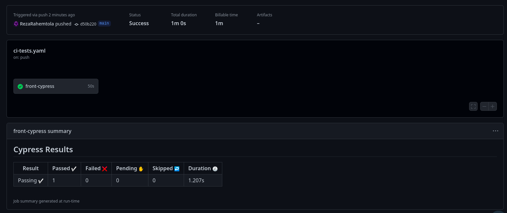

# PoC Software Pool 2023 - Day 04 - Deployment

**Day purposes**

✔️ Deploy an entire application

✔️ Use a cloud instance

✔️ Discover GitHub Actions

✔️ Setup a CI/CD pipeline


## Introduction

[This morning](../1%20-%20Docker/) you discovered Docker, a very useful and popular tool to package your application into containers. That's great, but you still need to start these containers *somewhere* reachable by someone who wants to access your app.

This can be quite complicated if you want to do it by yourself on your computer:
- It should be up and running 24/7
- You should make sure it's secured and up to date in case of vulnerabilities
- It can impact the performances of your other apps
- Dozens of other problems...

That's where cloud providers like [AWS](https://aws.amazon.com/) or [Scaleway](https://www.scaleway.com/) 🇫🇷 come into play: they offer cloud-based services like data storage or computing power.

They handle the hardware, maintenance and security concerns to let you focus on what's really important for you as a developer: shipping your application to users 🚀

> 💡 If you are curious, check [this link](https://www.bmc.com/blogs/saas-vs-paas-vs-iaas-whats-the-difference-and-how-to-choose/) to learn about the different types of services.

Today you will use [Scaleway Instances](https://www.scaleway.com/en/virtual-instances/) which are computing units installed with an OS of your choice, on which you can then connect via SSH and use as you want 🚀

Then you will discover [GitHub Actions](https://github.com/features/actions) to run tests and update your deployed application whenever you make change to your code 🔥


## Step 0 - Setup

### 📑 **Description**

The first thing you would normally do is to [create an instance](https://www.youtube.com/watch?v=1ulVecpL6QE) with all the settings you want, like the OS, computing power, storage space...<br>
We've already done this for you today, so you only have to connect to it 🔥

### 📌 **Tasks**

- Check your email address, you've received some information related to your dedicated instance
  - An IP address
  - A private SSH key
- Connect to the instance through SSH using the above information

### 📚 **Documentation**

- [Scaleway Instances Quickstart](https://www.scaleway.com/en/docs/compute/instances/quickstart/)
- [What is SSH and how to use it](https://www.ucl.ac.uk/isd/what-ssh-and-how-do-i-use-it)

### ✔️ **Validation**

Once you are connected to the instance, you can check the machine information with the following command:
```sh
hostnamectl
# Operating System: Ubuntu 22.04.1 LTS       
# Kernel: Linux 5.15.0-53-generic
# Architecture: x86-64
# Hardware Vendor: Scaleway
# Hardware Model: SCW-DEV1-S
```

You can then `exit` to go back to your terminal 😄


# Step 1 - Copy app files & run it 📁

### 📑 **Description**

Now that you know how to connect to your virtual instance, you have to add your application files and run it 🔥<br>
Here you can use the same application as [this morning](../1%20-%20Docker/resources/) for which you already created a `docker-compose.yml` file for an easy startup 👍

### 📌 **Tasks**

- Find a command to copy a local folder to a remote computer via SSH
- Move your application code to the instance, for example in the `/home/ubuntu/myapp` folder
- Connect to the instance and run your application
  - You may need to install docker, but now you know how to do it 🚀

> Don't forget to update the necessary variables in the `.env` files 😉

### 📚 **Documentation**

- [Secure Copy Protocol](https://en.wikipedia.org/wiki/Secure_copy_protocol)

### ✔️ **Validation**

If everything went well, you can open your browser at `http://<INSTANCE_IP>:3000` and access your app 🚀<br>
Unlike you run it on `localhost`, here it's accessible to anyone 😉


# Step 2 - Your first GitHub Action ⚙️

### 📑 **Description**

Deploying an application manually is cool, but DevOps is also about automating processes.<br>
Several tools exists to automate all kinds of workflows, from testing to deployment, and today you'll use [GitHub Actions](https://github.com/features/actions).

An Action is basically composed of several jobs (like `docker compose` services 😉) that can be triggered on events happening in your repository (a push, a PR opened...). These jobs will run in a virtual machine provided by GitHub with several OS choices. 

No better way to discover it than to practice, let's create your first GitHub Action 🚀

### 📌 **Tasks**

- Create a `.github/workflows` folder at the root of your repository
> Commonly, the `.github` folder can also contain an `assets` directory that stores your images used in `README`s, or the `ISSUE_TEMPLATE` folder that is useful to setup templates for features, bug reports...

- Create a `hello.yaml` file in `.github/workflows` with the following properties:
  - It should be named `Hello world`
  - It should be triggered:
    - When there is a push on any branch
    - When an issue is opened on the repository
  - It should have one job called `hello-world` that:
    - Is executed on a Ubuntu 22.04 machine
    - Has a step named `Display a greeting` that displays (with the `echo` command) the following message:<br>
      `Hi from GitHub Action, I'm running on <OS> and I was triggered by <USER> on the <EVENT> event!`
      > The values between <> should be retrieved from the environment 😉

### 📚 **Documentation**

- [Understanding GitHub Actions](https://docs.github.com/en/actions/learn-github-actions/understanding-github-actions)
- [Environment variables in Actions](https://docs.github.com/en/actions/learn-github-actions/environment-variables)

### ✔️ **Validation**

You can see the workflow runs in GitHub by going in the `Actions` tab (or appending `/actions` to your repository URL).<br>
Make a push and open an issue to check if the action is correctly triggered and if the message displayed is correct 😄


# Step 3 - Run tests in Action 🧪

### 📑 **Description**

Good job creating and running your first GitHub Action 🥳\
Now that you are familiar with it's syntax, let's go further by implementing a Continuous Integration: the objective is to make sure our project keeps working as intended while we keep developing it.

That's why here we will create an Action to run some tests on every commits, and retrieve the results for a simplified debugging if they fail 😉

For this exercise, you have to use the [Cypress](https://cypress.io/) tests contained in the frontend of you application.

> Cypress is a tool to run all kind of tests on your frontend, you'll discover it tomorrow if you choose the React option 😉

### 📌 **Tasks**

- Create a `ci-tests.yaml` action with the following parameters:
  - It should be triggered on every push and pull request
  - It should contain a single job named `front-cypress`
    - Run the frontend and the tests
    - Upload the screenshots and videos as artifacts if the tests fail

### 📚 **Documentation**

- [Continuous Integration with Cypress](https://docs.cypress.io/guides/continuous-integration/introduction)
- [GitHub Actions Marketplace](https://github.com/marketplace/actions)
- [Workflow Artifacts](https://docs.github.com/en/actions/using-workflows/storing-workflow-data-as-artifacts)

### ✔️ **Validation**

To validate your work, you can check the logs of your action to see if they contain the tests output.

Then, change the title of the application in `src/App.tsx` to make the tests fail and make sure the artifacts are present in the Action run.

<details>
  <summary>Example of success output</summary>

  
</details>

<details>
  <summary>Example of failure output</summary>

  
</details>
<br>


# Step 4 - CD on the Scaleway instance 🔀

### 📑 **Description**

Well done, now you have a way to automatically keep your app stable 🎉\
But if it's working correctly you can probably deploy it (directly in production to your users, or in a development environment for a future version release for example).

### 📌 **Tasks**

Your objective for this step is to combine the knowledge you've acquired from the previous steps to create a GitHub Action that will deploy the application (frontend and backend) to your Scaleway instance when there's a commit on your `main` branch

This means that you need to:
- Have some credentials to connect to the instance
- Upload the code
- Set environment variables if needed
- Rebuild the app with docker

> This step is intentionally less guided as you should have all the basic knowledge to be able to complete it, but don't hesitate to ask the staff for help if you struggle 😉

### 📚 **Documentation**

- [Using Secrets with Actions](https://docs.github.com/en/actions/security-guides/security-hardening-for-github-actions#using-secrets)

### ✔️ **Validation**

Just like in the first step, you can access your app at `http://<INSTANCE_IP>:3000`. Change the code (like the frontend title in `src/App.tsx`), commit it and wait for the action to deploy it on your instance. 

If you refresh the page you should have the new version displayed 🚀


## 📈 To go further

Congratulation for completing this day!

You've learned the basics of DevOps and launched an application in production, but there's still a lot to discover 😄

Here are a few interesting links to learn more:
- TODO
- TODO