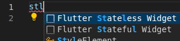
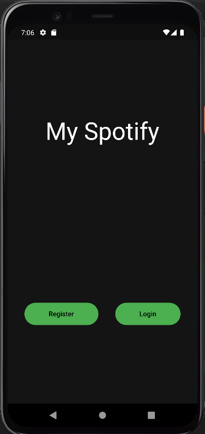
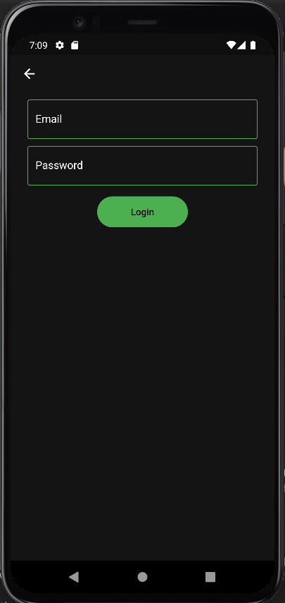
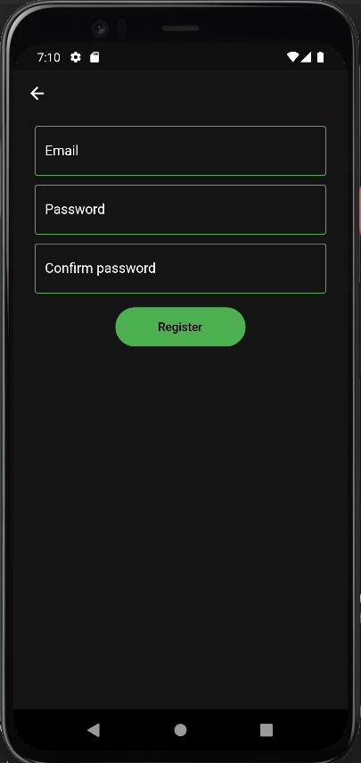

# PoC Software Pool 2023 - Day05 - Flutter

**Day purposes**

✔ Create your own User Interface (UI) with Flutter.

✔ Structure your UI.

✔ Test your UI.

✔ Make your UI responsive.

## Setup

The objective of this day is to create a music application like spotify with [Flutter](https://flutter.dev).

<!-- markdown-link-check-disable-next-line -->
You will first install [Flutter](https://docs.flutter.dev/get-started/install) and [Android Studio](https://developer.android.com/studio).

To use Flutter on Android Studio you need to install the plugins for `Flutter` and `Dart`.

To use Flutter on Visual Studio Code you will need to use the [Flutter extension](https://marketplace.visualstudio.com/items?itemName=Dart-Code.flutter).

If you want to use another IDE that does not have a plugin for Flutter you can always use the [flutter commands](https://docs.flutter.dev/reference/flutter-cli)

Even if you use other IDE than Android Studio, you need to install Android Studio.

> 💡 To launch your application you will need a smartphone emulator, in other words a virtual smartphone in your PC, which you can create and launch from Android Studio.

Once the installation is complete you can create and launch your first mobile application with the following commands:

```sh
# At the root of your pool repository, create today's folder
mkdir -p day05

# Move in this folder
cd day05

# Create a Flutter project
flutter create myapp

# Enter the folder
cd myapp

# Launch the application
flutter run
```

If all went well you should have the basic flutter application running in your emulator 🚀

## Step 0 - Dart

Flutter is a framework based on the dart language.

**_Do not start without knowing anything about it, here is an [introduction](https://dart.dev/samples) to this language._**

## Step 0.1 - Hello World

Like every new language you write for the first time, you must print `Hello World` in the terminal.

In order to do this, you have to create a folder `Dart` in which you will put your dart code. Create a `main.dart` file in it and let's code.

Here is a the doc to know [how to make a main in Dart](https://dart.dev/guides/language/language-tour#the-main-function).

To test your code, you need to run it (obviously), so you can do it just by using the `dart` command with your file name, `main.dart` in your case.

```sh
dart main.dart
```

## Step 0.2 - Vehicle

`Flutter` is an object oriented framework, so you will code as you might with flutter. In order to do it, you will [create a class](https://dart.dev/samples#classes) named `Vehicle` and create the following variables in it :

- `name` of type `String`;
- `_started` of type `bool` in it. (the underscore is to make the variable private)

To start the vehicle you have to create the function `start` in the class that make the started value to `true`.

To see if the vehicle is started, you have to make the function `isStarted` that print `Started` or `Not started` depending of the `_started` variable.

If you did everything good, the following code must start.

```dart
void main() {
  final Vehicle vehicle = Vehicle(name: "car"); // see named parameters to have a constructor like this.
  vehicle.start();
  vehicle.isStarted();
}
```

## Step 0.3 - Car

Now that your vehicle is operational, make it [abstract](https://dart.dev/samples#interfaces-and-abstract-classes).

To complete this, task you have to create a `Car` class that inherit of the `Vehicle` class, [override](https://api.flutter.dev/flutter/dart-core/override-constant.html) start function to put a print that display the name of the car followed by `car starting`, and make the following main work:

```dart
void main() {
  final Vehicle car = Car(name: "Peugeot");
  car.start();
  car.isStarted();
}
```

## Step 0.4 - Async

In this day you will have to interact with an API that is not synchronous with your app, as it's another program on another machine, that makes sense.

In order to learn a little bit of it, you will make a delay before your car rev the engine. To succeed, you have to make the `revTheEngine` function [asynchronous](https://dart.dev/codelabs/async-await#working-with-futures-async-and-await) and add this line of code on the first line of the function:

```dart
await Future.delayed(const Duration(seconds: 2));
```

In order to finish this introduction, use this main and run it:

```dart
void main() {
  final Vehicle car = Car(name: "Peugeot");
  car.start();
  Future.delayed(const Duration(seconds: 3), car.isStarted);
  car.isStarted();
}
```

## Step 0.1 - Hello World

Like every new language you write for the first time, you must print `Hello World` in the terminal.

In order to do this, you have to create a folder `Dart` in which you will put your dart code. Create a `main.dart` file in it and let's code.

Here is a the documentation to know [how to make a main in Dart](https://dart.dev/guides/language/language-tour#the-main-function).

To test your code, you need to run it (obviously), so you can do it just by putting the `dart` word before your file name, `main.dart` in your case.

```sh
dart main.dart
```

## Step 0.2 - Vehicle

`Flutter` is an object oriented framework, so let's discover some useful concepts. You will [create a class](https://dart.dev/samples#classes) named `Vehicle` and with the following variables in it: 

- `name` of type `String`
- `_started` of type `bool` in it
> The underscore is to make the variable private 😉

To start the vehicle you have to create the method `start` in the class that changes the started value to `true`.

To check if the vehicle is started, you have to create the method `isStarted` that prints `Started` or `Not started` depending on the `_started` variable.

If you did everything good, the following code must run successfully:

```dart
void main() {
  final Vehicle vehicle = Vehicle(name: "car"); // see named parameters to have a constructor like this.

  vehicle.start();
  vehicle.isStarted();
}
```

## Step 0.3 - Car

Now that your vehicle is operational, let's make it [abstract](https://dart.dev/samples#interfaces-and-abstract-classes).

To complete this, you have to create a `Car` class that inherits of the `Vehicle` class, [override](https://api.flutter.dev/flutter/dart-core/override-constant.html) the `start` method to add a print that displays the name of the car followed by `car starting`, and make the following `main` works:

```dart
void main() {
  final Vehicle car = Car(name: "Peugeot");

  car.start();
  car.isStarted();
}
```

## Step 0.4 - Async

In this day you will have to interact with an API that is not synchronous with your app, as it's another program on another machine, that makes sense.

In order to learn a little bit about it, you will add a delay before your car rev the engine. To succeed, you have to make the `revTheEngine` function [asynchronous](https://dart.dev/codelabs/async-await#working-with-futures-async-and-await) and add this line of code on the first line of the function:

```dart
await Future.delayed(const Duration(seconds: 2));
```

In order to finish this introduction, use this main and run it:

```dart
void main() {
  final Vehicle car = Car(name: "Peugeot");

  car.start();
  Future.delayed(const Duration(seconds: 3), car.isStarted);
  car.isStarted();
}
```

## Step 1 - Getting started

Now that you're warmed up, let's start to develop our music app 🔥

You can open the `main.dart` file located in the `lib` folder and delete everything in it.

Once the file is empty, reproduce the same architecture as the diagram below in the `lib` folder:

```
lib/
├── components/
├── pages/
├── utils/
├── main.dart
```

Before going further, check the [statelessWidget documentation](https://api.flutter.dev/flutter/widgets/StatelessWidget-class.html#widgets.StatelessWidget.1) and [statefulWidget documentation](https://api.flutter.dev/flutter/widgets/StatefulWidget-class.html#widgets.StatefulWidget.1)

We are going to make our first `page` which we will call `home.dart` (to put in the page folder obviously 🙂), it will serve as our home page.
You will put the following code in it, which will be present on each page you create:

```dart
import "package:flutter/material.dart";

class HomePage extends StatefulWidget {
  const HomePage({super.key});

  @override
  State<HomePage> createState() => _HomePageState();
}

class _HomePageState extends State<HomePage> {
  @override
  Widget build(BuildContext context) {
    return Scaffold(
      child: Center(
        child: Text("Home"),
      ),
    );
  }
}
```

We can now use this blank homepage in our application by calling it in our `main.dart` with the following code:

```dart
import "package:flutter/material.dart";
import 'package:my_spotify/pages/home.dart';

void main() => runApp(const MySpotify());

class MySpotify extends StatelessWidget {
  const MySpotify({super.key});

  @override
  Widget build(BuildContext context) {
    return const MaterialApp(
      debugShowCheckedModeBanner: false, // <--- hide debug banner
      home: HomePage(),
    );
  }
}
```

## Step 2 - Our firsts pages

To begin with, the first thing the user will be taken to, when the application starts up for the first time, will be a page that will offer him to either register if he doesn't have an account yet, or to log in if he already has one.

To do so, we will create a new page named `AuthPage`. You can use the following shortcut just by typing `stl` or `stf` then press enter in VSCode



Tu put style on our buttons we will use the [theme](https://docs.flutter.dev/cookbook/design/themes), I recommend you tu use the [ElevatedButton](https://api.flutter.dev/flutter/material/ElevatedButton-class.html) widget as the default button in your app.

**To put style on anything generically, use Theme in your MaterialApp**

For this first page you have to put the following element in it:

- A `Text` for the title
- An `ElevatedButton` to go to the login page
- An `ElevatedButton` to go to the register page

Here's an example of how it can look like:



Now that our first page is done we can create the pages that will be displayed on the screen after the user presses one of the two buttons, for this you will need two screens, `login` and `register` which should contain the following characteristics:

- Login:
  - A `TextField` for the email.
  - A `TextField` for the password, which should hide the text written inside.
  - An `ElevatedButton` `login` which does nothing at the moment.
- Register:
  - A `TextField` for the email.
  - A `TextField` for the password, which should hide the text written inside.
  - A `TextField` to confirm the password, which should also hide the text written inside.
  - An `ElevatedButton` `register` which does nothing for the moment.

### Here's an example of how it can look like:




## Step 3 - What if you change the screen size? 📱

To create a `responsive` application, that is to say an application that adapts to the size of the display in real time for that I let you do your research to keep your application responsive through the development of your application.

To guide you in your research here is a first [link](https://docs.flutter.dev/development/ui/layout/adaptive-responsive) to help you.

## Step 4 - Testing time 🧪

To make sure your application works well without having to test everything by hand Google has created a very powerful testing library for Flutter.

To use it, you should have a `test/` folder generated by default at the creation of the Flutter project, this folder contains a `widget test dart` file that you will open and replace all of its content with the following code:

```dart
import 'package:flutter/material.dart';
import 'package:flutter_test/flutter_test.dart';

import '../lib/main.dart';

void main() {
  testWidgets('Required widgets in authentication choice page', (WidgetTester tester) async {
    await tester.pumpWidget(const MySpotify());

    final Finder loginButton = find.byKey(const ValueKey("loginButton"));
    final Finder registerButton = find.byKey(const ValueKey("registerButton"));
    final Finder title = find.text("My Spotify"); // Replace "My Spotify" with the title you put in your application.

    expect(title, findsOneWidget);
    expect(loginButton, findsOneWidget);
    expect(registerButton, findsOneWidget);
  });
}
```

If you analyze the above code a bit you will understand that we are looking for the `Widgets` in our app with the `find.byKey` function, this means that we will need to assign `Keys` to our `Widgets`, you may have noticed that the default constructor of the components you created was:

```dart
const myComponent({super.key});
```

In this exercise you will need to find a way to add values to the `Keys` of your two buttons that are in your `Home` so that the tests seen earlier are validated.

## Step 5 - Navigation

Now that you have created the pages that will allow a user to authenticate, you will create the user's path.

That is to say, take the user from the `AuthPage` to the appropriate page after they have pressed one of the two buttons, so the `Register` button should bring up the `Register` page with the registration form and the `Login` button should bring up the `Login` page.

For this you will need to use the [Navigator](https://docs.flutter.dev/cookbook/navigation/navigation-basics) class.

Now you should be able to navigate between the `choice of authentication` page, the `login` page and the `register` page without being able to go any further.

It's time to see how to create the two main pages of our application:

- `Artist List`: a list of all artists created by the user.
- `Artist creation`: a form to fill in each field needed to create an artist.

The first thing we ask you to do here is to create a [bottomNavigationBar](https://api.flutter.dev/flutter/material/BottomNavigationBar-class.html) that will allow us to navigate between these two pages.

Now that you can navigate between your two pages, it's time to populate these pages with the following requirements:

- Artist List
  - A [tile](https://api.flutter.dev/flutter/material/ListTile-class.html) for each artist. All displayed as a list
- Artist creation:
  - A `TextField` for the artist's name.
  - A `scoring system` that goes from 0 to 5 to rate the artist.
  - A `TextField` for the nationality of the artist.
  - A `TextField` for the genre of the music.
  - A `TextField` for the url of the artist's picture.
  - An `ElevatedButton` to confirm the creation of the artist.

## Step 6 - Models

To prepare for the next exercise you will create a model for the `user`, the `artist` and the `music` with the following attributes:

- User
  - `id` of type `String`.
  - `email` of type `String`.
- Artist
  - `name` of type `String`.
  - `rating` of type `int`.
  - `nationality` of type `String`.
  - `musicGender` of type `String`.
  - `photoUrl` of type `String`.
  - `musics` of type `List<Music>`.
- Music
  - `name` of type `String`.
  - `rating` of type `int`.
  - `url` of type `String`.
  - `artistId` of type `String`.

## Step 7 - Authentication with an API 🔒

It is now time to connect your application to an API to store your data.

For this you will use the [http](https://pub.dev/packages/http) package 😃

> The models you created in the previous step should make it easier for you to send the data to the API.

For this step you have to be able to authenticate to the API with your application.

To manage the API calls you will create an `api.dart` file in the `utils` folder.

To get you started here is the code base to put in the `api.dart` file:

```dart
import 'package:http/http.dart' as http;

class Api {
  static final String _url = "http://10.0.2.2:8080";
  static String _token = "";

  static Future<bool> health() async {
    final response = await http.get(Uri.parse("$_url/health"));
    return response.statusCode == 200;
  }
}
```

The keyword static just mean that you don't need to create an instance of Api to use it. As we only need one instance of Api class, we can static everything inside it static 😉

For example example, here's how to use Api without static:
```dart
final Api api = Api();

api.health();
```

and with it:
```dart
Api.health();
```

In the above code `10.0.2.2` is used to reach the address of the machine emulating the smartphone. If you are on web you have to change it to `127.0.0.1`.

The `health` function allows you to check that the connection is well established between the api and the application. Very useful here 😉

Create a `login` and `register` function that will allow you to authenticate to the API.

The endpoints of the login and register routes are the following:
- Register: `/auth/register`.
- Login: `/auth/login`.

For both routes the body is:
- email
- password

Once the `JWT` token is received, put it in the `_token` variable.

**If you don't know what is a JWT, check this [link](https://jwt.io/introduction)**

## Step 8 - Managing artists with the API 🖌️

For this step you will have to manage the artist creation and the recovery of all the artists created with the api from the application.

You have to make sure that once the artist creation form is filled and the confirmation button is pressed, a request is sent to the api to create an artist with the given characteristics.

You will have to retrieve all the artists created at the launch of the application to be able to display them in the list of artists.

You will need to create the `createArtist` and `getArtist` function in your `Api` class.

## Step 9 - Managing music with the API 🎵

In this exercise you will have to manage the creation of music and the retrieval of music from an artist when the user presses on one of the artists in the artist list page.

In this exercise you have to create the function `createMusic` and `getMusic` in your `Api` class.

## Bonus

Congratulations for completing this day 🚀

Here are a few bonus ideas if you want to further explore Flutter 😄

### Animations

Add [animations](https://docs.flutter.dev/development/ui/animations) to enhance your user experience.

### Permanent login

Login every time you close the app is annoying. Here is [how to solve this problem](https://flutteragency.com/save-jwt-tokens-in-flutter-apps/).

Your turn!

> Made with :heart: by PoC
