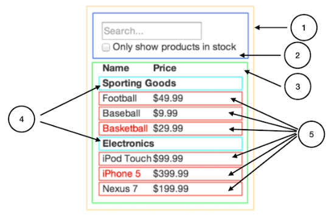

# PoC Software Pool 2023 - Day 05 - React

**Day purposes**

✔ Create your own User Interface (UI) with React and Chakra UI.

✔ Structure your UI.

✔ Test your UI.

✔ Make your UI responsive.

## Introduction

*[React](https://en.reactjs.org) is a Javascript library to build user interfaces.*

**What is a user interface?**

A user interface (UI) is the point at which humans interact with a computer, a website or an application.

For instance, your terminal is a user interface.

**What does this Javascript library allow us to do?**

Thanks to React, you can build [*React Components*](https://en.reactjs.org/docs/components-and-props.html), which is a Javascript function that returns a Javascript object representing a DOM element in memory.

All these DOM elements in memory compose the Virtual DOM.

> 💡 DOM stands for Document Object Model, which is the HTML representation of a web page.
> As a consequence, a DOM element is a part of the HTML representation of a web page.

This Virtual DOM is a copy of the Real DOM.

- The Real DOM is the HTML representation of the web page that the user sees. It's updated by [*queries*](https://burlingtoncodeacademy.github.io/webdev-prework-track/DOM_queries)
- The Virtual DOM is a copy of the Real DOM. It's automatically updated when the state of a React Component is updated. It automatically updates the Real DOM.

> In fact, this is why *React is called React*, it's *reactive* to changes of state to automatically updates the DOM 😉

When you create a React component, you can specify when its states should change.

This is the magic. You no more need to update the Real DOM by hand! 🪄

> Maybe you don't understand why this is awesome. It's because you haven't played yet with the Real DOM.\
> If you want, at the end of the day, try to build the same application without React, then you will understand 👍
> Here's the [official DOM documentation](https://developer.mozilla.org/en-US/docs/Web/API/Document_Object_Model/Introduction).

**How to use React the right way?**

There are two rules to follow:
- **Build a tree of components**
- **Build a React Component for each element of your UI**

Here's an example:
<div align="center">



</div>

Each number corresponds to a React Component.
> You can call React Components inside another React Component 😉

If you follow this until the end, you will get a [*single page app*](https://www.bloomreach.com/en/blog/2018/what-is-a-single-page-application).
> 💡 This means that your app is a single React Component, composed of React Components.

**Okay, this is great for developers! How about users?**

Building the Real DOM takes time.

Thus when a web page is loaded, the user have to wait a bit.

However if you use React well, you build the Real DOM only one time (when the first page is loaded), then you just update it.

As a consequence, by using React you give your users ***a more fluid experience*** 🥇

## Step 0 - Setup

In your pool repository, create a new directory for the `day05`:

```sh
mkdir -p day05
```

Then, create a new React project with Typescript:

```shell
npx create-react-app artists-book --template typescript
```

> Don't worry if you see vulnerabilities after this command, it's a false positive.<br>
> If you are curious about it [take a look at this issue](https://github.com/facebook/create-react-app/issues/11174) 😉

To verify that everything is ok, run the following commands:

```shell
# Move to your project
cd artists-book

# Start the server
npm start
```

If you get a page with the React logo spinning, then you can continue 🚀

***
### **⚠️ Important note ⚠️**

Before going further, **take a moment to read the React [Getting Started](https://en.reactjs.org/docs/getting-started.html) and its tutorials**.<br>
Make sure to understand **what is a [functional component](https://www.robinwieruch.de/react-function-component/)** as you'll have to use it for every component you'll create.

It's important to take at least 30 minutes to read these tutorials, it will save you a lot of time.
> Don't also hesitate to ask the staff if you don't understand certain concepts 😄
***

## Step 1 - Lay the foundations

Now that you understand the **core concepts** of React, it's time to lay the foundations of your project.

### Clean Up

Remove some files to have the following hierarchy:

```sh
  ├──node_modules       # External modules required
  │   └──{...}
  ├──public             # Static files - https://create-react-app.dev/docs/using-the-public-folder/
  │   ├──index.html
  │   └──robots.txt     # Prevent crawl up - https://www.geeksforgeeks.org/robots-txt-file/
  ├──src                # The folder where you will code
  │   ├──App.tsx
  │   └──index.tsx
  ├──.gitignore         # Tells git to ignore some files
  ├──package-lock.json  # Dependencies manager
  ├──package.json       # Package manager
  ├──README.md          # Don't hesitate to read it! It contains useful commands
  └──tsconfig.json      # TypeScript configuration file
```
> It's ok if some errors appear, it will be fixed 😃

Then follow these steps to setup your project with [Chakra UI](https://chakra-ui.com), a component library to help you build your React projects, [ESlint](https://eslint.org) and [Prettier](https://prettier.io).<br>
It will also give you a good architecture to start this day 🔥

### Installation

#### **Chakra UI**

As always, install the necessary dependencies:
```sh
npm i @chakra-ui/react @emotion/react @emotion/styled framer-motion
```

- Update `src/index.tsx` to wrap your app with a ChakraProvider, allowing us to customize behavior around the whole app:
```tsx
import React from 'react';
import ReactDOM from 'react-dom/client';

import { ChakraProvider } from '@chakra-ui/react';
import App from './app/App';
import theme from './theme';
import './theme/index.css';

const root = ReactDOM.createRoot(document.getElementById('root') as HTMLElement);
root.render(
	<React.StrictMode>
		<ChakraProvider theme={theme} resetCSS>
			<App />
		</ChakraProvider>
	</React.StrictMode>,
);
```
> You can take a look at the Chakra UI [tutorial](https://chakra-ui.com/getting-started/cra-guide#manual-installation) to setup `create-react-app` projects.

Now let's create [a custom Chakra theme](https://chakra-ui.com/docs/theming/customize-theme) to extend it with our own preferences 🎱:

- Create the folder `src/theme` with an `index.css` file inside. Then you can fill it with the following content to use different fonts and add some global [CSS](https://developer.mozilla.org/en-US/docs/Web/CSS):
```css
/* Import fonts from google fonts */
@import url('https://fonts.googleapis.com/css2?family=Poppins:ital,wght@0,100;0,200;0,300;0,400;0,500;0,600;0,700;0,800;0,900;1,100;1,200;1,300;1,400;1,500;1,600;1,700;1,800;1,900&display=swap');
@import url('https://fonts.googleapis.com/css2?family=Roboto:wght@400;500&display=swap');

body {
  font-family: 'Poppins' !important;
}

html {
  scroll-behavior: smooth;
}
```

- Add and `index.ts` file in the `theme` folder to define Chakra breakpoints that will help us make it [responsive](https://www.w3schools.com/html/html_responsive.asp):
```ts
import { extendTheme } from '@chakra-ui/react';

// Set breakpoint to help to make the app responsive.
const breakpoints = {
	xs: '320px',
	sm: '576px',
	md: '768px',
	lg: '1024px',
	xl: '1280px',
	'2xl': '1440px',
};

export default extendTheme({ breakpoints });
```

To finish the Chakra setup, let's import and use basic components from Chakra

- Create the folder `src/app`.

- Move the file `src/App.tsx` in the `app` folder and fill it with this to see the power of Chakra in action 🔥:
```tsx
import { Center, Spinner, Text, VStack } from '@chakra-ui/react';

const App = (): JSX.Element => (
	<Center mt="160px">
		<VStack spacing="32px">
			<Text>It's time for you to start frontend development!</Text>
			<Spinner w="132px" h="132px" />
		</VStack>
	</Center>
);

export default App;
```

Lastly, add `"baseUrl": "src"` under the `compilerOptions` of your `tsconfig.json`.
> Check the tsconfig [documentation](https://www.typescriptlang.org/tsconfig#baseUrl) about `baseUrl` to see why it's useful 😉

#### **ESLint**

You can't install ESLint exactly like the other days, we need to use different configurations to support the React syntax and use ESLint at his full potential 😄

Install the dependencies:
```sh
npm install -D eslint eslint-config-airbnb eslint-config-airbnb-typescript eslint-config-prettier eslint-plugin-prettier @typescript-eslint/eslint-plugin @typescript-eslint/parser
```

What's next? Creating a config file like `.eslintrc.yaml` 🚀 

Here's a good config to get started:
```yaml
parser: "@typescript-eslint/parser"

parserOptions:
  ecmaVersion: latest
  project: tsconfig.json

env:
  node: true
  browser: true

extends:
  - airbnb-typescript
  - airbnb/hooks
  - plugin:@typescript-eslint/recommended
  - plugin:prettier/recommended
  - react-app

rules:
  prettier/prettier: warn
  no-console: off
```

> Don't forget to add scripts to `package.json`:
> ```json
> {
>   "lint": "eslint src",
>   "lint:fix": "eslint src --fix"
> }
> ```

#### **Prettier**

Install the dev dependency:
```sh
npm install -D prettier
```

And define rules like these in a `.prettierrc` file:
```json
{
  "semi": true,
  "trailingComma": "all",
  "singleQuote": true,
  "printWidth": 120,
  "tabWidth": 2,
  "useTabs": true,
  "bracketSpacing": true,
  "parser": "typescript"
}
```

To test that everything went well, run the following commands:
```sh
# Run lint
npm run lint

# Start the server
npm start
```

You can continue if they all succeed!

Now that the foundations are laid for your project, it's time to dive into frontend development 🏊

***
### **⚠️ Important note ⚠️**

Before going further, be aware of this:

As you are using Chakra UI, **you mustn't use HTML tags**. In fact, Chakra makes available plenty of components, such as `Button`, `Box`, `Flex`, `Stack`... You can find the full list [here](https://chakra-ui.com/docs/components).

It's important to **take time to read this list**, it will save you a lot of time for the rest of the day 😉

For all the following steps, you will have three sections:
- **Requirements**: what you must have
- **Constraints**: what you must follow
- **Tips**: what you must read and use
***

## Step 2 - Your first component 🚀

Let's start by creating the Home page 😄

**Requirements:**
- The Home page must contain:
  - a title `Artists Book`
  - a subtitle `Manage your favorite artists`

**Constraints:**
- Create the file `src/pages/Home.tsx` with a React Component representing your Home page inside.
- Update the file `src/app/App.tsx` to call this component.

> Make sure you understood everything from the foundations.

> Have a look at the Chakra UI [Text](https://chakra-ui.com/docs/typography/text) and [`Heading`](https://chakra-ui.com/docs/components/heading) components 😉

Well done! You have created your first React Component 🥳

> 💡 A **great idea** is to create a folder `src/components` to store reusable components.

***
### **⚠️ Important note ⚠️**

From now on, you are free to add any element you want in your UI as long as you have the requirements. Chakra UI is a really powerful tool, have fun with it 🔥

> Don't hesitate to ask us questions about design, about ways to code frontend elements, or to validate your architecture 😉

[Here is an example of what you will have to do](https://pool-software-artists-book-47uohqzk7-pool-software-artists-book.vercel.app)
> Note that this is purely frontend, there is no interaction with a database.

TODO: update link for example deployed
***


## Step 3 - Your first routes 🛤️

Now that you have your Home page, it's time to have Register and Login pages reachable at the `/register` and `/login` URLs.

**Requirements:**
- The Home page must contain:
  - A `link` to the Register page.
  - A `link` to the Login page.
- The Register page must contain:
  - An `input` to enter an `email`.
  - An `input` to enter a `password`.
  - An `input` to enter the `confirmed password`.
    > 💡 Text for the password inputs mut be replace by dots
  - A `button` that when clicked, log the values of the email, the password and the confirmed password.
  - A `link` to the Login page.
- The Login page must contain:
  - An `input` to enter an `email`.
  - An `input` to enter a `password` with text replaced by dots again.
  - A `button` that when clicked, log the values of the email and the password.
  - A `link` to the Register page.

**Constraints:**
- You must create the file `src/pages/Register.tsx`.
- You must create the file `src/pages/Login.tsx`.
- You must create the file `src/app/Routes.tsx` with a React Component containing the Routes inside, called in `src/app/App.tsx`.

**Tips:**
- Have a look at the Chakra UI [Input](https://chakra-ui.com/docs/form/input), [Link](https://chakra-ui.com/docs/navigation/link) and [Button](https://chakra-ui.com/docs/form/button) components.
- You should have a look at the [react-router-dom](https://github.com/remix-run/react-router/blob/main/docs/start/tutorial.md) package.
- Check the React [State Hook](https://en.reactjs.org/docs/hooks-state.html) 👀
- Use the [web console](https://developer.mozilla.org/en-US/docs/Tools/Web_Console) to see the logs (Ctrl + Shift + I) 😉

## Step 4 - What if you change the screen size? 📱

Now that you have several pages, its time to make sure that they are responsive on different screen sizes 🙂

To do so, open the console and play with the screen width and height (CTRL + SHIFT + M while inside the console 😉)

If some elements are not responsive, fix it!

**Requirements:**
- Check:
  - The arrangement of the elements.
  - The spaces between elements.
  - The text size (especially for titles and subtitles)
  - ...

**Tips:**
- Here is [how to do with Chakra UI](https://chakra-ui.com/docs/features/responsive-styles). As you can see, the setup has already been done!

## Step 5 - Testing time 🧪

TODO: give the tests and explain how they work:
- npm i -D cypress @types/jest
- add the scripts
- add the files (config + cypress folder)
- gitignore with videos/screenshots
- explain how to add IDs


You now have three responsive pages.

Before going further, it's a good practice to create [end-to-end](https://css-tricks.com/front-end-testing-is-for-everyone/#h-end-to-end-e2e-testing) tests.

To do that, you will use [Cypress](https://www.cypress.io).

**Requirements:**
- Verify that the Home page contains:
  - One `Register` `button` redirecting to `/register`.
  - One `Login` `button` redirecting to `/login`.
- Verify that the Register page contains:
  - Three `inputs`.
  - One `Register` `button`.
  - One `Login` `button` redirecting to `/login`.
- Verify that the Login page contains:
  - Two `inputs`.
  - One `Login` `button`.
  - One `Register` `button` redirecting to `/register`.
- Add the following `scripts` to the file `package.json`:
  - `cypress:open`, running cypress with the GUI.
  - `cypress:run`, running cypress without the GUI.

**Constraints:**
- You must create the file `cypress/integration/home.spec.ts`
- You must create the file `cypress/integration/register.spec.ts`
- You must create the file `cypress/integration/login.spec.ts`

**Tips:**
- You will need to easily find components of you UI, give them an [`id`](https://developer.mozilla.org/en-US/docs/Web/HTML/Global_attributes/id?retiredLocale=id) 😄

## Step 6 - Your first dashboard 📋

Now that you have solid foundations, it's time to go further 🔥

You have a Home page, a Register page and a Login page. What's missing? A Dashboard page!

Let's now play with artists 🚀

> 💡 To see what is an `Artist`, check the [API doc](../resources/README.md)

Create a Dashboard page listing some artists, with the `/dashboard` URL.

> ⚠️ For now, data is stored with a React `useState` hook. There is no real database and no interaction with the API.

**Requirements:**
- Update the Register `button` to redirect to the Dashboard page when clicked.
- Update the Login `button` to redirect to the Dashboard page when clicked.
- The Dashboard page must contains:
  - A `navbar` in the top with:
    - A `link` to the Dashboard page on the left.
    - A `button` `Add an Artist` on the right, **doing nothing for now**.
  - A `grid` listing artists's `card`.

**Constraints:**
- You must create the file `src/types/artist.ts` with the `Artist` type inside. Be smart, take only the needed properties 😎
- You must create the file `src/pages/Dashboard.tsx`.
- You must create the file `src/components/Bar/TopBar.tsx` with the top `navbar` inside.
- You must create the file `src/components/Button/AddArtistButton.tsx` with the `Add an Artist` `button` inside.
- You must create the file `src/components/Card/ArtistCard.tsx` with the artists's `card` inside, displaying every information about an artist except from his `id`.
  > Try to display the `rating` using 5 stars ⭐

**Tips:**
- The Chakra UI [Grid](https://chakra-ui.com/docs/layout/grid), [Navbar](https://chakra-templates.dev/navigation/navbar) and [Cards](https://chakra-templates.dev/components/cards) components will be useful for this dashboard 😉
> ⚠️ Be careful with the Chakra UI templates, it's just to give you an idea of what you can do. ***Do not copy-paste code.***

## Step 7 - Become a true Frontend Developer 📈

Now that you can list artists, what if you could add some?

As you can notice, your `Add an artist` button does nothing for now.

Let's add artists in a cool way 😎: when this button is clicked, a `modal` appears with a form to create an artist.

**Constraints:**
- You must create the file `src/components/Modal/AddArtistModal.tsx` with the `modal` to add an artist inside, called in `src/components/Button/AddArtistButton.tsx`.

**Tips:**
- Chakra UI has a component perfectly fit for this use case: the [Modal](https://chakra-ui.com/docs/overlay/modal) 🔥


***
### **⚠️ Important note ⚠️**

First, well done! You've worked hard to be here 👏

It's time to give you a gift: an advice 🎁

One of the most difficult thing when you build a User Interface with React (and other libraries of components / frameworks) is to manage the dozens of components you create.

But why is it difficult?

It's because your components are not **stateless**. ***There is logic inside them***. For instance, sometimes you will copy-paste a whole component, just to change a condition, a function...

It's really difficult to build components that you can re-use in different parts of your project.

So how can you resolve this problem?

One of the best thing to do is to build ***stateless components***.

Keep your logic, your function calling APIs... the higher in your tree component. Pass functions, conditions... ***as parameters*** to your components.

It might not seem important right now, but it will help you so much.

To set this up, here is a little challenge you can take: all your logic, keep it inside the pages components, and only there.

If you want to go further in frontend development, follow this principle as much as you can 😉
***

## Step 8 - Your first API call from a UI 💯

Now that you have built your User Interface, it's time to call the [API](../resources/README.md) and interact with real data 🚀
> Please take a moment to setup this.\
> Feel free to play with it with a tool like [Postman](https://www.postman.com/).

Let's call the API when a user registers 🧔‍♂️

**Requirements:**
- The user must be notified with the appropriate message if the register action succeeds or fails.
- The Register button cannot be clickable if the credentials are invalid.
- On success, redirect the user to the Dashboard page.

**Constraints :**
- You must have an [env variable](https://create-react-app.dev/docs/adding-custom-environment-variables/) `REACT_APP_BACKEND_URL`.
- You must get the `REACT_APP_BACKEND_URL` inside the file `src/config/services.ts`, and only here.
- You must create the folder `src/services` and keep the functions calling the API inside it. In your React components, you will call these functions. Be smart, you're free to organize this folder as you want.

**Tips:**
- Have a look at the [axios](https://www.npmjs.com/package/axios) and [env-var](https://www.npmjs.com/package/env-var) packages.
- Another step, another Chakra UI component! This time, look at the [toast](https://chakra-ui.com/docs/feedback/toast) component.
- Take a look at the [localStorage](https://developer.mozilla.org/en-US/docs/Web/API/Window/localStorage), this is where you can keep the `accessToken`.

***
### **⚠️ Important note ⚠️**

You will store the given `accessToken` inside the `localStorage`.

Note that this is a **bad idea**.
> Please refer to [the Security Bonus](#security-issue) to understand why.

We ask you to do it this way because it's important to be aware of this.
***

## Step 9 - Time to play with real data 🚀

Now that you know how to call an API from a User Interface, it's time to have a complete interaction with it!

**Requirements:**
- On successful login, redirect to the Dashboard page.
- The user must be notified with the appropriate message on login.
- The user must be authenticated on the Dashboard page. If not, redirect him to the Home page.
- The user must be notified with the appropriate message on artist creation.

**Constraints :**
- Follow the previous constraints and structure your code 😉

**Tips:**
- You already have all you need, but you can ask the staff if you struggle 😄

## Step 10 - What about musics? 🎶

Well, we have artists. What about musics?

Create an Artist page listing all of his musics.

**Requirements:**
- When an artist is created, redirect the user to this artist's page.
- The Artist page must contains:
  - The same top `navbar` as the Dashboard page.
  - The photo / name / rating / nationality / music gender of the artist, displayed in a nice way.
  - An `Add a music` `button` opening a `modal` to add a music when clicked.
  - A `grid` listing his music's `card`.

**Constraints:**
- You must create the file `src/components/Card/MusicCard.tsx` with the musics's `card` inside, displaying every information about a music except from its `id`.
- You must create the file `src/components/Button/AddMusicButton.tsx` with the `Add a Music` `button` inside.
- You must create the file `src/components/Modal/AddMusicModal.tsx` with the `modal` to add a music inside, called in `src/components/Button/AddMusicButton.tsx`.

**Tips:**
- This is not the time to optimize your number of requests to the API. Keep it logical.

## Bonus

Congratulations for completing this day, you're now able to create a beautiful frontend for your own project 🤩

Here are some bonuses for you if you still have time:

### Animations

Improve your User Interface using animations 💥 

Here are the best two libraries:
- [Animate JS](https://animejs.com)
- [Motion](https://www.framer.com/motion/)

> We advice you to use Motion as it is already installed with Chakra UI 😉

### Dark & Light Mode

Implement a Dark and Light Mode thanks to [Chakra UI](https://chakra-ui.com/docs/features/color-mode) 🕶️

### Security Issue

As stated earlier, storing a JWT inside the `localStorage` is a bad idea. Here is [how to solve this problem](https://www.codeheroes.fr/2020/06/20/securiser-une-api-rest-3-3-gestion-du-jwt-cote-client/) 😉

Your turn!

### React Context

What if you could share data between different components without passing parameters to them?

Well it's possible, it's called [React Context](https://en.reactjs.org/docs/context.html).

Try to use it.

> Made with ❤️ by PoC
